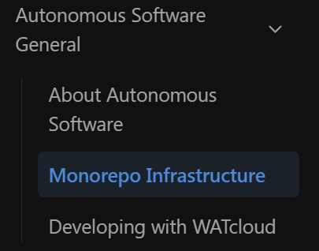
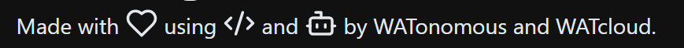

# WATonomous Wiki website

The [website](https://wiki.watonomous.ca) for the WATonomous Wiki.

## Getting started

1. Clone the repo
1. Install npm if you haven't:

    ```bash
    sudo apt install npm
    ```

1. Install dependencies:

    ```bash
    npm install
    ```

1. Run the development server:

    ```bash
    npm run dev
    ```

## Editing the Wiki
### General Layout
All wiki pages are managed through files under the [`pages`](pages) directory. 

The generic layout of the pages directory is as follows:
```
pages
├── _app.tsx
├── _meta.json
├── <section1_page>.mdx
├── <section1_subpage_directory>
│   ├── _meta.json
│   ├── <section1_subpage1>.mdx
|   └── <section1_subpage2>.mdx
|   ...
├── <section2_page>.mdx
├── <section2_subpage_directory>
│   ├── _meta.json
│   ├── <section2_subpage1>.mdx
|   └── <section2_subpage2>.mdx
|   ...
...
```

### Rules
1. `<section#_page>` and `<section#_subpage_directory>` must be the same name in order for them to link together. For example, given the following page directory layout:

```
├── autonomous_software_general.mdx
├── autonomous_software_general
│   ├── _meta.json
│   ├── about_asd.mdx
│   ├── monorepo_infrastructure.mdx
│   └── watcloud_dev.mdx
```

You will get a website page layout like the following:



Where `Autonomous Software General` is also a clickable section with text.

2. You must update the `_meta.json` files when a new page is created.

    - **If you are creating a new page:** Then you have to update `pages/<section_you_are_editing>/_meta.json` with your new section like so:
    
    ```json
    {
        "about_asd": "About Autonomous Software",
        "monorepo_infrastructure": "Monorepo Infrastructure",
        "watcloud_dev": "Developing with WATcloud",
        "SECTION_FILENAME": "FRONTEND NAME OF SECTION (THIS IS WHAT PEOPLE SEE)" 
    }
    ```

    - **If you are creating a new section:** Then you don't have to update the `pages/_meta.json`, but the name of the section is directly corrolated to the name of the `<section#_page>` and `<section#_subpage_directory>` (which are the same name).

### Using Cooler Components
MDX files allow us to add more cooler things than a simple MD file. In fact, it can handle importing react components! Some common libraries that are used in this wiki are:

- [Lucide React](https://lucide.dev/guide/packages/lucide-react) for cute emotes as shown in the footer of the wiki
    - **To use:** Go to the Lucide Website and search for the emote you want. Then just import the component into the mdx file like so:
        ```
        import { Bot, Heart, Code2 } from "lucide-react"

        <div className="w-full mx-auto max-w-screen-xl lg:flex lg:gap-x-20 lg:items-center lg:justify-between text-center lg:text-left">
        <span>
            Made with <Heart className="inline-block align-text-bottom"/> using <Code2 className="inline-block align-text-bottom"/> and <Bot className="inline-block align-text-bottom"/><br className="md:hidden"/> by WATonomous and WATcloud.
        </span>
        </div>
        ```

        It will show up in the page like so:

        

        *(Eddy) My limited knowledge of frontend development makes this the best way to import in lucide-react components into a wiki page. There might be a better way.*

### Adding Images

Later, we might need to store these images in a more efficient manner, but for now they are all contained under the [public/assets](public/assets/) directory.

**PLEASE ORGANIZE YOUR IMAGES ACCORDING TO THE PAGE THEY ARE PART OF.**

Otherwise, we can lose track of images being used REALLY quickly.
