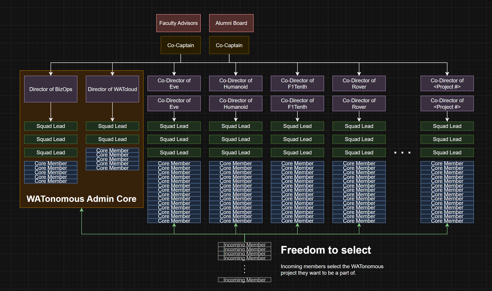

import { Callout } from 'nextra/components'

# 📜 WATonomous Constitution

## Article I – Name
The name of this organization shall be **WATonomous**. Capital **W** **A** **T**.

## Article II – Purpose
 
<Callout>
The purpose of this organization is **to show the world a bunch of students can build autonomous robots**.
</Callout>

In pursuit of such purpose...
1. We pursue multiple robotics projects centered around a common toolset
1. We encourage crosstalk between different projects to nuture a community and collectively expand our knowledge of robotics
1. We drive ourselves to become better people

## Article III – Team Structure

The organization's team structure is shown below:

### Section 1: Federated Team Structure

WATonomous operates using a **federated team model** that supports multiple autonomous robotics projects under one unified organization. This structure is designed to enable scalability, encourage ownership, and promote parallel development across different domains of autonomy.

**Key Characteristics**
- **Project-Based Divisions:** Each project (e.g., Eve, Rover, Humanoid, F1Tenth) functions as a semi-autonomous unit.
- **Local Leadership:** Projects are led by their own set of **Co-Directors**, who oversee execution and direction within their scope.
- **Squad-Oriented Subteams:** Each project is further divided into **Squads**, led by **Squad Leads** and composed of **Core Members**.
- **Central Coordination:** The **Co-Captains** and **Admin Core** (e.g., BizOps, WATcloud) provide shared infrastructure, strategic alignment, and operational support.

This model balances **decentralized execution** with **centralized coordination**, allowing each project to innovate independently while remaining aligned with the team’s broader goals.

### Section 2: Adaptive Leadership

Leadership within WATonomous is intentionally designed to be **adaptive** to meet the evolving needs of each project.

**Leadership Roles**
- **Squad Leads** are assigned based on task ownership rather than fixed roles.
- Squad responsibilities are **fluid (even between software and hardware)**, enabling members to take charge of specific initiatives or deliverables as needed.
- **Co-Directors** of each project are responsible for defining how leadership is distributed within their teams.

**Guiding Principles**
- **Task-Based Authority:** Leadership is delegated according to expertise, initiative, and the nature of the work.
- **Collaborative Structure:** Squad Leads collaborate closely with Co-Directors to ensure technical and logistical alignment.
- **Leadership Development:** The system encourages all members to grow into leadership roles based on merit and engagement.

This approach fosters an agile, bottom-up culture that empowers members to lead, take initiative, and directly shape their project’s success.

### Section 3: Squad Management

Squads are the fundamental working units within each WATonomous project or administrative group. They are designed to promote agility, collaboration, and focused execution.

**Purpose of Squads:**
- Organize members around specific goals, modules, or deliverables.
- Enable parallel workstreams within a larger project.
- Encourage ownership, communication, and iteration.

**Squad Composition:**
- **Led by a Squad Lead**, who coordinates execution and ensures alignment with the project’s direction.
- **Comprised of Core Members**, who contribute directly to the squad’s objectives.
- May also include **Incoming Members**, who support tasks and ramp up under mentorship.
- A squad should consist of **no more than 5 people**. Otherwise, the scope of the squad should be reconsidered, and be divided up into smaller scopes for multiple squads to form.

**Squad Lead Responsibilities:**
- Set meeting cadence and manage internal communication.
- Track progress on squad goals and report to Co-Directors.
- Support technical or logistical problem-solving within the group.
- Adjust squad composition or task focus as project needs evolve.

**Flexibility & Rotation:**
- Squad Leads may rotate based on task cycles, availability, or project phase.
- Squads can be reorganized or dissolved at the discretion of the project’s Co-Directors to meet changing priorities.

<Callout>
A squad cannot fully dissolve until comprehensive documentation of their contibutions have been made. This is at the discretion of the Project Directors, other Squad Leads, and optionally Co-Captains.
</Callout>

This squad system provides a scalable, modular structure that adapts to project complexity and fosters leadership development across the team.

### Section 4: Project Management

A **Project** refers to a semi-autonomous team within WATonomous focused on a specific application of autonomous robotics. The number and scope of active projects may evolve over time. This section outlines the formal procedures for managing the lifecycle of a project.

**4.1 Establishing a Project**
- Any member may propose a new project by submitting a short proposal to leadership (Directors or Co-Captains through public channels or direct messaging).
- The proposal must include:
  - Project name and scope
  - Technical objectives
  - Relevance to the broader goals of WATonomous
- Approval requires a **80% vote** from the leadership team.
- Once approved, the project is added to the active roster and is granted access to shared resources.
- **Directorship and Squad Leadership** of a project is determined during the project’s first official meeting. Members interested in leadership roles are expected to **self-organize** and reach a consensus. The final selection of **Project Directors and Squad Leads** must be **communicated to WATonomous leadership** within one week of the meeting.

**4.2 Pausing a Project**
- A project may be paused if:
  - It is temporarily inactive due to academic term transitions
  - Its members are reassigned to higher-priority efforts
- The project directors must notify the rest of leadership with a proposed timeline for reevaluation.
- A paused project is not expected to meet standard term-end report.

**4.3 Merging Projects**
- Two or more projects may be merged if they share significant technical or logistical overlap.
- The proposal must be initiated by one or more project leads and approved by a **80% vote** of leadership.
- A new lead structure must be proposed for the merged project.

**4.4 Terminating a Project**
- A project may be terminated if:
  - It has been inactive for over one term without a valid justification
  - It no longer aligns with WATonomous' long-term goals
  - It repeatedly fails to meet deliverables or maintain team structure
- Termination requires a **80% vote** of leadership and must be communicated clearly to all members.

**4.5 Evaluating Projects**
- Projects are reviewed at the **end of each academic term** by the leadership team.
- Evaluation criteria may include:
  - Progress on technical milestones (see Goal Tracking)
  - Quality and consistency of member engagement
  - Contribution to the overall mission of WATonomous
  - Documentation, demos, or integration into broader team efforts
- Projects failing to meet expectations may be recommended for support, restructuring, or sunsetting.

## Article IV – Role Descriptions

**Faculty Advisors and Alumni Board**
- Serve in an advisory capacity to provide long-term guidance, mentorship, and institutional memory.
- Do not participate in day-to-day operations but may review major strategic initiatives.
- Serve as a direct connection to the University of Waterloo and Industry

**Co-Captains**
- Represent the overall WATonomous team and are responsible for strategic vision, inter-project coordination, and organizational cohesion.
- Facilitate communication across directors, oversee high-level planning, and ensure alignment with long-term goals.
- Appoint or confirm project and administrative leadership roles when necessary.

**Directors and Co-Directors**
- Lead either an administrative vertical (e.g., BizOps, WATcloud) or a technical project (e.g., Rover, Eve).
- Define goals, timelines, and processes for their domain.
- Are accountable to the Co-Captains for progress and member well-being within their teams.
- Co-Directors of a project operate with equal authority to enable collaborative leadership and load sharing.

**Squad Leads**
- Coordinate and guide a focused group (or “squad”) within a project or administrative team.
- Lead execution of key tasks or deliverables and facilitate collaboration among Core Members.
- Are appointed by the Co-Directors of their project based on need, expertise, or initiative.
- May change over time depending on project needs (adaptive leadership).

**Core Members**
- Actively contribute to a project or administrative initiative on a regular basis.
- Take ownership of technical tasks, documentation, testing, event planning, or other responsibilities as needed.
- Are encouraged to pursue Squad Lead roles based on interest and engagement.

## Article V – Goal Tracking

WATonomous uses a **Quest System** to clearly define, track, and evaluate term goals. This system provides transparency, motivation, and alignment across all projects and administrative efforts. Each term, every **robotics project** and administrative unit maintains its own **Quest Book**, which serves as the definitive record of that group's objectives, their scoring criteria, and their progress.

### Section 1: Quest Books

- A **Quest Book** is the official document outlining the objectives ("Quests") for a given term **within a specific robotics project or administrative unit**.
- It contains:
  - The **Great Objective** representing the robotics project's overarching goal, established at the time of its inception.
  - A series of **Term Objectives**, each with defined scoring criteria and deadlines.
- The Quest Book is treated as the **source of truth** for what that group aims to accomplish during the term.
- Each Quest is assigned a scoring weight of **/5**, **/10**, or **/20**, depending on its scope and importance.

### Section 2: How Quest Books Are Written

- **Quests** are proposed by **Co-Captains and Directors** prior to the start of each academic term.
- A separate Quest Book is maintained for each project (e.g., Eve, Rover, Humanoid, F1Tenth) and administrative group (e.g., BizOps, WATcloud).
- All proposed Quests must follow the standardized **Quest Template**, including:
  - Clear descriptions
  - Specific due dates
  - Transparent scoring breakdowns with minimum requirements for partial credit
- Each Quest Book must be reviewed by:
  - The respective project or group’s **Directors**
  - The **Co-Captains**
  - Other relevant stakeholders (e.g. Advisors, Alumni)
  - Optionally, **Squad Leads** should their squad persist between terms
- Quest Books are approved by **Consensus** among reviewers, ensuring fairness, clarity, and alignment with organizational priorities.
- Once approved, Quest Books are published to the team and archived in the team wiki.

### Section 3: Scoring

- Each Quest is scored on its **assigned due date**, during a live scoring meeting.
  - Present at the meeting must be the **Director(s)**, **Squad Lead(s)**, and **key members** responsible for that Quest.
- Scoring follows the criteria defined in the Quest Book; **subjective adjustments are not permitted**.
- **Completed Quests** are announced in team-wide communications (e.g., Discord, or All-Hands).
- **Residual Quests** may be created for partially completed work. These are added to the Quest Book with new due dates and scoring.
- Once awarded, **scores are final and cannot be changed**.
- At the end of the term, each Quest Book’s final scores are:
  - Published in team-wide announcements
  - Permanently archived in the documentation or wiki

<Callout>
A Quest cannot by considered done until comprehensive documentation has been made. This is at the discretion of the Project Directors, Squad Leads, and optionally Co-Captains.
</Callout>

### Section 4: Quest Ownership and Accountability

Each Quest listed in a Quest Book must have clearly defined ownership to ensure accountability and clarity throughout the term.

**Roles and Responsibilities:**

- **Directors** are responsible for:
  - Defining the high-level objectives within their project or group.
  - Ensuring that Squad Leads and Core Members are aware of expectations.
  - Participating in the scoring process for their assigned Quests.
  - Breaking down Quests into actionable tasks that will form squads.

- **Squad Leads** are responsible for:
  - Further break down of tasks into action items for the squad.
  - Tracking progress and removing blockers.
  - Leading discussions related to their squad’s work.

- **Core Members** are responsible for:
  - Executing tasks tied to Quests.
  - Documenting progress and providing relevant evidence for scoring.
  - Proactively reporting issues to Squad Leads.

**Ownership Guidelines:**

- Every Quest must list at least one **responsible Director or Squad Lead**.
- Quests should not remain ownerless; if leadership transitions mid-term, responsibility must be reassigned.
- For cross-functional Quests involving multiple squads, a **primary lead** must be designated for scoring purposes.

**Performance Transparency:**

- Quest ownership contributes to squad and team visibility during the term.
- Final scores may be used to inform leadership decisions such as promotions, acknowledgments, and end-of-term evaluations.

## Article VI – Leadership Selection

### Section 1: Term Limits

Term limits are imposed to facilitate a healthy transition of power and strengthen our team's ability to transfer knowledge across generations. Each lead position has its own term limit:

- **Co-Captains and Project Directors:** 2 years  
- **Squad Leads:** No term limit. However, continuation in the role is at the discretion of the respective Project Director.

### Section 2: Transitioning Leadership

Leads may resign from their position for two reasons:
1. Their term limit has been reached.  
1. They no longer wish to continue in a leadership role.

When a lead resigns, a new lead must be appointed. The process depends on the role of the resigning lead:

**Co-Captain**

New Co-Captains are elected by a vote from the current Directors of WATonomous. A candidate must receive at least 80% of the vote to be selected. If no candidate meets this threshold, a revote is held. Candidates are encouraged to resolve differences and consolidate interests between revotes.

**Minimum Requirements to be a Candidate:**
- Must have held a lead position in WATonomous for at least one term.
- Must not have previously served as a Co-Captain.

**Transition Process:**
1. A Co-Captain announces their resignation, either due to term completion or personal choice.
1. A team-wide announcement is made, and the search for candidates begins.
1. The first vote is held one week after the resignation announcement.
1. If the first vote fails, revotes may occur, no sooner than 30 minutes after the previous vote.
1. Once a new Co-Captain is selected, a 1-month transition period begins, during which responsibilities and knowledge are transferred.

> *Note:* The resigning Co-Captain remains responsible for day-to-day tasks until the transition is complete.

**Director**

New Directors are identified and selected by current Co-Captains and Directors.

**Minimum Requirements to be Considered:**
- (Optional) Previously served as a Lead.
- (Optional) Expressed interest in leadership to current Directors or Co-Captains (via DMs or public messages).
- Demonstrated leadership ability.

**Transition Process:**
1. A Director announces their resignation, either due to term completion or personal choice.
1. A project-wide announcement is made, and the search for a replacement begins.
1. The resigning Director is responsible for identifying a suitable replacement.
1. The candidate must receive 80% approval from all other Directors and Co-Captains.
1. If the first vote fails, other Directors or Co-Captains may propose additional candidates. Revotes may occur no sooner than 30 minutes after the previous vote.
1. Once a new Director is selected, a 2-week transition period begins, during which responsibilities and knowledge are transferred.

> *Note:* The resigning Director remains responsible for day-to-day tasks until the transition is complete.

**Squad Lead**

New Squad Leads are selected by the Project/Division Directors and are appointed based on the tasks at hand.

**Minimum Requirements to be Considered:**
- (Optional) Expressed interest in leadership to Directors or Co-Captains (via DMs or public messages).
- Demonstrated leadership ability.

**Transition Process:**
1. New tasks emerge that require the formation of a squad (e.g., perception, electrical, etc.). The Director defines the squad's scope.
1. The Project Director appoints a Squad Lead.
1. The Squad Lead remains in position until the Director reassigns the role or the squad is dissolved.
1. If the Squad Lead resigns while the squad is still active, they are responsible for recommending a replacement.
1. If the recommended replacement is not approved by the Directors, the Directors will select an alternative candidate.
1. Once a replacement is selected, a 1-week transition period begins for knowledge transfer.

> *Note:* Squad Leads and squads are fluid and form based on the tasks at hand. Resigning Squad Leads are expected to retain responsibilities until a replacement is confirmed.

**Alumni Board Member**

The role of an Alumni Board Member is reserved for individuals who have made a lasting impact on WATonomous. These members serve as stewards of institutional memory and provide valuable connections to graduate programs and industry.

**Eligibility Criteria**  
An individual may be considered for Alumni Board Membership if they meet **at least one** of the following:

- **Former Co-Captain** of WATonomous  
  - Eligibility begins immediately after their term concludes.
  
- **Significant Contributor** to the team, regardless of title or role  
  - Must be nominated by a current Director, Co-Captain, Faculty Advisor, or existing Alumni Board Member.

**Nomination and Selection Process**  
- Nominations trigger a formal vote by current team leadership (Co-Captains, Directors, and optionally Squad Leads).  
- Prior to the vote, either the nominee or nominator may present their case to leadership.  
- Alumni Board Membership is granted upon receiving **at least 80% approval** from current leadership active during the formal vote.  
- Nominations may only proceed when WATonomous is **not in a state of emergency**.

<Callout>
The purpose of this membership is to recognize individuals who have sacrificed their lives (whether it be health, employment, etc.) in the pursuit of helping others. Although the system in place is honour-based, this mechanism should not be abused. Doing so affects the integrity of the team, and brings into questions whether WATonomous should still exist as an entity.
</Callout>

## Article VII – Membership

### Section 1: Eligibility

Membership is open to:
- Students and faculty of the University of Waterloo  
- Alumni of the University of Waterloo  

> *Note:* Special arrangements may be made for individuals outside the University of Waterloo if approved by an 80% majority vote from the WATonomous leadership.

To join WATonomous, the application process is determined by the current leadership and may vary over time. The most current application process will always be properly explained and documented on the WATonomous website and wiki.

### Section 2: Expectations

Members are expected to:
- Participate in meetings or team activities  
- Contribute regularly to projects or club events

### Section 3: Revoking Membership

Membership may be revoked for the following reasons:
- Prolonged lack of active participation on the team  
- Acts of violence, harassment, racism, or bigotry witnessed and documented internally  

> *Note:* WATonomous reserves the right to escalate sensitive cases to an appropriate governing body at the University of Waterloo.

## Article VIII – Amendments

- Any member may propose amendments to this constitution.
- Amendments must be approved by a 80% majority of Directors, Co-Captains, and active Alumni Board Members. A notification of the meeting must be sent out to all parties involved at least 1 week in advance.
- Final approval (over GitHub PR), must be made by one of the Co-Captains. 
- Commit history will be used as a direct reference to the change history of this constitution.

### How to structure an Amendment
1. Make a change to the constitution in a GitHub branch.
1. Create a Pull Request to the main branch of the wiki, outlining the changes made to the constitution.
1. Merging is not permitted until the proper amendment process is followed.

## Article IX – Emergency Clause

In times of emergency, term limits may be suspended, and leadership transitions will be handled by the current Leadership Team, Faculty Advisors, and active Alumni Board Members.

### Section 1: What Constitutes an Emergency?

An emergency may be declared if any of the following conditions are met:

- WATonomous membership drops below 20 people.
- A serious accident causes hospitalization of team members.
- Natural disasters or major political events affecting the region (e.g., war, martial law, rebellion, or murder).

### Section 2: Declaration and Termination of Emergency

**Declaring an Emergency:**
A **State of Emergency** may be declared if:

- One or more qualifying emergency conditions are present, **and**
- Co-Captains agree to initiate emergency status:

A formal vote or written record must be created confirming the declaration.

**Emergency Leadership Meeting:**
Once declared, a meeting must be announced team-wide **at least one week in advance** of when it will be held. This meeting must address:

1. **Team Strategy** – How the team will respond to the crisis, including concrete milestones and task ownership.
1. **Leadership** – Who will guide the organization through this period.

> **Decision-Making:** Full consensus is preferred. If consensus cannot be reached, decisions may proceed with a **80% vote** among attendees representing at least two of the three stakeholder groups (Leadership, Faculty, Alumni Board Members).

**Ending an Emergency:**
A State of Emergency may be ended if:

- The original condition(s) no longer apply,
- A review meeting is held with representation from the Leadership Team, Faculty Advisors, and Alumni Board,
- And a **80% vote** from these groups confirms readiness to return to normal operations.

> A minimum of two weeks must pass between the declaration and termination of an emergency unless otherwise agreed by all three groups.

### Section 3: Failsafe Procedures

In the event that quorum cannot be met due to incapacity, absence, or disengagement, the following backup measures apply:

- **Quorum Flexibility:** A minimum of **four participants** from at least **two different groups** (e.g., Faculty + Alumni, or Leadership + Faculty) may convene an emergency meeting.
- **Succession Protocol:** If both Co-Captains are incapacitated, any current Director or Squad Lead may temporarily assume emergency coordination duties until quorum is restored.
- **Remote Participation:** Emergency meetings may be held virtually or asynchronously (e.g., via email or team-wide poll) if timely response is required.
- **Cooldown Period:** A new emergency may not be declared within **three months** of a previous one unless unanimously approved by all three stakeholder groups.
