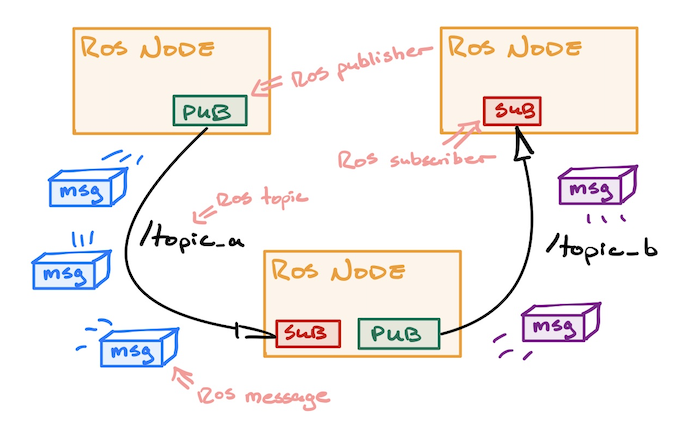
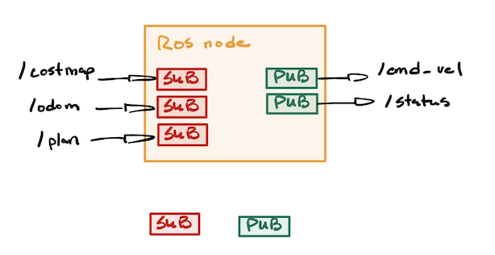
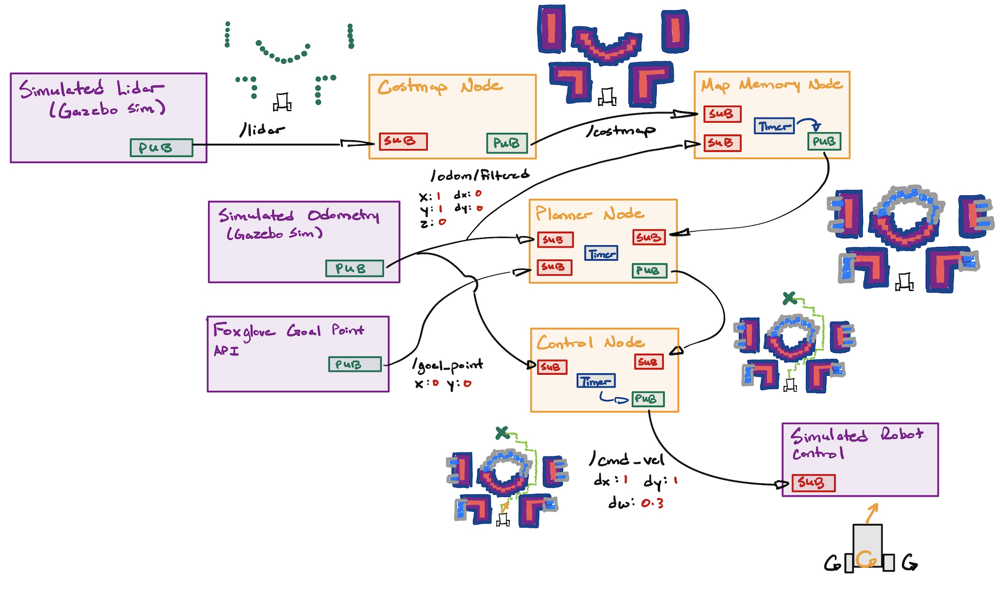
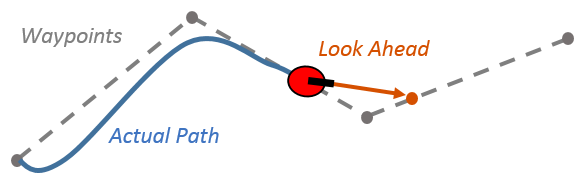

import { Callout } from 'nextra/components'
import { Steps } from 'nextra/components'

# ASD Admission Assignment

The ASD Admission Assignment seeks to teach you all the relevant software tools and robotics knowledge you'll need for your future career in state-of-the-art robotics.

<Callout type="warning" emoji="️⚠️">
  This assignment can be a bit daunting, but we promise that with grit, you can complete this assignment regardless of your current capabilities. Feel free to ask any questions on Discord.
</Callout>

## Rules

1. If you finished the assignment (or the deadline has been reached), submit a link to your code on github plus video proof to the `assignment-completions` discord channel.
2. **You're allowed to work in groups of 3.** Be sure to credit your group members in the submission. You can look for group members in the `assignment-groups` discord channel.
3. You are allowed to use AI tools such as LLMs.
4. You are allowed to look at the answer. If you know how to find it. We'll know if you used the answer though ;)

<Callout type="error" emoji="️‼️">
  **Why so many loopholes?** It's because we aren't testing you. It's to give you a chance to really hold yourself accountable, and explore the interesting world of robotics. Sure you can copy your way through, but what's the point? Are you really becoming a better you by doing that? Do you care more about your own personal growth or more about superficially showing yourself off? 
</Callout>

## Goal of the Assignment
In this assignment, you are tasked with giving a simulated robot the intelligence to navigate from point-to-point while avoiding static objects. The robot is [differential drive](https://en.wikipedia.org/wiki/Differential_wheeled_robot) and has a camera and laser scanner.

<iframe
    className="pt-4 w-full aspect-video"
    src={`https://www.youtube.com/embed/bLf8vFsxAJ0`}
    title="YouTube Video"
    frameBorder="0"
    allow="accelerometer; autoplay; clipboard-write; encrypted-media; gyroscope; picture-in-picture"
></iframe>

The code you will write, and the libraries you will use, are industry-standard. That means you will be writing code that could be transferable to companies you will be working for in the future! Here's a non-exhaustive list:

- [Nvidia](https://developer.nvidia.com/isaac/ros)
- [Google (Intrinsic)](https://www.intrinsic.ai/)
- [Amazon (Amazon Robotics)](https://amazon.jobs/content/en/teams/ftr/amazon-robotics)
- [Tesla](https://www.tesla.com/AI)
- ... and MANY robotics startups

Of course, we cannot cover everything. So feel free to use this assignment as a good starting point to get into the world of robotics. :)

## Getting Started

### Prerequisites
We recommend you refresh your knowledge of the following before beginning the assignment:
- [GitHub and git](https://docs.github.com/en/get-started/start-your-journey/hello-world)
- [navigating the terminal](https://www.redhat.com/en/blog/navigating-filesystem-linux-terminal)
- [C++ and Python](https://leetcode.com/) (You will be using C++ for this assignment because it is easier to learn rclpy coming from rclcpp)
- Concurrent Programming and Interprocess Communication

### Setup
The ASD Admission Assignment is compatible with Linux, Windows ([WSL](https://learn.microsoft.com/en-us/windows/wsl/install)), and MacOS. We utilize [docker](https://docs.docker.com/get-started/docker-overview/) for ease of reproducibility and deployability, so you'll barely need to install anything on your own computer to make this assignment work!

In the terminal:
1. [Download Docker Engine (or Docker Desktop if you have no choice)](https://docs.docker.com/engine/install/ubuntu/#install-using-the-repository)
2. Clone the WATonomous ASD Admissions Assignment
```bash
git clone git@github.com:WATonomous/wato_asd_training.git
```
3. You're ready to begin!

## Warm Up: How to use the Repository
The ASD Assignment utilizes our custom-built [Monorepo Infrastructure](../autonomous_software_general/monorepo_infrastructure). It is a Docker Compose wrapper that orchestrates various concurrent programs together. It also lets us build code, setup VScode Intellisense, and deploy to robots.

In this warm up, you will learn how to use the infrastructure. More specifically, how to open Foxglove to visualize data, make changes to the code, build the code, and witness your changes on Foxglove. We highly recommend you reference the [Monorepo Infrastructure Docs](../autonomous_software_general/monorepo_infrastructure) while you go through this warm up and the rest of the assignment.

### First Encounter with Foxglove
**1. Set your `watod-config.sh` to run `robot`, `gazebo`, and `vis_tools` as the active modules.**
```bash
ACTIVE_MODULES="robot gazebo vis_tools"
```

**2. Build these module images**
```bash
./watod build
```

**3. Up the module containers**
```bash
./watod up
```

**4. Figure out your Foxglove URL**
- If you are developing locally, this can be found in the logs after you run `./watod up`, it should look like something along the lines of `https://localhost:#####`
- If you are developing on watcloud, it should act the same as deving locally. If not, check that the port is being forwarded by looking at the `PORTS` tab in VScode

**5. Open up [Foxglove](https://foxglove.dev/ros) (web app or desktop app). Click **Open Connection** and enter the URL you found previously. The Foxglove dashboard should open.**

**6. Import the pre-made Foxglove layout located in `config/wato_asd_training_foxglove_config.json` into the Foxglove Dashboard.**
- You should see the following:


You can move the robot around using the Teleop Panel.

### Coding the Robot and Propagating the change into Foxglove
This section will get you to integrate a simple publisher node using one of the empty packages located in the `src` directory. Later on, we will give you a rundown on what you are actually writing.

**0. Get Intellisense working. This will give you code completion on VScode.**
```bash
./watod --setup-dev-env robot
```


**1. In `src/robot/costmap/include/costmap_node.hpp` place the following code**
```cpp
#ifndef COSTMAP_NODE_HPP_
#define COSTMAP_NODE_HPP_

#include "rclcpp/rclcpp.hpp"
#include "std_msgs/msg/string.hpp"

#include "costmap_core.hpp"

class CostmapNode : public rclcpp::Node {
  public:
    CostmapNode();
    
    // Place callback function here
    void publishMessage();

  private:
    robot::CostmapCore costmap_;
    // Place these constructs here
    rclcpp::Publisher<std_msgs::msg::String>::SharedPtr string_pub_;
    rclcpp::TimerBase::SharedPtr timer_;
};

#endif 
```

**2. In `src/robot/costmap/src/costmap_node.cpp` place the following code**
```cpp
#include <chrono>
#include <memory>

#include "costmap_node.hpp"

CostmapNode::CostmapNode() : Node("costmap"), costmap_(robot::CostmapCore(this->get_logger())) {
  // Initialize the constructs and their parameters
  string_pub_ = this->create_publisher<std_msgs::msg::String>("/test_topic", 10);
  timer_ = this->create_wall_timer(std::chrono::milliseconds(500), std::bind(&CostmapNode::publishMessage, this));
}

// Define the timer to publish a message every 500ms
void CostmapNode::publishMessage() {
  auto message = std_msgs::msg::String();
  message.data = "Hello, ROS 2!";
  RCLCPP_INFO(this->get_logger(), "Publishing: '%s'", message.data.c_str());
  string_pub_->publish(message);
}

int main(int argc, char ** argv)
{
  rclcpp::init(argc, argv);
  rclcpp::spin(std::make_shared<CostmapNode>());
  rclcpp::shutdown();
  return 0;
}
```

**3. Because you added a new ROS2 libary `std_msgs`, you need to instruct ROS2's package manager to install and compile with `std_msgs`**
- In `src/robot/costmap/package.xml` add in the following:
```xml
<?xml version="1.0"?>
<package format="3">
  <name>costmap</name>
  <version>0.0.0</version>
  <description>A sample ROS package for pubsub communication</description>

  <maintainer email="oleather@watonomous.ca">Owen Leather</maintainer>
  <license>Apache2.0</license>

  <!--https://www.ros.org/reps/rep-0149.html#dependency-tags-->
  <buildtool_depend>ament_cmake</buildtool_depend>
  <depend>rclcpp</depend>

  <!--YOU ARE ADDING THIS MAINLY-->
  <depend>std_msgs</depend>

  <test_depend>ament_lint_auto</test_depend>
  <test_depend>ament_lint_common</test_depend>
  <test_depend>ament_cmake_gtest</test_depend>

  <!--https://www.ros.org/reps/rep-0149.html#export-->
  <export>
    <build_type>ament_cmake</build_type>
  </export>
</package>
```
This is telling the ROS2 pacakge manager to install the `std_msgs` library.
- In `src/robot/costmap/CMakeLists.txt` add in the following:
```cmake
cmake_minimum_required(VERSION 3.10)
project(costmap)

# Set compiler to use C++ 17 standard
if(NOT CMAKE_CXX_STANDARD)
  set(CMAKE_CXX_STANDARD 17)
endif()

if(CMAKE_COMPILER_IS_GNUCXX OR CMAKE_CXX_COMPILER_ID MATCHES "Clang")
  add_compile_options(-Wall -Wextra -Wpedantic)
endif()

# Search for dependencies required for building this package
find_package(ament_cmake REQUIRED) # ROS2 build tool
find_package(rclcpp REQUIRED)      # ROS2 C++ package
find_package(std_msgs REQUIRED)    # YOU ARE ONLY ADDING THIS TO THE FILE

# Compiles source files into a library
# A library is not executed, instead other executables can link
# against it to access defined methods and classes.
# We build a library so that the methods defined can be used by
# both the unit test and ROS2 node executables.
add_library(costmap_lib
  src/costmap_core.cpp)
# Indicate to compiler where to search for header files
target_include_directories(costmap_lib
  PUBLIC include)
# Add ROS2 dependencies required by package
ament_target_dependencies(costmap_lib 
  rclcpp
  std_msgs # YOU ARE ONLY ADDING THIS TO THE FILE
)

# Create ROS2 node executable from source files
add_executable(costmap_node src/costmap_node.cpp)
# Link to the previously built library to access costmap classes and methods
target_link_libraries(costmap_node costmap_lib)

# Copy executable to installation location
install(TARGETS
  costmap_node
  DESTINATION lib/${PROJECT_NAME})

# Copy launch and config files to installation location
install(DIRECTORY
  config
  DESTINATION share/${PROJECT_NAME})

ament_package()
```
This is telling ROS2 compiler that you need `std_msgs` to compile the code.

**4. Rebuild and Rerun the robot**
```bash
# In a separate terminal while the other modules are running
./watod down robot # shuts down the robot service
./watod build robot # rebuilds the robot service
./watod up robot # starts the robot service up again
```
You can also just down, build, and up the whole thing. But this will eat up precious time.

**5. View your changes on Foxglove**
- Create a new panel that views raw messages, enter `/test_topic` as the topic you want to view
- You should see something like the following:


Congratulations! You now know how to make a code change and have it propagate into Foxglove!

## What did I just Write?
From the last example, you were probably thinking, "What the hell did I just write?" Well, you just wrote C++ code using the [ROS2 Humble](https://docs.ros.org/en/humble/index.html) library! ROS2 is a powerful toolset of C++/Python libraries, build utilities, orchestration managers, logging tools, and visualization software used by the open-source robotics community. ROS originally spawned in the Bay Area as a way to mitigate "reinventing the wheel" of robotics infrastructure. Nowadays, it is used by a plethora of startups, and its repository has be forked many times for companies such as Cruise and Zoox. Currently, the maintainers of ROS were aquired by Google as a political play. You can learn more about the history of ROS [here](https://www.theconstruct.ai/history-ros/).

So how do you use ROS? Learning ROS (and robotics programming in general) takes time. As you make more mistakes, you will get a better understanding of it. For now, we will only go over some basic aspects of ROS that are expecially relevant to this assignment.

<Callout type="warning" emoji="️⚠️">
  We use ROS and ROS2 interchangeably. But keep in mind that they are two different libraries that you download separately. That being said, there is a lot that is similar between them.
</Callout>

### ROS System Diagram
Here's a simple diagram of three ROSnodes talking to each other. This is the generic way most robotics developers look at robotics systems.



### ROS Node
A process that is running instances of ROS objects is called a ROSnode. What this means is, as long as your code has ROS objects that listen/publish data to the network, then it is considered a ROSnode. You can think of ROSnodes as the building blocks of a robotics system.

### ROS Messages and Topics
ROS at its core is a framework for interprocess communication. Given two processes (ROSnodes) running, how do you make them communicate with each other? Especially when one process requires the output of another.

The way ROS does this is through passing messages over a transport protocol such as UDP or TCP. In simpler terms, it is packaging data into a format that can be passed throughout your computer's internal network, at which point another program can then read that pacakged data, unpack it, and use it for processing.

ROS communication involves two things: **topics**, and **messages**. A **message** is an arbitary data structure (an integer, or struct of multiple objects) that is used to represent the data that two or more processes will read and write. In ROS, there are a ton of prebuilt messages that can be used for your robotics project. We often don't need to create our own custom messages, but when we do, we have to build messages using ROS's build tools. You can think of messages as nothing more than the data that is to be sent between processes.

As a result, another question arises: How do we manage where to read and write messages? For example, if two processes are publishing the same message type, then how can we differentiate between a message coming from one process vs coming from the other process? Well that is where **topics** become important. ROS topics represent the medium in which messages should be passed through. You can think of them as URLs to a website. It you specify one URL in you browser, then you will get all the information available in that URL (the website itself) Topics functions very similarly. You can specify the topic a process can read/write to, and ROS fill figure out all of the networking jargon in the background. 

You read more about it [here](https://industrial-training-master.readthedocs.io/en/melodic/_source/session1/Topics-and-Messages.html#:~:text=The%20first%20type%20of%20ROS,messages%20on%20that%20same%20topic.)

### ROS Publishers and Subscribers
ROS utilizes these topics and messages with simple callable objects in C++ and Python. If you want to send messages out to a topic, use a publisher. Likewise, if you want to listen for messages in a topic, use a subscriber. The syntax for writing a publisher and subscriber can be found [here](https://docs.ros.org/en/foxy/Tutorials/Beginner-Client-Libraries/Writing-A-Simple-Cpp-Publisher-And-Subscriber.html)

<Callout type="warning" emoji="️⚠️">
  In this assignment, you will have to split your code into a C++ header file and a regular C++ file. You can ask LLNs how to do this :).
</Callout>

In the warmup, we made you write a simple publisher. Please use the warmup code as a reference to how your ROS code should fit into the assignment's code format (as in what should be in the `.hpp` file and what should be in the `.cpp` file).

### The Sky's the Limit
A robotics system can be composed of a bunch of different ROSnodes communcating in a bunch of different ways. In fact, a ROSnode can consist of multiple publishers and subscribers. You just need to be careful of the concurrency between them.



Unfortunately, the only way to truly understand ROS is to read their docs and use it. If you have any questions when programming ROS, please ask them in our Discord.

## How to Code Intelligence

Now that you've gotten into the swing of things, let's take a step back and take a look at the field of robotics as a whole. 

A reoccuring question roboticists often have is:

> "How do we make robots think?"

This question scales with the complexity of the robot. For a line following robot, this could be extremely easy: the robot simply needs to turn slightly left or right depending on where the line is. However, for something as complex as a humanoid robot, the question becomes alot more daunting.

Line Follower Robot             |  Humanoid Robot
:-------------------------:|:-------------------------:
 | 

As you progress through your career in robotics, you will witness a multitude of robotics systems. Some that can be built by 5 people, others that have to be built by 100+ people (but actually only really written by like 5 people).

However, all robotic systems seek to do one thing: **mimic aspects of the human brain to achieve a desired goal**. Of course, sometimes it's to mimic human cognition entirely, but for most applications of robotics, there is a economical usecase that needs to be fulfilled.

In fact, every roboticist falls somewhere along a spectrum. At one end are the dreamers—a visionary group almost cult-like in their pursuit of playing god, driven by the singular ambition to create artificial general intelligence. At the other end are the pessimists—pragmatic, sometimes cynical individuals who see robots as little more than tools, focused solely on their limitations and building them only for profit.

You decide where you want to be. But nevertheless, let's not start you off pessimistic.

### A Simple Model of the Human Brain
Human intelligence is a fascinating thing. Somehow this glob of flesh in your head is capable of controlling your every move, imagining the impossible, and deciphering the complexities of the universe. However, your mind has limitations, and all brains are not perfectly unique. In fact, every human brain shares a common set of modules. For example, it is the reason why we can translate languages. Noam Chomsky, a founding figure of linguistics, hypothesized that we as humans share an innate language faculty. That all of our brains have an innate structure responsible for communication. These limitations are what we use to understand the brain, and with that we can spawn hypotheses on how we think.

#### Here's a good guess (it's very limited, but it's good enough for most roboticists):


Generally, we as humans do the following:
- **Perception:** Identify, organize, and interpret information from our five senses. 
- **World Modeling:** Utilize and contextualize what we perceive to build an inner model of the world. We also build higher-order attributes on these percepts for the sake of reasoning and predicting possible future states of the world.
- **Memory:** Store our models of the world, our actions, and their resulting consequences, for the sake of optimizing future actions.
- **Configuration:** Decides what we should pay attention to. This part of our brain takes in input from all the other parts and configures them to perform the task at hand.
- **Action:** Plans and executes our desired actions based on the task at hand. This ranges from long-term planning down to distinct movements in your muscles.

Let's describe your brain at this very moment... Right now your brain is perceiving and identifying your surroundings. Your eyes recognize the computer screen in front of you, a desk, a wall, perhaps a keyboard and mouse. At the same time, you also understand that the desk or computer screen in front of you is the same desk and computer screen you saw 2 seconds ago. That is your perception. 

After that, your brain stitches what it senses into a inner model of the world. You know that the computer screen in front of you is on top of the desk you are working on. It is the same reason why you still roughly know the structure of the room around you when you close your eyes. This inner world model is also used to draw connection and implications. For example, you know that a computer screen normally doesn't move on its own. These sorts of implications allow our brains to predict possible future states of the world. 

Based on all the information your brain has grabbed so far, you can then go on to decide what you want to pay attention to. For example, your mind is probably focused on finishing this assignment. Therefore, you configured your mind to be in a state that can finish coding assignments. 

Finally, now that you know as much as you can about the world, and what you want to do, you now plan you course of action. In order to finish your coding assignment, you know that you need to stay seated at your desk, and your hands ready to type. You brain converts these planned intentions into primitive motor movements such as moving the muscles in your fingures and your eyes.

Once you know the results of your actions, your brain stores those results in your memory. You can then use past results to further improve your future actions.

### How does the Brain Tie into Robotics?
**Every robotics system can be thought of in the context of the modules explained above.** No matter how simple or complex the robot is, its inner software system generally follows a flow of information similar to our simplified model of the brain.


> This is a random AV architecture we pulled from online. Usually software architectures are grouped differently by pretty much everyone. Try connecting its various modules to our simple model of the human brain.

**Take an autonomous vehicle for example.** It's perception modules are its sensors (camera, radar, lidar, sonar, etc.). Its world model is a highly detailed map of the road (including lanes, traffic signs, lights, etc. This is known as an HD Map). The car also uses its world model to predict the future paths of people and cars around it. Its configurator is its behaviour tree, which is a more complex state machine that defines what the robot should do based on the current state its in. Finally, its action is the various levels of planning: Global Planning, Local Planning, and Control sequences to steer the vehicle and control its throttle.


**Something more simple can be a line follower robot.** This robot's perception is a single sensor that tracks where the line is. Its world model is very limited, as it only needs to know where it is with respect to the line. Likewise, its configuration is sparse because its sole purpose is to follow a line. Finally, its action module just moves the left of right wheel faster based on where the line is with respect to the robot. Overall, you should be noticing a pattern here. We can view any robot through the lens of a simplified model of the human brain.

## Time to Finish your Assignment

In this assignment, you are given a simulation of a robot with a laserscanner and a camera. Because the laser scanner gives us a very good understanding of how far hard objects are away from us, we will only the laser scanner for this assignment. The goal of the robot is to move to a point specified by the user. Note, to make the assignment easier, we have already given you the constant position of the robot with respect to the map. This is represented by an `Odometry` message present in the `/odom/filtered` topic.


<Callout type="warning" emoji="️⚠️">
  **Think back to the previous section:** if you were the robot in that simulation, and all you knew was how to control yourself, where your goal position was, and how far dangerous things are from you, then how would you plan to get to that point?
</Callout>

From before, you know that this robot will need the following high-level modules: perception, world modeling, memory, configuration, and action. With time, you will learn to associate different algorithms to different modules, but for now, we will just tell you a good sequence of modules that can solve the assignment. **FEEL FREE TO TRY DIFFERENT APPROACHES.**

### A Simple Navigation Architecture
Below is a diagram of a simple navigation architecture that can be used to help the robot navigate from point A to point B.



Here is a description of each node:
- **Costmap:** A ROSnode that takes in LaserScans from the `/lidar` topic, and converts them into a costmap. This is a discretized grid of squares that represent the chances as object exists in that grid with an arbitrary score.
- **Map Memory:** A ROSnode that take in the costmaps overtime and stitches them together to form a global map. This utilizes the robot's own position in the map found as an Odometry message in the '/odom/filtered' topic.
- **Planner:** A ROSnode that takes in the global map and odometry to use the A* algorithm to plan how to get from point A to point B. 
- **Control:** A ROSnode that takes in the path from the planner and odometry, and does Pure Pursuit control to physically move the robot along that path. It does this by publishing Twist messages to the '/cmd_vel' topic.

With these four nodes, you can make the robot navigate to anywhere in the map!

## Implementation Details
This section will be details on how to program each node. You can use this section as a reference for your own code, and as a foundation for where to get started.

### **Costmap Node**
> **Should contain the following ROS constructs:**
> - 1 Subscriber that subscribes to the '/lidar' topic for [sensor_msgs::msg::LaserScan](https://docs.ros.org/en/noetic/api/sensor_msgs/html/msg/LaserScan.html) messages
> - 1 Publisher that publishes [nav_msgs::msg::OccupancyGrid](https://docs.ros.org/en/lunar/api/nav_msgs/html/msg/OccupancyGrid.html) messages to a '/costmap' topic


Equivalent to basic pereption, the Costmap Node is responsible for processing data from laserscans to create a discretized map of where the robot can and cannot go. A simple costmap can have binary values 0 and 1 and is called an occupancy grid. However, often sensor readings are noisey, so when a laser scan tells you something is 10m away, it might actually be 9.5-10.5 meters away. That is why a costmap is useful. It allows us to represent the map as a range of values representing the 'cost' that would incur should the robot cross into that part of the map. This means that a high cost equates to places where objects are definitely present and the robot should avoid. Areas of the map with low cost represent places where we are uncertain of whether an object is near, but we should trek safely nontheless. 

#### **Steps to Create a Basic Costmap**

1. **Subscribe to the `/lidar` Topic**
   - Receive `sensor_msgs::msg::LaserScan` messages from the `/lidar` topic.
   - The `LaserScan` message contains:
     - `angle_min`, `angle_max`: The start and end angles of the scan.
     - `angle_increment`: The angular resolution of the scan.
     - `ranges`: Array of distance measurements.

2. **Initialize the Costmap**
   - Create a 2D array to represent the `OccupancyGrid`. Each cell corresponds to a grid space in the real world.
   - Define the resolution of the costmap (e.g., 0.1 meters per cell) and its size.
   - Initialize all cells to a default value (e.g., 0 for free space).

3. **Convert LaserScan to Grid Coordinates**
   - For each valid range value in `ranges`:
     - Compute the Cartesian coordinates of the detected point:
       ```math
       x = range \cdot \cos(angle)
       ```

       ```math
       y = range \cdot \sin(angle)
       ```
     - Transform these coordinates into grid indices using the resolution and origin of the costmap.

4. **Mark Obstacles**
   - Set the cells corresponding to detected obstacle positions to a high cost (e.g., 100 for "occupied").

5. **Inflate Obstacles**
   - Define an **inflation radius** (e.g., 1 meter) and a maximum cost for inflated cells.
   - For each obstacle cell:
     - Calculate the Euclidean distance to surrounding cells.
     - Assign a cost to the surrounding cells based on the distance:
       ```math
       cost = max\_cost \cdot \left(1 - \frac{distance}{inflation\_radius}\right)
       ```
       - Only assign a cost if the calculated cost is higher than the cell's current value.
       - Do not assign a cost to cells beyond the inflation radius.

6. **Publish the Costmap**
   - Convert the 2D costmap array into a `nav_msgs::msg::OccupancyGrid` message.
   - Populate the `OccupancyGrid` fields:
     - `header`: Include the frame ID and timestamp.
     - `info`: Define the resolution, origin, and size of the grid.
     - `data`: Flatten the 2D costmap array into a 1D array.
   - Publish the message to the `/costmap` topic.

---

#### **Code Example (Pseudo-ROS 2 Implementation)**

```cpp
void laserCallback(const sensor_msgs::msg::LaserScan::SharedPtr scan) {
    // Step 1: Initialize costmap
    initializeCostmap();

    // Step 2: Convert LaserScan to grid and mark obstacles
    for (size_t i = 0; i < scan->ranges.size(); ++i) {
        double angle = scan->angle_min + i * scan->angle_increment;
        double range = scan->ranges[i];
        if (range < scan->range_max && range > scan->range_min) {
            // Calculate grid coordinates
            int x_grid, y_grid;
            convertToGrid(range, angle, x_grid, y_grid);
            markObstacle(x_grid, y_grid);
        }
    }

    // Step 3: Inflate obstacles
    inflateObstacles();

    // Step 4: Publish costmap
    publishCostmap();
}
```

---

#### Key Points
- The `LaserScan` data provides obstacle locations in polar coordinates, which are converted to grid coordinates.
- The costmap marks obstacles and inflates costs around them using a linear scale within a defined radius.

### **Map Memory Node**
> **Should contain the following ROS constructs:**
> - 1 Subscriber that subscribes to the '/costmap' topic for [nav_msgs::msg::OccupancyGrid](https://docs.ros.org/en/lunar/api/nav_msgs/html/msg/OccupancyGrid.html) messages
> - 1 Subscriber that subscribes to the '/odom/filtered' topic for [nav_msgs::msg::Odometry](https://docs.ros.org/en/noetic/api/nav_msgs/html/msg/Odometry.html) messages
> - 1 Publisher that publishes [nav_msgs::msg::OccupancyGrid](https://docs.ros.org/en/lunar/api/nav_msgs/html/msg/OccupancyGrid.html) messages to a '/map' topic
> - 1 Timer that is used to limit the number of times the map is updated (this is for optimization, we don't need to update the map everytime we get a costmap)


This node is a combination of world modeling and memory. Given that we know where we can and cannot go at a given time, we can infer the inehrent structure of the entire map as we move the robot around. This is useful because we can stop the robot from retracing its steps and planning a new route that goes through obstacles that we previously detected. 

To reduce the frequency of map updates, you can design the mapping node to only fuse maps when the robot has moved a set distance. For the explanations below, we use 1.5m.

---

#### **Steps to Build and Update the Map**

1. **Subscribe to `/costmap` Topic**
   - Receive `nav_msgs::msg::OccupancyGrid` messages from the `/costmap` topic.
   - Each costmap represents the local environment as detected by the robot at a specific moment.

2. **Subscribe to `/odom/filtered` Topic**
   - Receive `nav_msgs::msg::Odometry` messages from the `/odom/filtered` topic.
   - Use this data to track the robot’s movement and determine when it has moved 5 meters since the last map update.

3. **Track Robot Movement**
   - Store the robot’s initial position and periodically compute its distance from the last update position:
     ```math
     distance = \sqrt{(x_{current} - x_{last})^2 + (y_{current} - y_{last})^2}
     ```

4. **Aggregate Costmaps into the Global Map**
   - Maintain a global `OccupancyGrid` that represents the map of the environment.
   - When the robot moves 1.5 meters, integrate the most recent costmap into the global map:
     - Transform the costmap into the global frame using the robot’s current position and orientation.
     - Update the global map by merging the transformed costmap into it, prioritizing new data over old data.

5. **Optimize with a Timer**
   - Use a timer to limit the frequency of map updates to a reasonable rate (e.g., every 1 second).
   - Only perform a map update if the robot has moved 1.5 meters since the last update position.

6. **Publish the Map**
   - Publish the aggregated global map as a `nav_msgs::msg::OccupancyGrid` message to the `/map` topic.

---

#### **Logic for Map Update**

1. Check if the robot has moved 5 meters since the last map update.
2. If yes, aggregate the most recent costmap into the global map.
3. Publish the updated map.

---

#### **Linear Fusion of Costmaps**
When integrating costmaps:
- If a cell in the new costmap has a known value (occupied or free), overwrite the corresponding cell in the global map.
- If a cell in the new costmap is unknown, retain the previous value in the global map.

---

#### **Code Example (Pseudo-ROS 2 Implementation)**

```cpp
class MappingNode : public rclcpp::Node {
public:
    MappingNode() : Node("mapping_node"), last_x(0.0), last_y(0.0), distance_threshold(5.0) {
        // Initialize subscribers
        costmap_sub_ = this->create_subscription<nav_msgs::msg::OccupancyGrid>(
            "/costmap", 10, std::bind(&MappingNode::costmapCallback, this, std::placeholders::_1));
        odom_sub_ = this->create_subscription<nav_msgs::msg::Odometry>(
            "/odom/filtered", 10, std::bind(&MappingNode::odomCallback, this, std::placeholders::_1));

        // Initialize publisher
        map_pub_ = this->create_publisher<nav_msgs::msg::OccupancyGrid>("/map", 10);

        // Initialize timer
        timer_ = this->create_wall_timer(
            std::chrono::seconds(1), std::bind(&MappingNode::updateMap, this));
    }

private:
    // Subscribers and Publisher
    rclcpp::Subscription<nav_msgs::msg::OccupancyGrid>::SharedPtr costmap_sub_;
    rclcpp::Subscription<nav_msgs::msg::Odometry>::SharedPtr odom_sub_;
    rclcpp::Publisher<nav_msgs::msg::OccupancyGrid>::SharedPtr map_pub_;
    rclcpp::TimerBase::SharedPtr timer_;

    // Global map and robot position
    nav_msgs::msg::OccupancyGrid global_map_;
    double last_x, last_y;
    const double distance_threshold;
    bool costmap_updated_ = false;

    // Callback for costmap updates
    void costmapCallback(const nav_msgs::msg::OccupancyGrid::SharedPtr msg) {
        // Store the latest costmap
        latest_costmap_ = *msg;
        costmap_updated_ = true;
    }

    // Callback for odometry updates
    void odomCallback(const nav_msgs::msg::Odometry::SharedPtr msg) {
        double x = msg->pose.pose.position.x;
        double y = msg->pose.pose.position.y;

        // Compute distance traveled
        double distance = std::sqrt(std::pow(x - last_x, 2) + std::pow(y - last_y, 2));
        if (distance >= distance_threshold) {
            last_x = x;
            last_y = y;
            should_update_map_ = true;
        }
    }

    // Timer-based map update
    void updateMap() {
        if (should_update_map_ && costmap_updated_) {
            integrateCostmap();
            map_pub_->publish(global_map_);
            should_update_map_ = false;
        }
    }

    // Integrate the latest costmap into the global map
    void integrateCostmap() {
        // Transform and merge the latest costmap into the global map
        // (Implementation would handle grid alignment and merging logic)
    }

    // Flags
    nav_msgs::msg::OccupancyGrid latest_costmap_;
    bool should_update_map_ = false;
};
```

---

#### **Key Points**
1. The global map is updated only when the robot moves at least 5 meters and at a controlled frequency.
2. The node uses odometry to track movement and costmaps to update the environment representation.
3. A timer ensures that updates do not occur too frequently, optimizing computational resources.

### **Planner Node**
> **Should contain the following ROS constructs:**
> - 1 Subscriber that subscribes to the '/map' topic for [nav_msgs::msg::OccupancyGrid](https://docs.ros.org/en/lunar/api/nav_msgs/html/msg/OccupancyGrid.html) messages
> - 1 Subscriber that subscribes to the '/goal_point' topic for [geometry_msgs::msg::PointStamped](https://docs.ros.org/en/noetic/api/geometry_msgs/html/msg/PointStamped.html) messages
> - 1 Subscriber that subscribes to the '/odom/filtered' topic for [nav_msgs::msg::Odometry](https://docs.ros.org/en/noetic/api/nav_msgs/html/msg/Odometry.html) messages
> - 1 Publisher that publishes [nav_msgs::msg::Path](https://docs.ros.org/en/lunar/api/nav_msgs/html/msg/Path.html) messages to a '/path' topic
> - 1 Timer that tracks when we have reached the goal, or timedout, and we need to replan


The planner node corrosponds to a combination of configuration and action. Because the robots sole purpose is to move to a specified point, its configuration is very simple. Within the planner, you can model its configurator as a simple state machine that switches between two states: waiting for a goal, waiting for robot to reach the goal. These two states are sufficient enough for the task at hand. Furthermore, the planning node also produces a global plan from the robot's starting position to the final goal. It does this by using the discretized grid of the map and iterating through the grid to reach an optimal path. This plan is updated everytime the map updates.

To plan from one point in an incomplete map to another, there are a multiple of algorithms you can use. The simplest is Breadth First Search, which will inflate outwards from the robot's starting position, and end when it reaches the goal point. For this assignment, we suggest you make your life more interesting and learn how to use A*. [Here's a nice video about how A* works](https://www.youtube.com/watch?v=-L-WgKMFuhE)

To give you an easier time with building A*, here's some structs that could help you with building and traversing the graph:
```cpp
// ------------------- Supporting Structures -------------------

// 2D grid index
struct CellIndex
{
  int x;
  int y;

  CellIndex(int xx, int yy) : x(xx), y(yy) {}
  CellIndex() : x(0), y(0) {}

  bool operator==(const CellIndex &other) const
  {
    return (x == other.x && y == other.y);
  }

  bool operator!=(const CellIndex &other) const
  {
    return (x != other.x || y != other.y);
  }
};

// Hash function for CellIndex so it can be used in std::unordered_map
struct CellIndexHash
{
  std::size_t operator()(const CellIndex &idx) const
  {
    // A simple hash combining x and y
    return std::hash<int>()(idx.x) ^ (std::hash<int>()(idx.y) << 1);
  }
};

// Structure representing a node in the A* open set
struct AStarNode
{
  CellIndex index;
  double f_score;  // f = g + h

  AStarNode(CellIndex idx, double f) : index(idx), f_score(f) {}
};

// Comparator for the priority queue (min-heap by f_score)
struct CompareF
{
  bool operator()(const AStarNode &a, const AStarNode &b)
  {
    // We want the node with the smallest f_score on top
    return a.f_score > b.f_score;
  }
};
```

---

#### **Node Behavior and Design**

The planner operates as a state machine with two states:
1. **Waiting for Goal**: The node waits for a new goal point from the `/goal_point` topic.
2. **Waiting for Robot to Reach Goal**: Once a goal is received, the node plans a path using A\* and monitors the robot's progress toward the goal.

#### **Key Functionalities**
1. **Global Plan**:
   - Uses the A\* algorithm to find the optimal path from the robot's current position to the goal on the occupancy grid (`/map`).
   - Pathfinding accounts for obstacle constraints and generates a path that minimizes the cost.

2. **State Transition**:
   - Transition from "waiting for goal" to "waiting for robot to reach the goal" occurs when a valid goal is received.
   - Transition back occurs when:
     - The goal is reached.
     - A timeout is reached.
     - The map updates, requiring a replan.

3. **Timer for Replanning**:
   - Checks for timeout or completion conditions periodically.
   - Replans if the robot fails to progress or if a new map update invalidates the previous plan.

---

#### **Steps to Implement**

1. **Subscribers**:
   - `/map`: Receives `nav_msgs::msg::OccupancyGrid` messages.
     - Used as the grid for A\* pathfinding.
   - `/goal_point`: Receives `geometry_msgs::msg::PointStamped` messages.
     - Specifies the goal point.
   - `/odom/filtered`: Receives `nav_msgs::msg::Odometry` messages.
     - Tracks the robot's current position and progress toward the goal.

2. **Publisher**:
   - `/path`: Publishes `nav_msgs::msg::Path` messages.
     - Contains the planned path from the robot's position to the goal.

3. **Timer**:
   - Periodically checks if the goal is reached or if replanning is required.
   - Ensures efficient operation by limiting unnecessary updates.

4. **A\* Implementation**:
   - Use the occupancy grid as the search space.
   - Initialize start and goal points based on the robot’s position and the goal point.
   - Implement A\*:
     - Maintain an open list of nodes to be evaluated and a closed list of evaluated nodes.
     - Use a cost function:
       \[
       f(n) = g(n) + h(n)
       \]
       - \( g(n) \): Cost to reach the node.
       - \( h(n) \): Heuristic estimate of cost to reach the goal (e.g., Euclidean or Manhattan distance).
     - Expand nodes until the goal is reached or no valid path exists.

5. **State Machine**:
   - Define and handle transitions between "waiting for goal" and "waiting for robot to reach goal."

---

#### **Code Example (Pseudo-ROS 2 Implementation)**

```cpp
class PlannerNode : public rclcpp::Node {
public:
    PlannerNode() : Node("planner_node"), state_(State::WAITING_FOR_GOAL) {
        // Subscribers
        map_sub_ = this->create_subscription<nav_msgs::msg::OccupancyGrid>(
            "/map", 10, std::bind(&PlannerNode::mapCallback, this, std::placeholders::_1));
        goal_sub_ = this->create_subscription<geometry_msgs::msg::PointStamped>(
            "/goal_point", 10, std::bind(&PlannerNode::goalCallback, this, std::placeholders::_1));
        odom_sub_ = this->create_subscription<nav_msgs::msg::Odometry>(
            "/odom/filtered", 10, std::bind(&PlannerNode::odomCallback, this, std::placeholders::_1));

        // Publisher
        path_pub_ = this->create_publisher<nav_msgs::msg::Path>("/path", 10);

        // Timer
        timer_ = this->create_wall_timer(
            std::chrono::milliseconds(500), std::bind(&PlannerNode::timerCallback, this));
    }

private:
    enum class State { WAITING_FOR_GOAL, WAITING_FOR_ROBOT_TO_REACH_GOAL };
    State state_;

    // Subscribers and Publisher
    rclcpp::Subscription<nav_msgs::msg::OccupancyGrid>::SharedPtr map_sub_;
    rclcpp::Subscription<geometry_msgs::msg::PointStamped>::SharedPtr goal_sub_;
    rclcpp::Subscription<nav_msgs::msg::Odometry>::SharedPtr odom_sub_;
    rclcpp::Publisher<nav_msgs::msg::Path>::SharedPtr path_pub_;
    rclcpp::TimerBase::SharedPtr timer_;

    // Data Storage
    nav_msgs::msg::OccupancyGrid current_map_;
    geometry_msgs::msg::PointStamped goal_;
    geometry_msgs::msg::Pose robot_pose_;

    bool goal_received_ = false;

    void mapCallback(const nav_msgs::msg::OccupancyGrid::SharedPtr msg) {
        current_map_ = *msg;
        if (state_ == State::WAITING_FOR_ROBOT_TO_REACH_GOAL) {
            planPath();
        }
    }

    void goalCallback(const geometry_msgs::msg::PointStamped::SharedPtr msg) {
        goal_ = *msg;
        goal_received_ = true;
        state_ = State::WAITING_FOR_ROBOT_TO_REACH_GOAL;
        planPath();
    }

    void odomCallback(const nav_msgs::msg::Odometry::SharedPtr msg) {
        robot_pose_ = msg->pose.pose;
    }

    void timerCallback() {
        if (state_ == State::WAITING_FOR_ROBOT_TO_REACH_GOAL) {
            if (goalReached()) {
                RCLCPP_INFO(this->get_logger(), "Goal reached!");
                state_ = State::WAITING_FOR_GOAL;
            } else {
                RCLCPP_INFO(this->get_logger(), "Replanning due to timeout or progress...");
                planPath();
            }
        }
    }

    bool goalReached() {
        double dx = goal_.point.x - robot_pose_.position.x;
        double dy = goal_.point.y - robot_pose_.position.y;
        return std::sqrt(dx * dx + dy * dy) < 0.5; // Threshold for reaching the goal
    }

    void planPath() {
        if (!goal_received_ || current_map_.data.empty()) {
            RCLCPP_WARN(this->get_logger(), "Cannot plan path: Missing map or goal!");
            return;
        }

        // A* Implementation (pseudo-code)
        nav_msgs::msg::Path path;
        path.header.stamp = this->get_clock()->now();
        path.header.frame_id = "map";

        // Compute path using A* on current_map_
        // Fill path.poses with the resulting waypoints.

        path_pub_->publish(path);
    }
};
```

---

#### **Key Points**
1. **State Machine**: Clear separation of "waiting for goal" and "waiting for robot to reach goal."
2. **A\* Planning**: Finds an optimal path on the discretized occupancy grid using heuristic cost estimation.
3. **Replanning**: Automatically triggered by timer-based checks for progress or map updates.

### **Control Node**
> **Should contain the following ROS constructs:**
> - 1 Subscriber that subscribes to the '/path' topic for [nav_msgs::msg::Path](https://docs.ros.org/en/lunar/api/nav_msgs/html/msg/Path.html) messages
> - 1 Subscriber that subscribes to the '/odom/filtered' topic for [nav_msgs::msg::Odometry](https://docs.ros.org/en/noetic/api/nav_msgs/html/msg/Odometry.html) messages
> - 1 Publisher that publishes [geometry_msgs::msg::Twist](https://docs.ros.org/en/lunar/api/geometry_msgs/html/msg/Twist.html) messages to a '/costmap' topic
> - 1 Timer to follow a stored path


The control node is the final piece of the puzzle. It is the final action layer that is between your robotics software, and moving the robot (well, there's also the hardware abstraction layer that actually takes what this node outputs and converts it into actual electrical signals to move the motors of the robot). 

The field of controls is vast, and there are multiple different types of control schemes. As you go through university, you will probably learn about PID control. This form of control is used EVERYWHERE. 

>As of writing this assignment I was telling my dad about how I learned PID control, and how we can optimize signals in the Laplace domain, find parameters of a system with frequency analysis, blah, blah, blah. And he responded by telling me how he learned the same thing back in China, and uses it all the time to control temperatures and electrical signals in oil refineries.

Turns out you can use PID controls for following the path you just made. You simply calculate how far your robot deviates from the path (and its discrete derivative and integral), and use that to adjust your robot back onto the path. HOWEVER, PID controls is quite finnicky, so lets teach you a different control scheme. 

**Pure Pursuit Control** is a geometric algorithm used to guide a robot along a predefined path. The robot selects a "lookahead point" on the path at a fixed distance ahead, and the algorithm calculates the steering angle needed to reach this point. This angle is based on the curvature of a circular arc connecting the robot’s current position to the target point.



The lookahead distance controls how far ahead the target point is chosen. A larger distance makes the motion smoother but less precise, while a smaller distance improves accuracy but can lead to sharper, less smooth movements. As the robot moves, the target point and steering angle are updated continuously, allowing the robot to follow the path dynamically.


You can read more about Pure Pursuit [here](https://www.mathworks.com/help/nav/ug/pure-pursuit-controller.html).

#### **Node Behavior and Design**

The Pure Pursuit Controller node is responsible for taking a path and odometry data as inputs and generating velocity commands to guide the robot along the path. The node operates in a closed-loop fashion: it continuously checks the robot's current position, calculates the desired heading based on the "lookahead point," and generates appropriate linear and angular velocity commands.

The node subscribes to:
- **`/path`**: Receives the global path as a series of waypoints.
- **`/odom/filtered`**: Tracks the robot's current position and orientation.

The node publishes:
- **`/cmd_vel`**: Outputs velocity commands in the form of linear and angular velocities.

Additionally, the node employs a timer to ensure regular updates of the velocity commands.

---

#### **Key Functionalities**

1. **Path Tracking**: 
   - Extract the current lookahead point from the path based on the robot’s position and a fixed lookahead distance.
   - Compute the steering angle required to reach the lookahead point.

2. **Velocity Commands**:
   - Calculate linear and angular velocities using the steering angle and the robot’s dynamics.

3. **Error Handling**:
   - Handle edge cases like when the path is empty or the robot is close to the final goal.

4. **Timer for Updates**:
   - The node updates the velocity commands at a fixed rate (e.g., 10 Hz) for smooth and consistent control.

---

#### **Pseudo ROS Code Example**

```cpp
#include <rclcpp/rclcpp.hpp>
#include <nav_msgs/msg/path.hpp>
#include <nav_msgs/msg/odometry.hpp>
#include <geometry_msgs/msg/twist.hpp>
#include <cmath>
#include <optional>

class PurePursuitController : public rclcpp::Node {
public:
    PurePursuitController() : Node("pure_pursuit_controller") {
        // Initialize parameters
        lookahead_distance_ = 1.0;  // Lookahead distance
        goal_tolerance_ = 0.1;     // Distance to consider the goal reached
        linear_speed_ = 0.5;       // Constant forward speed

        // Subscribers and Publishers
        path_sub_ = this->create_subscription<nav_msgs::msg::Path>(
            "/path", 10, [this](const nav_msgs::msg::Path::SharedPtr msg) { current_path_ = msg; });

        odom_sub_ = this->create_subscription<nav_msgs::msg::Odometry>(
            "/odom/filtered", 10, [this](const nav_msgs::msg::Odometry::SharedPtr msg) { robot_odom_ = msg; });

        cmd_vel_pub_ = this->create_publisher<geometry_msgs::msg::Twist>("/cmd_vel", 10);

        // Timer
        control_timer_ = this->create_wall_timer(
            std::chrono::milliseconds(100), [this]() { controlLoop(); });
    }

private:
    void controlLoop() {
        // Skip control if no path or odometry data is available
        if (!current_path_ || !robot_odom_) {
            return;
        }

        // Find the lookahead point
        auto lookahead_point = findLookaheadPoint();
        if (!lookahead_point) {
            return;  // No valid lookahead point found
        }

        // Compute velocity command
        auto cmd_vel = computeVelocity(*lookahead_point);

        // Publish the velocity command
        cmd_vel_pub_->publish(cmd_vel);
    }

    std::optional<geometry_msgs::msg::PoseStamped> findLookaheadPoint() {
        // TODO: Implement logic to find the lookahead point on the path
        return std::nullopt;  // Replace with a valid point when implemented
    }

    geometry_msgs::msg::Twist computeVelocity(const geometry_msgs::msg::PoseStamped &target) {
        // TODO: Implement logic to compute velocity commands
        geometry_msgs::msg::Twist cmd_vel;
        return cmd_vel;
    }

    double computeDistance(const geometry_msgs::msg::Point &a, const geometry_msgs::msg::Point &b) {
        // TODO: Implement distance calculation between two points
        return 0.0;
    }

    double extractYaw(const geometry_msgs::msg::Quaternion &quat) {
        // TODO: Implement quaternion to yaw conversion
        return 0.0;
    }

    // Subscribers and Publishers
    rclcpp::Subscription<nav_msgs::msg::Path>::SharedPtr path_sub_;
    rclcpp::Subscription<nav_msgs::msg::Odometry>::SharedPtr odom_sub_;
    rclcpp::Publisher<geometry_msgs::msg::Twist>::SharedPtr cmd_vel_pub_;

    // Timer
    rclcpp::TimerBase::SharedPtr control_timer_;

    // Data
    nav_msgs::msg::Path::SharedPtr current_path_;
    nav_msgs::msg::Odometry::SharedPtr robot_odom_;

    // Parameters
    double lookahead_distance_;
    double goal_tolerance_;
    double linear_speed_;
};

// Main function
int main(int argc, char **argv) {
    rclcpp::init(argc, argv);
    auto node = std::make_shared<PurePursuitController>();
    rclcpp::spin(node);
    rclcpp::shutdown();
    return 0;
}
```

---

#### **Key Details**

- **Lookahead Distance**: The controller selects a point on the path at a fixed distance ahead of the robot. This distance must be tuned for the robot's dynamics and desired path-following performance.
  
- **Linear Speed**: The robot’s speed is typically kept constant, while the angular velocity adjusts based on the curvature.

- **Edge Cases**: Ensure the node handles scenarios like an empty path or reaching the final goal. You can stop the robot when the goal is within the `goal_tolerance`.

- **Yaw Calculation**: Converting the robot’s quaternion orientation to yaw is essential for computing the steering angle.

This implementation provides a simple yet effective way to integrate Pure Pursuit Control in ROS for smooth path following.

## Helpful Tips
- You never need to run `colcon build` because our monorepo infrastructure runs it automatically whenever you run `./watod build`. A good amount of ROS packaging and Launchfiles has also been abstracted away from you. This was deliberate in order to make your experience with the assignment as "code-heavy" as possible.
  - If you want more into about how our infrastructure works, refer to the docs, or just read the `watod` scripting. It's not as complex as you think it is.
  - What are launchfiles you may ask? Well basically ROS compiles your code into executable binaries inside a `./install` directory. Launchfiles, and its python api, are used to navigate the binaries within the `./install` directory. Note, you do not see any `./install` directories in this assignment because we build your code inside docker containers. 
- The resolution of the costmap should be more than the map. This is to allow the map memory algorithm to match points from the costmap to the map without leaving holes.
- Throughout this assignment, you should really learn how to use Foxglove. It is a powerful tool to see what messages are being sent throughout the robot. Use 3D panel to see the messages in an intuitive way. Use Raw Message panels to see what the message actually looks like. Good for debugging.
- Make sure your map memory node publishes a map on initialization. Otherwise, your planner won't be able to plan unless if you move the robot manually for a bit.
- Your planner node might plan through objects it can't see. That's okay, as the robot moves, the map will update, and so will the planned path.

## Final Remarks
Congratulations! You have just achieved basic navigation in a static environment. You can now submit your assignment to the Discord, and use your newfound expertise to code REAL robots!!

Now that you've built a simple navigation system, it's time to open your mind:
- How can we change this software system to account for other sensors such as cameras, radars, and sonars?
- If we weren't directly given the robot's position with respect to the map, then how would we localize the robot? In other words, how do we make the robot know where it is?
- What if we wanted the robot to do more complex decision making? What if its goal was more than just going from one point to another?
- How can we change this algorithm to account for moving obstacles?
- What if the robot wasn't differential drive? What if it was two separate carts connected to each other at a pivot point?

All of these are probing questions that should get you excited about the limitless potential of robotics. You have just learned how to code a robot. Now it's time for you to learn to how code even more intelligent robots. Your future is bright :).

Whether you used this assignment to get in WATonomous, or you used it for your personal growth, we wish you luck in your future career. :D