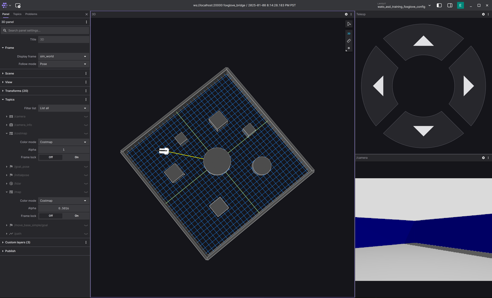
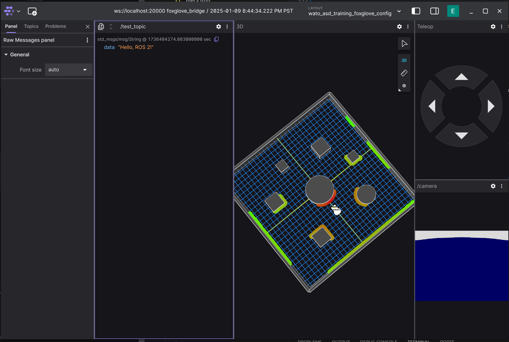
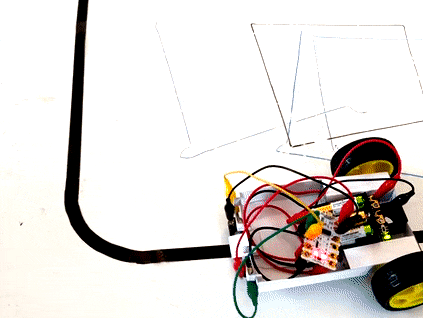
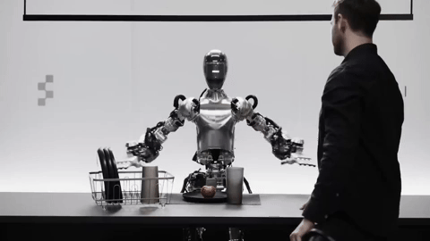
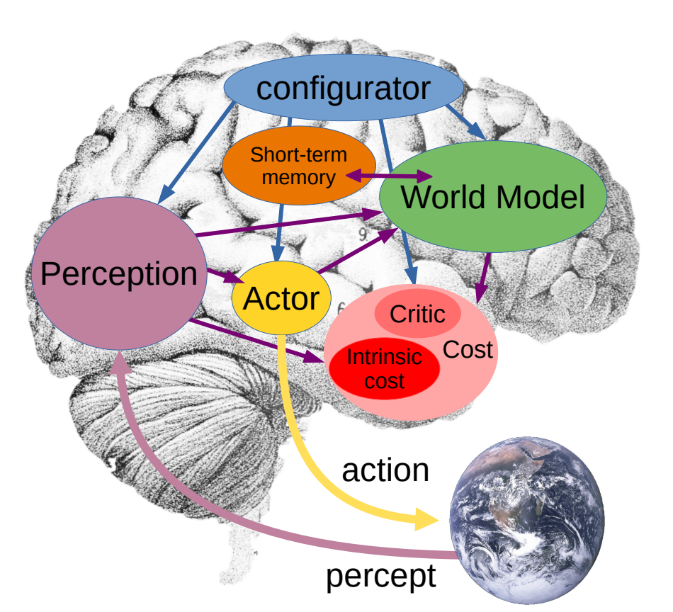
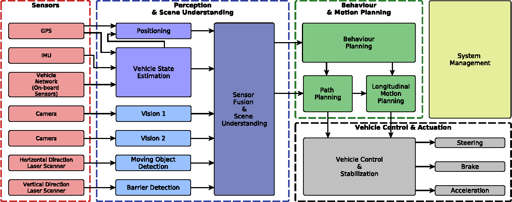
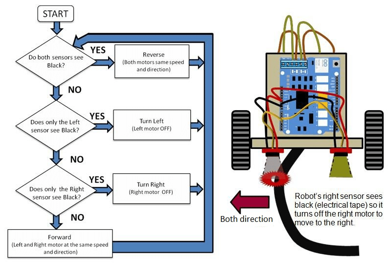

import { Callout } from 'nextra/components'
import { Steps } from 'nextra/components'

# ASD Admission Assignment

The ASD Admission Assignment seeks to teach you all the relevant software tools and robotics knowledge you'll need for your future career in state-of-the-art robotics.

<Callout type="warning" emoji="️⚠️">
  This assignment can be a bit daunting, but we promise that with grit, you can complete this assignment regardless of your current capabilities. Feel free to ask any questions on Discord.
</Callout>

## Rules

1. If you finished the assignment (or the deadline has been reached), submit a link to your code on github plus video proof to the `assignment-completions` discord channel.
2. **You're allowed to work in groups of 3.** Be sure to credit your group members in the submission. You can look for group members in the `assignment-groups` discord channel.
3. You are allowed to use AI tools such as LLMs.
4. You are allowed to look at the answer. If you know how to find it. We'll know if you used the answer though ;)

<Callout type="error" emoji="️‼️">
  **Why so many loopholes?** It's because we aren't testing you. It's to give you a chance to really hold yourself accountable, and explore the interesting world of robotics. Sure you can copy your way through, but what's the point? Are you really becoming a better you by doing that? Do you care more about your own personal growth or more about superficially showing yourself off? 
</Callout>

## Goal of the Assignment
In this assignment, you are tasked with giving a simulated robot the intelligence to navigate from point-to-point while avoiding static objects. The robot is [differential drive](https://en.wikipedia.org/wiki/Differential_wheeled_robot) and has a camera and laser scanner.

<iframe
    className="pt-4 w-full aspect-video"
    src={`https://www.youtube.com/embed/bLf8vFsxAJ0`}
    title="YouTube Video"
    frameBorder="0"
    allow="accelerometer; autoplay; clipboard-write; encrypted-media; gyroscope; picture-in-picture"
></iframe>

The code you will write, and the libraries you will use, are industry-standard. That means you will be writing code that could be transferable to companies you will be working for in the future! Here's a non-exhaustive list:

- [Nvidia](https://developer.nvidia.com/isaac/ros)
- [Google (Intrinsic)](https://www.intrinsic.ai/)
- [Amazon (Amazon Robotics)](https://amazon.jobs/content/en/teams/ftr/amazon-robotics)
- [Tesla](https://www.tesla.com/AI)
- ... and MANY robotics startups

Of course, we cannot cover everything. So feel free to use this assignment as a good starting point to get into the world of robotics. :)

## Getting Started

### Prerequisites
We recommend you refresh your knowledge of the following before beginning the assignment:
- [GitHub and git](https://docs.github.com/en/get-started/start-your-journey/hello-world)
- [navigating the terminal](https://www.redhat.com/en/blog/navigating-filesystem-linux-terminal)
- [C++ and Python](https://leetcode.com/) (You will be using C++ for this assignment because it is easier to learn rclpy coming from rclcpp)
- Concurrent Programming and Interprocess Communication

### Setup
The ASD Admission Assignment is compatible with Linux, Windows ([WSL](https://learn.microsoft.com/en-us/windows/wsl/install)), and MacOS. We utilize [docker](https://docs.docker.com/get-started/docker-overview/) for ease of reproducibility and deployability, so you'll barely need to install anything on your own computer to make this assignment work!

In the terminal:
1. [Download Docker Engine (or Docker Desktop if you have no choice)](https://docs.docker.com/engine/install/ubuntu/#install-using-the-repository)
2. Clone the WATonomous ASD Admissions Assignment
```bash
git clone git@github.com:WATonomous/wato_asd_training.git
```
3. You're ready to begin!

## Warm Up: How to use the Repository
The ASD Assignment utilizes our custom-built [Monorepo Infrastructure](../autonomous_software_general/monorepo_infrastructure). It is a Docker Compose wrapper that orchestrates various concurrent programs together. It also lets us build code, setup VScode Intellisense, and deploy to robots.

In this warm up, you will learn how to use the infrastructure. More specifically, how to open Foxglove to visualize data, make changes to the code, build the code, and witness your changes on Foxglove. We highly recommend you reference the [Monorepo Infrastructure Docs](../autonomous_software_general/monorepo_infrastructure) while you go through this warm up and the rest of the assignment.

### First Encounter with Foxglove
**1. Set your `watod-config.sh` to run `robot`, `gazebo`, and `vis_tools` as the active modules.**
```bash
ACTIVE_MODULES="robot gazebo vis_tools"
```
**2. Build these module images**
```bash
./watod build
```
**3. Up the module containers**
```bash
./watod up
```
**4. Figure out your Foxglove URL**
- If you are developing locally, this can be found in the logs after you run `./watod up`, it should look like something along the lines of `https://localhost:#####`
- If you are developing on watcloud, it should act the same as deving locally. If not, check that the port is being forwarded by looking at the `PORTS` tab in VScode
**5. Open up [Foxglove](https://foxglove.dev/ros) (web app or desktop app). Click **Open Connection** and enter the URL you found previously. The Foxglove dashboard should open.**
**6. Import the pre-made Foxglove layout located in `config/wato_asd_training_foxglove_config.json` into the Foxglove Dashboard.**
- You should see the following:



You can move the robot around using the Teleop Panel.

### Coding the Robot and Propagating the change into Foxglove
This section will get you to integrate a simple publisher node using one of the empty packages located in the `src` directory. Later on, we will give you a rundown on what you are actually writing.

**0. Get Intellisense working. This will give you code completion on VScode.**
```bash
./watod --setup-dev-env robot
```


**1. In `src/robot/costmap/include/costmap_node.hpp` place the following code**
```cpp
#ifndef COSTMAP_NODE_HPP_
#define COSTMAP_NODE_HPP_

#include "rclcpp/rclcpp.hpp"
#include "std_msgs/msg/string.hpp"

#include "costmap_core.hpp"

class CostmapNode : public rclcpp::Node {
  public:
    CostmapNode();
    
    // Place callback function here
    void publishMessage();

  private:
    robot::CostmapCore costmap_;
    // Place these constructs here
    rclcpp::Publisher<std_msgs::msg::String>::SharedPtr string_pub_;
    rclcpp::TimerBase::SharedPtr timer_;
};

#endif 
```

**2. In `src/robot/costmap/src/costmap_node.cpp` place the following code**
```cpp
#include <chrono>
#include <memory>

#include "costmap_node.hpp"

CostmapNode::CostmapNode() : Node("costmap"), costmap_(robot::CostmapCore(this->get_logger())) {
  // Initialize the constructs and their parameters
  string_pub_ = this->create_publisher<std_msgs::msg::String>("/test_topic", 10);
  timer_ = this->create_wall_timer(std::chrono::milliseconds(500), std::bind(&CostmapNode::publishMessage, this));
}

// Define the timer to publish a message every 500ms
void CostmapNode::publishMessage() {
  auto message = std_msgs::msg::String();
  message.data = "Hello, ROS 2!";
  RCLCPP_INFO(this->get_logger(), "Publishing: '%s'", message.data.c_str());
  string_pub_->publish(message);
}

int main(int argc, char ** argv)
{
  rclcpp::init(argc, argv);
  rclcpp::spin(std::make_shared<CostmapNode>());
  rclcpp::shutdown();
  return 0;
}
```

**3. Because you added a new ROS2 libary `std_msgs`, you need to instruct ROS2's package manager to install and compile with `std_msgs`**
- In `src/robot/costmap/package.xml` add in the following:
```xml
<?xml version="1.0"?>
<package format="3">
  <name>costmap</name>
  <version>0.0.0</version>
  <description>A sample ROS package for pubsub communication</description>

  <maintainer email="oleather@watonomous.ca">Owen Leather</maintainer>
  <license>Apache2.0</license>

  <!--https://www.ros.org/reps/rep-0149.html#dependency-tags-->
  <buildtool_depend>ament_cmake</buildtool_depend>
  <depend>rclcpp</depend>

  <!--YOU ARE ADDING THIS MAINLY-->
  <depend>std_msgs</depend>

  <test_depend>ament_lint_auto</test_depend>
  <test_depend>ament_lint_common</test_depend>
  <test_depend>ament_cmake_gtest</test_depend>

  <!--https://www.ros.org/reps/rep-0149.html#export-->
  <export>
    <build_type>ament_cmake</build_type>
  </export>
</package>
```
This is telling the ROS2 pacakge manager to install the `std_msgs` library.
- In `src/robot/costmap/CMakeLists.txt` add in the following:
```cmake
cmake_minimum_required(VERSION 3.10)
project(costmap)

# Set compiler to use C++ 17 standard
if(NOT CMAKE_CXX_STANDARD)
  set(CMAKE_CXX_STANDARD 17)
endif()

if(CMAKE_COMPILER_IS_GNUCXX OR CMAKE_CXX_COMPILER_ID MATCHES "Clang")
  add_compile_options(-Wall -Wextra -Wpedantic)
endif()

# Search for dependencies required for building this package
find_package(ament_cmake REQUIRED) # ROS2 build tool
find_package(rclcpp REQUIRED)      # ROS2 C++ package
find_package(std_msgs REQUIRED)    # YOU ARE ONLY ADDING THIS TO THE FILE

# Compiles source files into a library
# A library is not executed, instead other executables can link
# against it to access defined methods and classes.
# We build a library so that the methods defined can be used by
# both the unit test and ROS2 node executables.
add_library(costmap_lib
  src/costmap_core.cpp)
# Indicate to compiler where to search for header files
target_include_directories(costmap_lib
  PUBLIC include)
# Add ROS2 dependencies required by package
ament_target_dependencies(costmap_lib 
  rclcpp
  std_msgs # YOU ARE ONLY ADDING THIS TO THE FILE
)

# Create ROS2 node executable from source files
add_executable(costmap_node src/costmap_node.cpp)
# Link to the previously built library to access costmap classes and methods
target_link_libraries(costmap_node costmap_lib)

# Copy executable to installation location
install(TARGETS
  costmap_node
  DESTINATION lib/${PROJECT_NAME})

# Copy launch and config files to installation location
install(DIRECTORY
  config
  DESTINATION share/${PROJECT_NAME})

ament_package()
```
This is telling ROS2 compiler that you need `std_msgs` to compile the code.

**4. Rebuild and Rerun the robot**
```bash
# In a separate terminal while the other modules are running
./watod down robot # shuts down the robot service
./watod build robot # rebuilds the robot service
./watod up robot # starts the robot service up again
```
You can also just down, build, and up the whole thing. But this will eat up precious time.

**5. View your changes on Foxglove**
- Create a new panel that views raw messages, enter `/test_topic` as the topic you want to view
- You should see something like the following:



Congratulations! You now know how to make a code change and have it propagate into Foxglove!

## What did I just Write?
From the last example, you were probably thinking, "What the hell did I just write?" Well, you just wrote C++ code using the [ROS2 Humble](https://docs.ros.org/en/humble/index.html) library! ROS2 is a powerful toolset of C++/Python libraries, build utilities, orchestration managers, logging tools, and visualization software used by the open-source robotics community. ROS originally spawned in the Bay Area as a way to mitigate "reinventing the wheel" of robotics infrastructure. Nowadays, it is used by a plethora of startups, and its repository has be forked many times for companies such as Cruise and Zoox. Currently, the maintainers of ROS were aquired by Google as a political play. You can learn more about the history of ROS [here](https://www.theconstruct.ai/history-ros/).

So how do you use ROS? Learning ROS (and robotics programming in general) takes time. As you make more mistakes, you will get a better understanding of it. For now, we will only go over some basic aspects of ROS that are expecially relevant to this assignment.

<Callout type="warning" emoji="️⚠️">
  I use ROS and ROS2 interchangeably. But keep in mind that they are two different libraries that you download separately. That being said, there is a lot that is similar between them.
</Callout>

### ROS Messages and Topics
ROS at its core is a framework for interprocess communication. Given two processes running, how do you make them communicate with each other? Especially when one process requires the output of another.

The way ROS does this is through passing messages over a transport protocol such as UDP or TCP. In simpler terms, it is packaging data into a format that can be passed throughout your computer's internal network, at which point another program can then read that pacakged data, unpack it, and use it for processing.

ROS communication involves two things: topics, and messages. A message is an arbitary data structure (an integer, or struct of multiple objects) that is used to represent the data that two or more processes will read and write. In ROS, there are a ton of prebuilt messages that can be used for your robotics project. We often don't need to create our own custom messages, but when we do, we have to build messages using ROS's build tools. You can think of messages as nothing more than the data that is to be sent between processes.

As a result, another question arises: How do we manage where to read and write messages? For example, if two processes are publishing the same message type, then how can we differentiate between a message coming from one process vs coming from the other process? Well that is where **topics** become important. ROS topics represent the medium in which messages should be passed through. You can think of them as URLs to a website. It you specify one URL in you browser, then you will get all the information available in that URL (the website itself) Topics functions very similarly. You can specify the topic a process can read/write to, and ROS fill figure out all of the networking jargon in the background. 

You read more about it [here](https://industrial-training-master.readthedocs.io/en/melodic/_source/session1/Topics-and-Messages.html#:~:text=The%20first%20type%20of%20ROS,messages%20on%20that%20same%20topic.)

### ROS Publishers and Subscribers
ROS utilizes these topics and messages with simple callable objects in C++ and Python. If you want to send messages out to a topic, use a publisher. Likewise, if you want to listen for messages in a topic, use a subscriber. The syntax for writing a publisher and subscriber can be found [here](https://docs.ros.org/en/foxy/Tutorials/Beginner-Client-Libraries/Writing-A-Simple-Cpp-Publisher-And-Subscriber.html)

<Callout type="warning" emoji="️⚠️">
  In this assignment, you will have to split your code into a C++ header file and a regular C++ file. You can ask LLNs how to do this :).
</Callout>

In the warmup, we made you write a simple publisher. Please use the warmup code as a reference to how your ROS code should fit into the assignment's code format (as in what should be in the `.hpp` file and what should be in the `.cpp` file).

Unfortunately, the only way to truly understand ROS is to read their docs and use it. If you have any questions when programming ROS, please ask them in our Discord.

## How to Code Intelligence

Now that you've gotten into the swing of things, let's take a step back and take a look at the field of robotics as a whole. 

A reoccuring question roboticists often have is:

> "How do we make robots think?"

This question scales with the complexity of the robot. For a line following robot, this could be extremely easy: the robot simply needs to turn slightly left or right depending on where the line is. However, for something as complex as a humanoid robot, the question becomes alot more daunting.

Line Follower Robot             |  Humanoid Robot
:-------------------------:|:-------------------------:
 | 

As you progress through your career in robotics, you will witness a multitude of robotics systems. Some that can be built by 5 people, others that have to be built by 100+ people (but actually only really written by like 5 people).

However, all robotic systems seek to do one thing: **mimic aspects of the human brain to achieve a desired goal**. Of course, sometimes it's to mimic human cognition entirely, but for most applications of robotics, there is a economical usecase that needs to be fulfilled.

In fact, every roboticist falls somewhere along a spectrum. At one end are the dreamers—a visionary group almost cult-like in their pursuit of playing god, driven by the singular ambition to create artificial general intelligence. At the other end are the pessimists—pragmatic, sometimes cynical individuals who see robots as little more than tools, focused solely on their limitations and building them only for profit.

You decide where you want to be. But nevertheless, let's not start you off pessimistic.

### A Simple Model of the Human Brain
Human intelligence is a fascinating thing. Somehow this glob of flesh in your head is capable of controlling your every move, imagining the impossible, and deciphering the complexities of the universe. However, your mind has limitations, and all brains are not perfectly unique. In fact, every human brain shares a common set of modules. For example, it is the reason why we can translate languages. Noam Chomsky, a founding figure of linguistics, hypothesized that we as humans share an innate language faculty. That all of our brains have an innate structure responsible for communication. These limitations are what we use to understand the brain, and with that we can spawn hypotheses on how we think.

#### Here's a good guess (it's very limited, but it's good enough for most roboticists):



Generally, we as humans do the following:
- **Perception:** Identify, organize, and interpret information from our five senses. 
- **World Modeling:** Utilize and contextualize what we perceive to build an inner model of the world. We also build higher-order attributes on these percepts for the sake of reasoning and predicting possible future states of the world.
- **Memory:** Store our models of the world, our actions, and their resulting consequences, for the sake of optimizing future actions.
- **Configuration:** Decides what we should pay attention to. This part of our brain takes in input from all the other parts and configures them to perform the task at hand.
- **Action:** Plans and executes our desired actions based on the task at hand. This ranges from long-term planning down to distinct movements in your muscles.

Let's describe your brain at this very moment... Right now your brain is perceiving and identifying your surroundings. Your eyes recognize the computer screen in front of you, a desk, a wall, perhaps a keyboard and mouse. At the same time, you also understand that the desk or computer screen in front of you is the same desk and computer screen you saw 2 seconds ago. That is your perception. 

After that, your brain stitches what it senses into a inner model of the world. You know that the computer screen in front of you is on top of the desk you are working on. It is the same reason why you still roughly know the structure of the room around you when you close your eyes. This inner world model is also used to draw connection and implications. For example, you know that a computer screen normally doesn't move on its own. These sorts of implications allow our brains to predict possible future states of the world. 

Based on all the information your brain has grabbed so far, you can then go on to decide what you want to pay attention to. For example, your mind is probably focused on finishing this assignment. Therefore, you configured your mind to be in a state that can finish coding assignments. 

Finally, now that you know as much as you can about the world, and what you want to do, you now plan you course of action. In order to finish your coding assignment, you know that you need to stay seated at your desk, and your hands ready to type. You brain converts these planned intentions into primitive motor movements such as moving the muscles in your fingures and your eyes.

Once you know the results of your actions, your brain stores those results in your memory. You can then use past results to further improve your future actions.

### How does the Brain Tie into Robotics?
**Every robotics system can be thought of in the context of the modules explained above.** No matter how simple or complex the robot is, its inner software system generally follows a flow of information similar to our simplified model of the brain.



> This is a random AV architecture we pulled from online. Usually software architectures are grouped differently by pretty much everyone. Try connecting its various modules to our simple model of the human brain.

**Take an autonomous vehicle for example.** It's perception modules are its sensors (camera, radar, lidar, sonar, etc.). Its world model is a highly detailed map of the road (including lanes, traffic signs, lights, etc. This is known as an HD Map). The car also uses its world model to predict the future paths of people and cars around it. Its configurator is its behaviour tree, which is a more complex state machine that defines what the robot should do based on the current state its in. Finally, its action is the various levels of planning: Global Planning, Local Planning, and Control sequences to steer the vehicle and control its throttle.



**Something more simple can be a line follower robot.** This robot's perception is a single sensor that tracks where the line is. Its world model is very limited, as it only needs to know where it is with respect to the line. Likewise, its configuration is sparse because its sole purpose is to follow a line. Finally, its action module just moves the left of right wheel faster based on where the line is with respect to the robot. Overall, you should be noticing a pattern here. We can view any robot through the lens of a simplified model of the human brain.

## Time to Finish your Assignment

In this assignment, you are given a simulation of a robot with a laserscanner and a camera. Because the laser scanner gives us a very good understanding of how far hard objects are away from us, we will only the laser scanner for this assignment. The goal of the robot is to move to a point specified by the user. Note, to make the assignment easier, we have already given you the constant position of the robot with respect to the map. This is represented by an `Odometry` message present in the `/odom/filtered` topic.


<Callout type="warning" emoji="️⚠️">
  **Think back to the previous section:** if you were the robot in that simulation, and all you knew was how to control yourself, where your goal position was, and how far dangerous things are from you, then how would you plan to get to that point?
</Callout>

From before, you know that this robot will need the following high-level modules: perception, world modeling, memory, configuration, and action. With time, you will learn to associate different algorithms to different modules, but for now, we will just tell you a good sequence of modules that can solve the assignment. **FEEL FREE TO TRY DIFFERENT APPROACHES.**

### A Simple Navigation Architecture
Below is a diagram of a simple navigation architecture that can be used to help the robot navigate from point A to point B.


Here is a description of each node:
- Costmap: A ROSnode that takes in LaserScans from the `/lidar` topic, and converts them into a costmap. This is a discretized grid of squares that represent the chances as object exists in that grid with an arbitrary score.
- Map Memory: A ROSnode that take in the costmaps overtime and stitches them together to form a global map.
- Planner: A ROSnode that takes in the global map and use the A* algorithm to plan how to get from point A to point B. 
- Control: A ROSnode that takes in the path from the planner and does Pure Pursuit control to physically move the robot along that path.

With these four nodes, you can make the robot navigate to anywhere in the map!

## Implementation Details
This section will be details on how to program each node. You can use this section as a reference for your own code, and as a foundation for where to get started.

### Costmap

### Map Memory

### Planner

### Control

## Helpful Tips

## Final Remarks
Congratulations! You have just achieved basic navigation in a static environment. You can now submit your assignment to the Discord, and use your newfound expertise to code REAL robots!!

Now that you've built a simple navigation system, it's time to open your mind:
- How can we change this software system to account for other sensors such as cameras, radars, and sonars?
- If we weren't directly given the robot's position with respect to the map, then how would we localize the robot? In other words, how do we make the robot know where it is?
- What if we wanted the robot to do more complex decision making? What if its goal was more than just going from one point to another?
- How can we change this algorithm to account for moving obstacles?
- What if the robot wasn't differential drive? What if it was two separate carts connected to each other at a pivot point?

All of these are probing questions that should get you excited about the limitless potential of robotics. You have just learned how to code a robot. Your future is bright :).

Whether you used this assignment to get in WATonomous, or you used it for your personal growth, we wish you luck in your future career. :D