import { Callout } from 'nextra/components'
import Checklist from '../../components/checklist'

# Humanoid Electrical Admission Assignment — Altium Onboarding: Your First PCB

**WATonomous Humanoid**
**Electrical Onboarding Project**

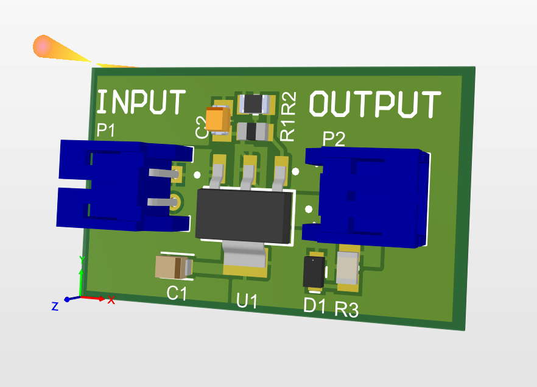

This project is how you learn our tools and our review process. You will design a small board end to end, then submit it for review before you are put on a real subsystem.
Everything you need is either in this document or in the LM1117 datasheet. Where this document tells you to calculate or find something, do that yourself first. Hints are linked but kept out of the main flow on purpose.

<Callout type="warning" emoji="️⚠️">
  **Do not copy the screenshots.** The screenshots in this document show the tool, not a correct answer. Some of them contain genuine mistakes in the schematic, and they are not always of the exact part you are building. Use them to find the buttons and understand the workflow. Work out the actual design from the datasheet and the tasks, and if a screenshot disagrees with the datasheet, the datasheet wins.
</Callout>

## 1. Problem Statement

Design a 2-layer PCB that takes 5 V in and produces a regulated 3.3 V out, using the LM1117-ADJ in a SOT-223 package.

Requirements:
- Input connector for the 5 V rail
- Output connector for the 3.3 V rail
- Red indicator LED on the 3.3 V rail
- Input and output capacitors per the datasheet's requirements
- Feedback resistor divider that sets the output to 3.3 V
- Design point: 500 mA continuous load
- 2 layers, 1 oz copper, hand-solderable parts only

That is roughly nine components. The engineering is in the details: choosing parts that exist, reading the regulator's requirements correctly, and handling the heat it produces.

Nothing here gets physically built. We are not sending these boards to a fab, so you will not be soldering or testing hardware at the end of this. The point is the design work and the review, and your submission is checked as a set of files. That does not lower the bar. A board that would not survive fabrication is still a board that fails review.

| Field | Detail |
| --- | --- |
| **Time budget** | 6–10 hours over a week. It is possible to finish in one sitting but isn't recommended. |
| **Deliverable** | Gerbers, NC drill files, BOM, schematic PDF, and a short README containing: Your full name, uwaterloo.ca email id, and any design decisions you want to highlight/discuss. |
| **Submission** | Post in #humanoid-onboarding on Discord (Section 8). |
| **Questions** | Post in #onboarding-help on Discord. |
| **Fabrication** | None. These boards are not being manufactured. We review your submission only. |

## 2. Setup

### 2.1 Altium license

Use the University of Waterloo student license. Waterloo Engineering provides Altium Designer to enrolled students at no cost.

1. Visit [Altium 365 login](https://365.altium.com/signup) and register/create your account using your uwaterloo email.
2. Then visit [Altium education](https://www.altium.com/education/students) to request a license for your Altium account. Follow the steps given on the page, the waiting might take ~30 minutes so don't panic.
3. Install [Altium Designer](https://www.altium.com/products/downloads) and sign in with the account tied to that license.

   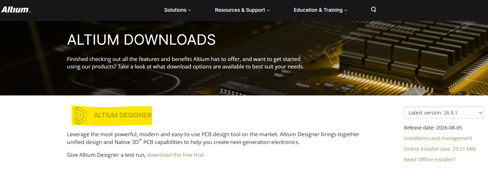

4. Altium only works natively on Windows (x86) systems. For MacOS (apple silicon), ARM, Snapdragon, Linux, you would need to either dual boot your system or run a translation layer for your work. VM's and virtualization is only possible for intel based Macbooks.
5. Open your new install of Altium designer. From the top right hand corner of the window, login with your Altium account credentials, click again once logged in and select "**Licenses**"

   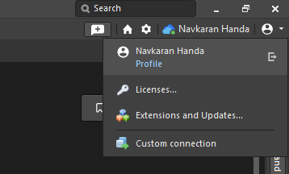

6. Opening the license management page, you should be able to see your student license and "Activate" it.

<Callout type="warning" emoji="️⚠️">
  **Do not install a cracked copy.** Cracked installs cannot be reviewed or manufactured through our pipeline, and you will redo the work. If you have trouble getting a license, post in #onboarding-help.
</Callout>

### 2.2 Project location

**Create this as a standalone project.** Do not put it on anything on the WATonomous workspace (for now). A shared team workspace is being set up and instructions will be added to this document later. For now everything lives on your own machine.
Set up a folder before you start (you can choose whatever as the location since the deliverables stay the same):

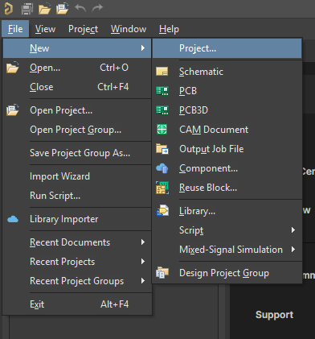

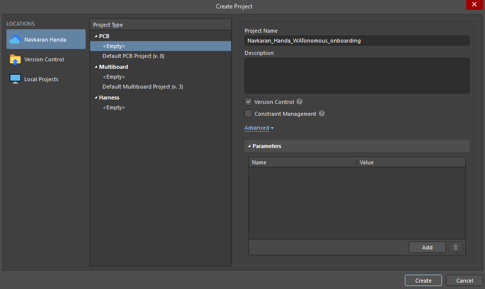

Once you have the project created, add the following files

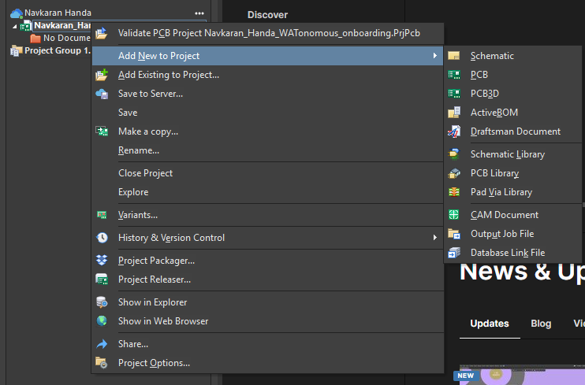

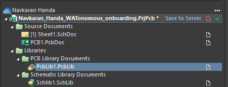

If you save locally, do not save into a folder that OneDrive is actively syncing. Sync conflicts corrupt Altium binary files.
If you're saving on your workspace, remember to click the "Save to Server" button, otherwise changes wont reflect.

### 2.3 Discord

| **Channel** | **Use it for** |
| --- | --- |
| #onboarding-help | Questions. Create a post so the thread stays readable and others can search it. |
| #humanoid-onboarding | Your final submission message when the project is complete. |

Ask early and as often as required.

## 3. Altium Essentials

The project moves through one pipeline: source your parts, capture the schematic, lay out the PCB, route and pour copper, then generate outputs and submit. Each section in this document covers one stage in that order, so if you are ever unsure where you are, this is the shape of the whole thing.

A handful of terms come up before this document defines them properly. Quick reference:

| **Term** | **Meaning** |
| --- | --- |
| Designator | The label identifying one component on the schematic and PCB, such as R1, C1, or U1. R for resistor, C for capacitor, U for IC, and so on. |
| Footprint | The physical copper pad pattern a component solders onto. Covered fully in Section 3.2. |
| Courtyard | The keep-out boundary drawn around a footprint marking the space the physical part occupies, so neighbouring parts don't collide. |
| Silkscreen | The printed layer showing designators, outlines, and text on the finished board. Purely for humans, not manufactured as copper. |
| NRND | Not Recommended for New Designs. A lifecycle flag on a supplier listing meaning the part is being phased out. Avoid it. |
| ECO | Engineering Change Order. The dialog Altium shows when pushing schematic changes into the PCB, listing everything about to change before you confirm it. |

### 3.1 Schematic vs. PCB

**Schematic** = what connects to what. Position is meaningless. Only connectivity matters.
**PCB** = where things physically sit and how copper gets between them. Millimetres matter.

The schematic is the source of truth. Push changes into the PCB with Design → Update PCB Document (D, U). Never fix a wiring error directly in the PCB. Fix the schematic and re-push. If you skip this step after editing the schematic, your PCB does not update itself and quietly stops matching what you drew. Nothing warns you at the time, and it only surfaces later as parts that will not connect the way you expect.

### 3.2 What a component is

In Altium a component is three things bundled together. All three must agree or your board is wrong.

| **Piece** | **What it is** | **Where it lives** |
| --- | --- | --- |
| Symbol | The schematic drawing, carrying numbered pins. Pin numbers are what matter electrically. Pin names are for humans. | Schematic Library (.SchLib) |
| Footprint | The physical copper pads, silkscreen outline, and courtyard the part solders onto. Each pad has a designator. | PCB Library (.PcbLib) |
| Parameters | Value, tolerance, voltage rating, manufacturer part number, supplier part number. Feeds the BOM. | Component properties |

Symbol pin 3 maps to footprint pad 3. If the numbering disagrees between them, nothing in Altium will warn you and the board will be wired incorrectly.

### 3.3 Shortcuts

Altium menus are hierarchical, so many shortcuts are sequences: P then W means press P, release, press W.

#### Both editors

| **Key** | **Action** |
| --- | --- |
| Tab | Properties of the object you are currently placing |
| Spacebar | Rotate 90° while placing or moving |
| Shift + Spacebar | Rotate clockwise (SCH) / cycle corner style (PCB) |
| X / Y | Mirror the object being placed |
| Q | Toggle mm / mils |
| Esc | Cancel current command |
| Ctrl + Scroll | Zoom (plain scroll pans vertically) |
| Ctrl + M | Measure distance |

#### Schematic

| **Key** | **Action** |
| --- | --- |
| P, P | Place Part |
| P, W  /  Ctrl + W | Place Wire |
| P, N | Place Net Label |
| P, O, P | Place Power Port (GND, VCC) |
| P, V, N | Place No-ERC directive |
| T, A, A | Annotate (auto-assign designators) |
| D, U | Update PCB Document |

#### PCB

| **Key** | **Action** |
| --- | --- |
| 2 / 3 | 2D / 3D view |
| L | View Configuration panel (layers, colours) |
| Shift + S | Single Layer Mode |
| Ctrl + W  /  P, T | Interactive Routing |
| * (numpad) | Switch signal layer while routing, auto-places a via |
| P, G | Place Polygon Pour |
| P, L | Place Line (board outline) |
| G | Cycle snap grid |
| D, R | Design Rules |
| D, K | Layer Stack Manager |
| T, D, R | Design Rule Check |

<Callout type="warning" emoji="️⚠️">
  **L while dragging a component flips it to the bottom layer.** If a part suddenly reads backwards, that is what happened. Undo.
</Callout>

## 4. Sourcing Your Components

You need to be on top of component sourcing, if you design with the ECAD of a component that is not in stock/depreciated, that will cause a lot of redoing of your design.

**DigiKey, mouser, Newark etc. →** Distributors holding real inventory. Use its parametric filters to narrow to parts that exist.
**Octopart** (octopart.com) → searches across distributors. Use it to check stock elsewhere and confirm lifecycle status.

### 4.1 Filters to set

Set these on DigiKey for each part type. Always include In Stock.

| **Part** | **Filters** |
| --- | --- |
| Regulator (U1) | Search for the LM1117-ADJ, Category: Voltage Regulators - LDO regulators. Filter for: (1) Voltage - Input (Max) = 15V, (2) Voltage - Output (Min/Fixed) = 1.25V — the ADJ part has no fixed output, so this is its reference voltage and the output is set by your external divider, (3) Supplier Device Package = SOT-223. You should land on [this component](https://www.digikey.ca/en/products/detail/texas-instruments/LM1117MP-ADJ-NOPB/364774). This is the only exact component we want for this onboarding. You can choose the rest of the passives yourself. |
| Capacitors | Category: Ceramic Capacitors (or Tantalum, if the datasheet requires it). Package 0805. Dielectric X5R or X7R. Voltage rating: see task below. |
| Resistor (R1) | Category: Chip Resistor - Surface Mount. Package 0805, power ≥ 1/8 W, tolerance 1%. |
| LED (D1) | Category: LED Indication - Discrete. Package 0805, colour red. |
| Headers (J1, J2) | Category: Rectangular Connectors - Headers. 2 position, through-hole. |

#### Why 0805

SMD passives are sold in imperial size codes (length and width in hundredths of an inch). 0805 is about the size of a grain of rice: large enough to hand-solder with tweezers and a standard iron, small enough to be normal practice. Smaller codes like 0402 need magnification. Everything on this board is hand-assembled, so use 0805 throughout.

<Callout type="warning" emoji="️⚠️">
  **0603 imperial and 0603 metric are different sizes.** Metric 2012 = imperial 0805. A listing reading "0805 (2012 Metric)" is one size, not two. Confirm which system a page is using.
</Callout>

### 4.2 What to record

For every part, capture these before moving on. They go straight into your BOM.

| **Field** | **Why** |
| --- | --- |
| Manufacturer Part Number (MPN) | The globally unique identity of the part. A BOM without MPNs is not orderable. |
| DigiKey part number | So purchasing can paste it into a cart. |
| Package / case | Must match the footprint you place. |
| Unit price | Feeds the BOM total. |
| Datasheet URL | Save the PDF into Datasheets/. |
| Lifecycle status | Check on Octopart. Reject anything marked NRND or Obsolete. |

<Callout type="info" emoji="💡">
  **Task 4 — Select your parts**

  1. Choose an LM1117-ADJ in SOT-223 and record its MPN and datasheet URL.
  2. Work out the voltage rating your capacitors need. Ceramics lose capacitance under DC bias, so a part rated close to its operating voltage will not deliver its stated value. Pick a derating factor and be ready to justify it.
  3. Work out the capacitance and dielectric for each capacitor from the datasheet. Section 5 covers where to look.
  4. Calculate the LED series resistor value. You need the LED's forward voltage from its datasheet and a target current. Pick something sensible for an indicator rather than maximum brightness.
  5. Confirm every part is In Stock and not marked NRND.
</Callout>

[→ Hint 4 — capacitor derating and LED resistor](#hint-parts)

## 5. Reading the LM1117 Datasheet

Download the datasheet for the exact MPN you chose. Manufacturers differ, so use yours, not a generic one.
You are looking for five things. Do not skim past them, because the rest of this project depends on all five.

| **Look for** | **Section it is usually in** |
| --- | --- |
| Pinout, including what the tab connects to | Pin Configuration and Functions |
| Absolute maximum input voltage | Absolute Maximum Ratings |
| Dropout voltage at your load current | Electrical Characteristics |
| Required output capacitor type, value, and ESR range | Application Information |
| Thermal resistance θJA for SOT-223 | Thermal Information |

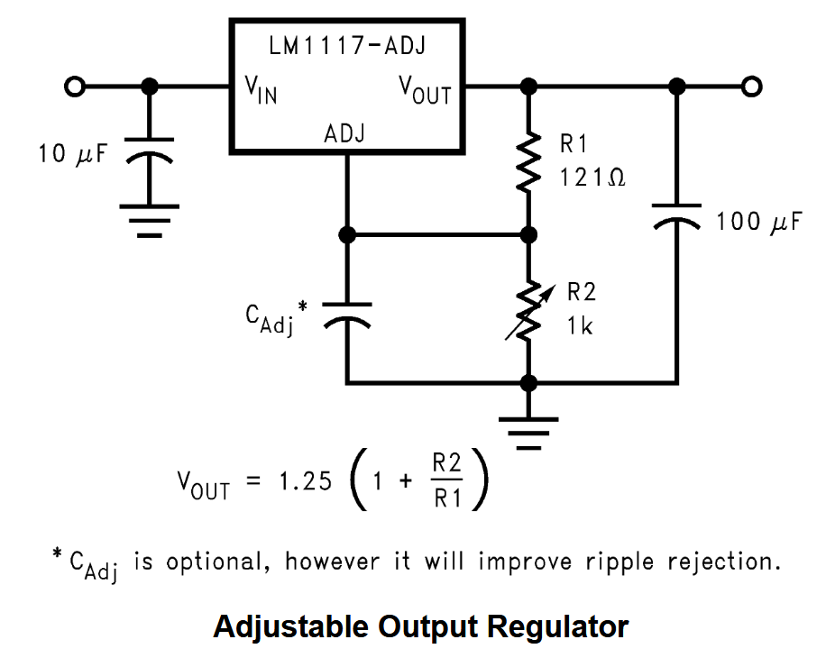

### 5.1 Pinout

**Determine what the SOT-223 tab is electrically connected to. Do not assume.** Tabbed regulator packages are not consistent across parts, and getting this wrong will short your output when you pour copper on it later. Write the answer down and check it again during layout.

You are using the adjustable part, so read the ADJ column of the pinout, not the fixed one. On the LM1117-ADJ, pin 1 is ADJ rather than GND, which means the package has no ground pin at all. Ground only reaches the regulator through the bottom of your feedback divider. The fixed versions assign pin 1 differently, so a pinout you half remember from another LM1117 will be wrong here.

[→ Hint 5.1 — the tab](#hint-tab)

#### Setting the output voltage

A fixed regulator decides its own output. An adjustable one does not. The LM1117-ADJ holds a constant reference voltage between its output pin and the ADJ pin. In practice that reference is just a fixed internal voltage the regulator always tries to maintain across those two pins, and you pick what the output becomes by choosing a resistor divider between the output, the ADJ pin, and ground.

<Callout type="info" emoji="💡">
  **Task 5.1 — Output divider**

  1. Find the reference voltage and the output voltage equation in the datasheet. The equation is given in Application Information, not in the parameter tables.
  2. Find the ADJ pin current in the Electrical Characteristics table and note whether the equation includes a term for it.
  3. Choose two resistors that give 3.3 V. Real resistors come in preferred series such as E96, so pick values that exist and check what output your chosen pair actually produces.
  4. Work out how far off 3.3 V you land using 1% resistors at their worst case tolerance, and decide whether that is acceptable for a rail feeding 3.3 V logic.
  5. Note what happens to the output if the divider is left disconnected or the ADJ pin floats. This tells you how careful to be with that net during layout.
</Callout>

[→ Hint 5.1b — the output divider](#hint-divider)

As a rough guardrail, if your calculated output lands more than about 3 to 5% away from 3.3 V, treat that as a sign to reconsider the resistor pair rather than accepting it and moving on.

### 5.2 Thermal

A linear regulator does not convert energy. It burns the difference between input and output as heat. Input current equals output current, so the power lost is the voltage drop times the load.

<Callout type="info" emoji="💡">
  **Task 5.2 — Thermal analysis**

  1. Write down the formula for power dissipated in a linear regulator, then calculate it for this board at the 500 mA design point.
  2. Calculate the efficiency. Note what it depends on, and what it does not.
  3. Find θJA for SOT-223 in the datasheet. Note how the value changes with attached copper area.
  4. Calculate the junction temperature at 500 mA in a 25 °C room, and again at 45 °C ambient for a part sitting inside an enclosure.
  5. Compare that against the maximum junction temperature in the datasheet. Decide how much copper area you need on the tab and record the number, because you will use it in Section 7.
</Callout>

[→ Hint 5.2 — thermal formulas](#hint-thermal)

### 5.3 Output capacitor

This regulator's feedback loop can oscillate if the output capacitor is wrong. The datasheet specifies what is acceptable, and it is more specific than just putting a capacitor there.

<Callout type="info" emoji="💡">
  **Task 5.3 — Capacitor requirements**

  1. Find the output capacitor requirement in Application Information. Record the minimum capacitance, the acceptable types, and any ESR limits.
  2. Decide what you will use for the output capacitor and write down the datasheet line that supports it. You will be asked for this in review.
  3. Decide what the remaining capacitors should be, and why each one is there.
</Callout>

[→ Hint 5.3 — ESR and why it matters](#hint-esr)

<Callout type="warning" emoji="️⚠️">
  **If you choose a tantalum, it is polarised.** Reverse-biasing a tantalum can destroy it violently. Check the polarity marker on the symbol, on the footprint, and on the physical part.
</Callout>

## 6. Adding a Part in Altium

Every part needs a symbol and a footprint before you can place it. There are two ways to get one. Use Manufacturer Part Search for everything on this board, and build the LM1117 by hand once as well so you understand what the search is doing for you.

### 6.1 Route A — Manufacturer Part Search

Everything you place on a schematic comes out of the Components panel. The Components panel only shows parts that already exist in your workspace library, so a brand new part will not be there. Manufacturer Part Search is how you add one.

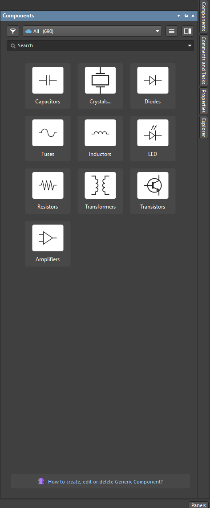

*The Components panel. This is what you place from, and it only lists parts already in your library.*

Open Manufacturer Part Search from View → Panels → Manufacturer Part Search, or from the Panels button at the bottom right. You can browse by category, but for this project you will search by part number.

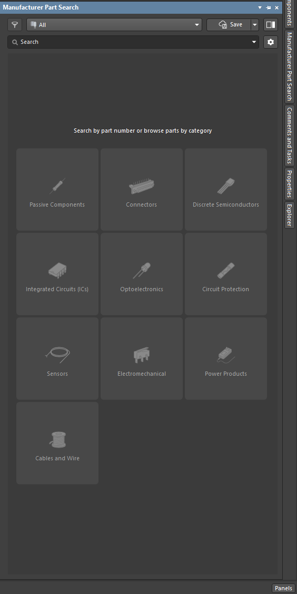

*Manufacturer Part Search. Browse by category, or search directly for a part number.*

#### Start on the supplier side

Do not start in Altium. Start at DigiKey, Octopart, Mouser, or whichever supplier you are sourcing from, and find the exact part you want. Copy the Manufacturer Product Number, not the DigiKey part number, because that is what Altium searches on.

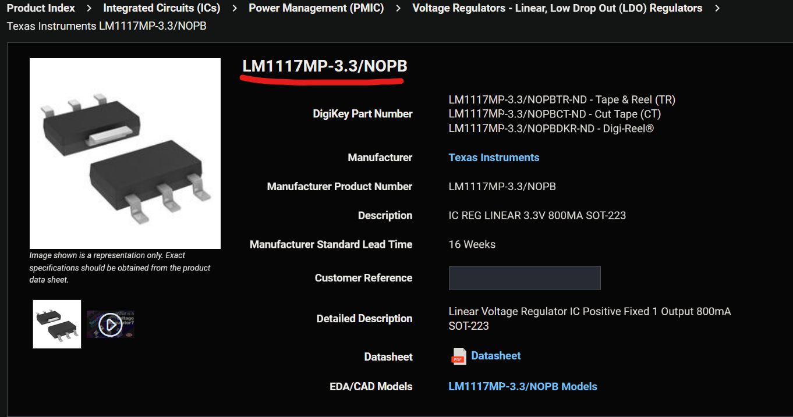

*The supplier page. Take the Manufacturer Product Number and keep this page open for cross referencing.*

Keep that page open. You are going to check Altium's data against it in a moment. Note that the screenshot above shows the fixed 3.3 V part, which is not what you are building. Your page should read LM1117MP-ADJ/NOPB.

#### Search and cross reference

1. Paste the manufacturer part number into the search field in Manufacturer Part Search and press Enter.

   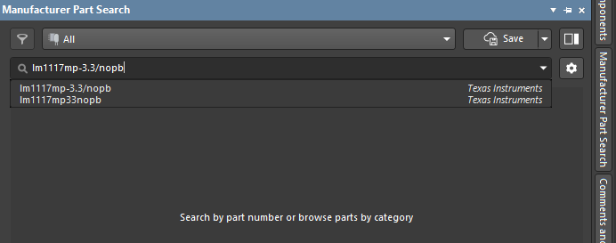

   *Searching by manufacturer part number. Altium suggests matches as you type.*

2. Look through the results. Several entries can share a similar part number, and some will be listed under a different manufacturer or as Uncategorized. Pick the row whose manufacturer and description match the supplier page you just came from.
3. Check the Details pane underneath. Compare Case/Package, manufacturer part number, and the key parameters against the supplier page. Scroll down to the Models section and look at the symbol and the 3D preview. Confirm the pin count and the package look right before you commit to it.
4. Once you are happy with it, click the cloud save button on the left of the result row. That is the button circled below.

   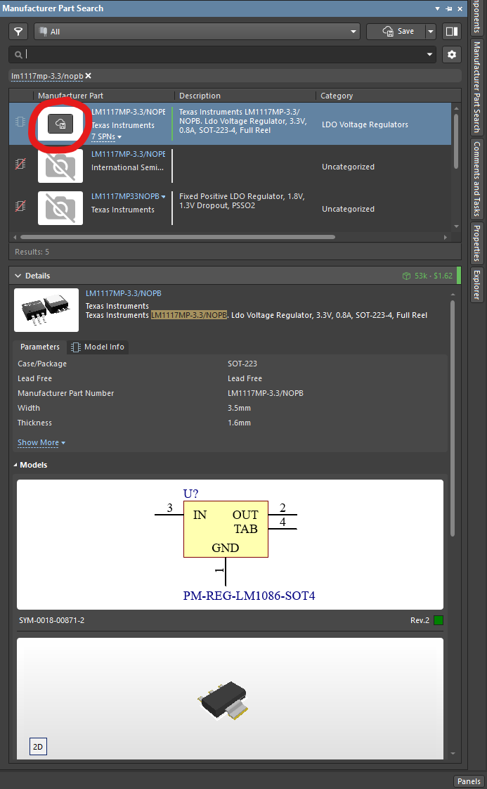

   *Results with the Details pane open. Cross reference the parameters and models against the supplier page, then click the cloud save button.*

<Callout type="info" emoji="💡">
  **Does cloud save work if my project is stored locally?**

  Yes. The cloud save puts the component into your personal Altium 365 Workspace library, which is a separate thing from where your project files live. You created that workspace in Section 2.1 when you signed up at 365.altium.com. Your project can stay on your own machine and still use workspace components, because Altium caches them locally for offline access. If you ever need a component without a workspace, the save drop-down also offers to download it as an Integrated Library Package zip instead.
</Callout>

#### Create the component

The cloud save button opens the Create new component dialog. This is where you choose which folder in your library the part lands in, so pick the right one. Everything is easier to find later if the categories are sensible.

**For the LM1117, choose Integrated Circuits → Power Supply.** Resistors, capacitors, LEDs and connectors each have their own top level entry.

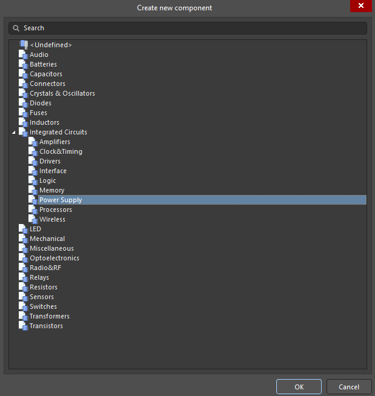

*Create new component. Pick the category the part belongs in, not just Undefined.*

Clicking OK opens the Use Component Data dialog, which asks which of the cloud data you actually want to keep. It has three tabs and you should go through all three.

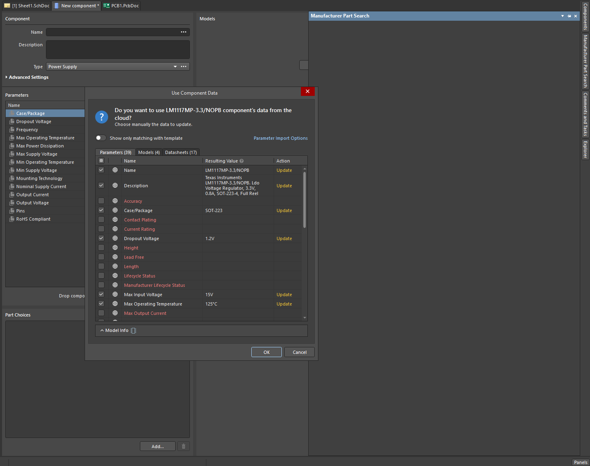

*Use Component Data. Work through Parameters, Models, and Datasheets before clicking OK.*

**Parameters.** Tick the ones worth keeping, such as Case/Package, Dropout Voltage, Max Input Voltage, Output Current, and Output Voltage. Leave out anything blank or irrelevant, because every parameter you accept ends up on the schematic and in the BOM.
**Models.** A part number often carries several footprint variants. These variants aren't different packages, they are different pad sizes depending on the compromise between ease of soldering and on-board space consumed. Check what is on offer, then keep the footprint that matches the package you are ordering. Check the sizing against the datasheet mechanical drawing.
**Datasheets.** This will often list fifteen or twenty entries mirrored across different distributors. Untick all but the one or two you actually need, normally the manufacturer's own. Leaving all of them attached bloats the component for no benefit.

#### Save it

1. Click OK. The component opens in the component editor with everything you selected.
2. Give it a sensible Name and Description if they are not already filled in, and check the Type field matches the category you picked.
3. **Delete any redundant datasheets** you missed in the dialog. They are listed at the bottom of the Parameters region.
4. Press Ctrl + S to save locally.
5. Click Save to Server next to the component entry in the Projects panel. Add a short release note in the Edit Revision dialog, something like "Initial addition of the LM1117/3.3v LDO from Manufacturer Part Search", then click OK.

   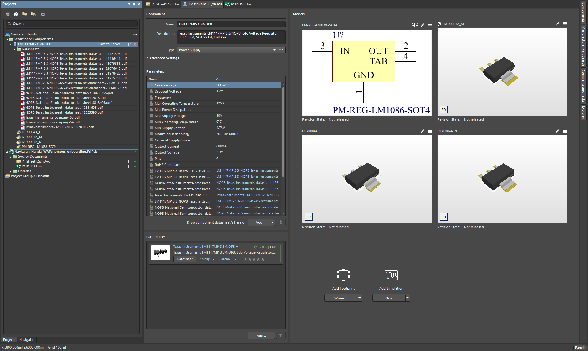

   *The component editor after saving. Save to Server appears next to the component entry in the Projects panel on the left.*

The part now appears in the Components panel and you can place it on the schematic. Repeat for every component on the board.

<Callout type="warning" emoji="️⚠️">
  **Manufacturer Part Search data is not automatically correct.** The symbol and footprint come from a shared database and they are wrong often enough to matter. Two failure modes come up most often: the footprint attached is for the wrong package variant, such as a similar part number with a different pin count or pitch, or the pad sizing does not match what the datasheet mechanical drawing actually specifies. Verify against the datasheet before you route anything. Section 6.3 lists exactly what to check.
</Callout>

### 6.2 Route B — Build it yourself

We do not recommend this process right now, since there is a higher margin of error and more work to perfect the sizing. This onboarding is easy enough where the manufacturer part search will suffice, however this is a good skill that you will need and learn throughout your work in the team.

#### Footprint

1. File → New → Library → PCB Library.
2. Tools → Footprint Wizard, choose SOT-223, and enter the dimensions from the datasheet's mechanical drawing. Use the recommended land pattern if the datasheet gives one.
3. Confirm three small pads numbered 1 to 3 on one side and the large tab pad on the other. Note which number the tab pad carries, because conventions vary.
4. Add a silkscreen outline on Top Overlay, outside the pads, with a pin-1 marker.
5. Edit → Set Reference → Center.

#### Symbol

1. File → New → Library → Schematic Library.
2. Draw a rectangle and place the pins. Set each pin's number and name to match the datasheet exactly.
3. Set each pin's electrical type, meaning Power, Input, Output, or Passive. The ERC uses this to catch mistakes.
4. In the symbol's properties, use Add → Footprint and link your PCB library footprint.
5. Add parameters for MPN, supplier part number, value, and description.

### 6.3 Verify every component

Do this for every part on the board, whether you downloaded it or built it.

<Checklist id="humanoid-electrical-component-verify" items={[
  "Footprint pad dimensions match the datasheet's mechanical drawing or recommended land pattern",
  "Symbol pin numbers match the datasheet pinout",
  "Footprint pad numbers match the symbol pin numbers",
  "Polarised parts have a polarity marker that agrees between symbol, footprint, and the physical part",
  "MPN and supplier part number are filled in",
  "3D body present, or footprint checked in 3D view (press 3) for obvious scale errors",
]} />

## 7. Building the Board

### 7.1 Schematic capture

<Callout type="warning" emoji="️⚠️">
  **The schematic screenshots contain mistakes.** The screenshots below are there to show you where things live in Altium. They are not a reference schematic. Build yours from the requirements in Section 1 and what you found in the datasheet, then let the ERC and your own check in Section 7.6 catch the rest.
</Callout>

1. Place all components (P, P). Press Tab while placing to set the designator and value immediately.
2. Arrange left to right. Input connector, regulator, output connector. Ground toward the bottom.
3. Wire with P, W. Zoom in and confirm each wire terminates on the pin, because a hairline gap is not a connection.
4. Place GND power ports (P, O, P) on every ground connection.
5. Place net labels (P, N) on the input and output rails. Use 3V3 rather than 3.3V, because periods break some downstream tools. Keep your case consistent as well, since GND and gnd are two different nets.
6. Annotate with T, A, A. No component may keep a ? designator. Go Tools → Annotations → Annotate Schematics.

   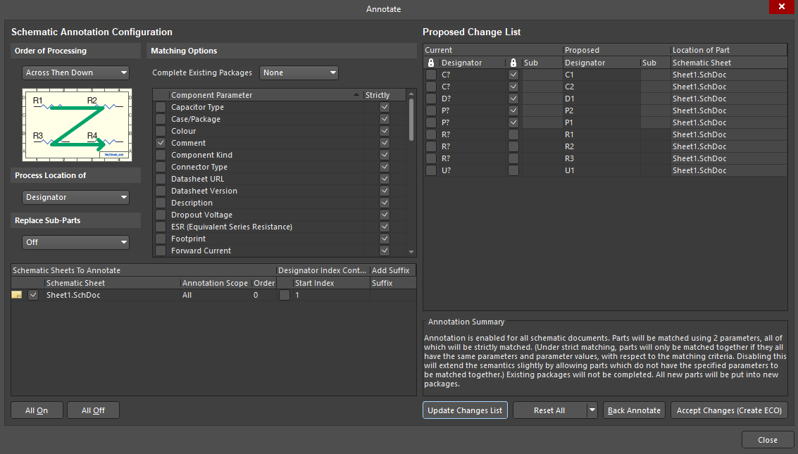

   Click **All On, Update changes list,** and **Accept changes (Create ECO).**

   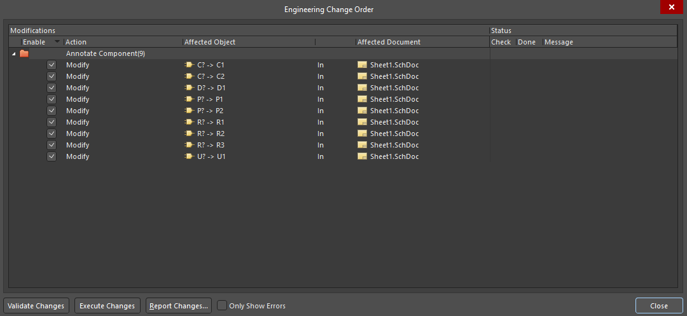

   Validate and execute the changes here and close the dialog boxes and check if all the components have been annotated.
7. Fill in the title block with the board name, your name, the date, and revision v0.1.
8. Add a text note on the sheet stating input voltage, output voltage, design load current, and your calculated dissipation.

   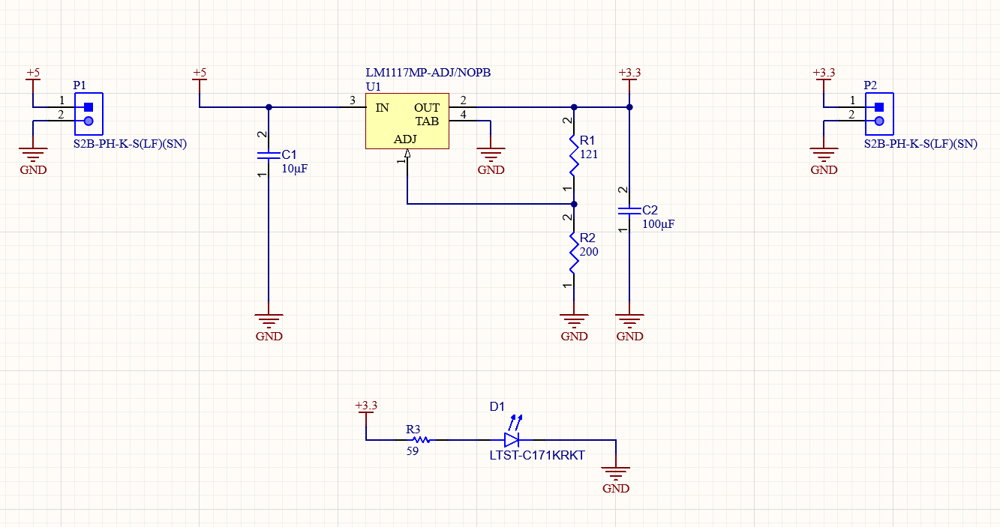

#### Electrical Rule Check

Project → Validate PCB Project. Read the results in the Messages panel. Double-click any message to jump straight to it.

**Target: zero errors and zero warnings, however since some premade symbols can be finnicky, if you cant solve something send a question in the appropriate channel on discord.** A warning means the checker found something unusual. Use a No-ERC directive only when you are sure it is a genuine false positive, not just to make the warning disappear. If one is genuinely a false positive, suppress it with a No-ERC directive (press keys P, V, N) on that specific pin and be ready to explain why. Never disable a whole rule class.

### 7.2 PCB setup and placement

1. Open the PCB. Press D, K to confirm 2 signal layers, 1.6 mm thickness, and 1 oz copper.
2. Close every panel and press Q until units read mm. Set a sensible snap grid with G.
3. Select Mechanical 1. Draw a closed rectangle with P, L, then use Design → Board Shape → Define Board Shape from Selected Objects. Around 28 × 17 mm gives room for the thermal pour.
4. From the schematic, run Design → Update PCB Document (D, U). Validate Changes, confirm green checks, then Execute Changes.
5. Place components inside the outline. Spacebar rotates.

<Callout type="warning" emoji="️⚠️">
  **Draw the outline on Mechanical 1, not a copper layer.** On a copper layer the fab reads it as a ring of metal around your board. Check the active layer tab before you draw.
</Callout>

#### Placement rules

- Connectors on the board edge, input and output on opposite sides
- Regulator between them, oriented so power flows the same direction as on the schematic
- **Decoupling capacitors as close to their pins as physically possible.** Trace inductance blocks exactly the fast currents a decoupling cap exists to supply, so distance defeats the purpose. Aim for single-digit millimetres.
- Leave open area around the regulator tab for the thermal pour
- Designators readable, beside their component, not overlapping pads

Watch the ratsnest as you move parts. Shorter, non-crossing grey lines mean better placement. Untangling now is free. Untangling during routing is not. Press 3 periodically to catch collisions.

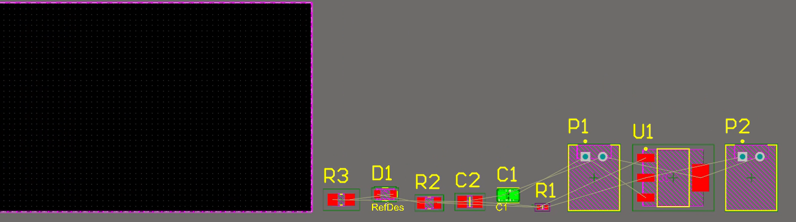

### 7.3 Design rules

Set your rules before routing (D, R), not after. They constrain the router as you work.

| **Rule** | **Value** |
| --- | --- |
| Clearance | 0.2 mm minimum |
| Width, default | Min 0.2 mm, preferred 0.25 mm |
| Width, power nets | Query: InNet('5V') Or InNet('3V3') Or InNet('GND'). Set the value per Task 7.4. Give it a higher priority than the default. |
| Routing via style | Hole 0.3 mm, diameter 0.6 mm |
| Hole size | Min 0.3 mm |
| Solder mask expansion | 0.05 mm |
| Silkscreen over component pads | Enabled, 0.15 mm clearance |
| Polygon connect, global | Relief, 4 spokes, 0.25 mm |
| Polygon connect, regulator tab | See Task 7.5 |
| Board outline clearance | 0.3 mm |

### 7.4 Routing

A trace is a resistor with a current rating. Too narrow and it heats up and drops voltage. On a 3.3 V rail, a hundred millivolts lost in copper is a meaningful fraction of your budget.

<Callout type="info" emoji="💡">
  **Task 7.4 — Trace widths**

  1. Look up trace width versus current capacity for 1 oz copper on an outer layer. IPC-2221 is the standard reference and most online calculators implement it.
  2. Choose a width for the power nets at your design current, with some margin.
  3. Choose a width for the LED branch. It does not carry the same current.
  4. Note which nets carry the full load current. Current flows in a loop, so check that you have accounted for the return path.
</Callout>

[→ Hint 7.4 — trace width](#hint-width)

- Route with Ctrl+W. Press Tab mid-route to change width.
- Shift+Spacebar cycles corner style. Use 45°, not 90°.
- Route power nets first, while you still have the most freedom. Leave the LED branch until last.
- The * key on the numpad switches layer and drops a via automatically.

### 7.5 Polygons

#### Ground pour

Fill the bottom layer with copper on GND rather than routing individual ground traces. This gives you a low-impedance return path, keeps return currents under their forward traces, and removes most of the ground routing work.

1. Select Bottom Layer, press P, G, and draw a rectangle inset about 0.3 mm from the board outline.
2. Set Net to GND, Fill Mode to Solid, tick Remove Dead Copper, and choose Pour Over All Same Net Objects.
3. Repour, then add a stitching via near each top-layer GND pad.

#### Thermal pour

This is the heatsink you sized in Task 5.2. It is not decoration.

<Callout type="info" emoji="💡">
  **Task 7.5 — Thermal pour**

  1. Click the regulator's tab pad and read its net in the Properties panel. Confirm it matches what you determined in Section 5.1. If it reads No Net, your symbol pin was never connected.
  2. Pour a top-layer polygon on that net, covering at least the copper area you calculated in Task 5.2.
  3. By default Altium connects pads to polygons with thermal relief spokes that deliberately restrict heat flow. Decide whether that is what you want on this specific pad, then set the polygon connect style under D, R → Plane → Polygon Connect Style, scoped to this pad only.
  4. Optional. Stitch to a matching bottom-layer polygon on the same net with a via array, which roughly doubles the copper area.
</Callout>

[→ Hint 7.5 — thermal pour](#hint-pour)

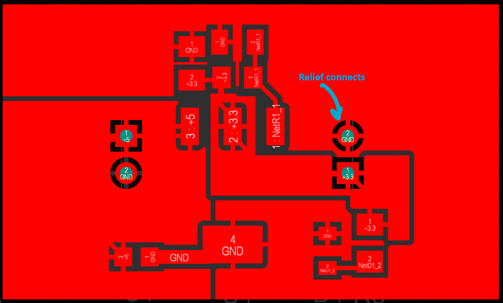

### 7.6 Verification

Tools → Design Rule Check (T, D, R). Target zero violations.

**Do not fix a violation by loosening the rule.** If you believe a rule is genuinely wrong for this board, change it deliberately and record the change and the reason in your README.

DRC checks rule compliance, not correctness. Do these by hand as well.

- Press 3 and rotate. Does it look like a board? Any collisions or parts hanging off the edge?
- Highlight each net in the PCB panel and trace 5V, 3V3, and GND end to end.
- Re-read the tab pad's net one more time.
- Check polarity on the LED, and on C3 if it is a tantalum.
- Walk the schematic connection by connection against the PCB. Nine components is small enough to check exhaustively.
- Repour polygons, then re-run DRC.

## 8. Outputs and Submission

### 8.1 Generate outputs

| **Output** | **Menu** | **Settings** |
| --- | --- | --- |
| Gerbers | File → Fabrication Outputs → Gerber Files | Millimeters, 4:4 format. Layers: top and bottom copper, top and bottom solder mask, top overlay, Mechanical 1. Embedded apertures (RS274X). |
| NC Drill | File → Fabrication Outputs → NC Drill Files | Millimeters, 4:4 format. This must match the Gerber format exactly. |
| BOM | Reports → Bill of Materials | Export as .xlsx. Columns: designator, quantity, value, footprint, manufacturer, MPN, supplier, supplier PN, unit price, description. |
| Schematic PDF | File → Smart PDF | Schematic sheet only. |

<Callout type="warning" emoji="️⚠️">
  **Gerber and drill formats must match.** Mismatched formats put your holes at the wrong scale, sometimes off the board entirely. Set both to 4:4 and then verify.
</Callout>

Group identical parts onto one BOM line with a combined designator list.

### 8.2 Check your Gerbers

Open your exported Gerbers in an external viewer before submitting. An online Gerber viewer or KiCad's GerbView both work. Altium's canvas is not what the fab sees.
Confirm the board shape is right, the ground plane is present and continuous, the thermal pour exists, and the drill holes line up with the pads. This catches missing layers and unpoured polygons in about four minutes.

### 8.3 README

Write a short README.md alongside your outputs containing:
- Your name, uwaterloo.ca email, date, and revision
- Chosen LM1117 MPN and why
- Thermal calculation: dissipation at 500 mA, θJA used, resulting junction temperature, copper area poured
- Output capacitor choice and the datasheet line supporting it
- LED resistor calculation
- Divider resistor values, the output voltage they produce, and your tolerance check
- Trace width choice and the current it supports
- Any design rules you deviated from, and why
- Anything you are unsure about

Since this PCB is very simple, a lot of the default values given by Altium will work for the current and thermal calculations. However, this readme is to be created for you to understand what those defaults mean and how to build your own default design rules in the future.

Please always make sure to mention things you are unsure about. That is very important for the leads to understand where your strengths and weaknesses lie. This is not an interview, and you will not be judged/rejected for not knowing something. If you finish the onboarding, there is nothing stopping you from joining the team.

### 8.4 Submit

Zip your Outputs folder and post in #humanoid-onboarding on Discord with:
- The zipped outputs, or a link to them
- A 3D render screenshot
- Your README contents
- A one-line summary covering board, layer count, dimensions, and design current

To say it once more, your board is not going to a fab. There is no batch to make and no assembly session waiting at the end. Review is the deliverable, so the files you submit are the only thing anyone sees.
In review you will be asked why you made specific choices. When you do not have a reason, say so rather than inventing one. Nobody expects a first-year to have a reason for everything. We expect you to know which is which.

## Appendix A: Hints

Attempt the task before reading. These are here so you do not stay stuck, not so you can skip the work.

#### Hint 4 — Capacitor derating and LED resistor {/* #hint-parts */}

Ceramic capacitors lose capacitance under DC bias. A 10 µF X5R rated 6.3 V can lose well over half its value at rated voltage. Choosing parts rated at roughly twice your operating voltage is a common rule of thumb.
For the LED, the series resistor sees the rail voltage minus the LED forward voltage, and Ohm's law gives you the resistance for your chosen current. Indicator LEDs are usually run at a few milliamps, so your design should not be anywhere near their maximum ratings. Check the resistor's power dissipation afterwards.

#### Hint 5.1 — The tab {/* #hint-tab */}

On the LM1117 in SOT-223 the tab is not ground, and on the ADJ version there is no ground pin on the package at all. Many other tabbed regulator packages do have grounded tabs, which is exactly why this catches people. If you tie the tab to GND you are shorting the thing the tab is actually connected to.
This determines which net your thermal pour sits on. Pouring the wrong net there shorts your regulator.

#### Hint 5.1b — The output divider {/* #hint-divider */}

The regulator works by holding a fixed reference voltage between OUT and ADJ. Put a resistor across that gap and a known current flows through it. That current continues into the second resistor from ADJ to ground, and the voltage it develops there stacks on top of the reference. Output equals the reference multiplied by one plus the ratio of the two resistors, plus a small error term from the current the ADJ pin itself draws.
That error term is why the lower resistor should not be enormous. A large resistor turns a tiny ADJ current into a real voltage offset. The datasheet typical application shows a sensible pair for a common output voltage, so compare whatever you calculate against the order of magnitude used there.
If the ADJ pin floats, the regulator sees no feedback and drives the output toward its maximum. Anything downstream expecting 3.3 V would see close to the input voltage. Treat that net as something you check twice.

#### Hint 5.2 — Thermal formulas {/* #hint-thermal */}

Dissipation: P = (Vin − Vout) × Iload. The regulator passes current straight through, so input and output current are equal.
Efficiency: η = Vout / Vin. The current cancels, so efficiency depends only on the voltage ratio and nothing in your layout can improve it.
Junction temperature: TJ = TA + (P × θJA). For SOT-223, θJA varies by roughly a factor of three between a bare pad and a generous copper pour, which is the entire reason the pour exists.

#### Hint 5.3 — ESR and why it matters {/* #hint-esr */}

Real capacitors have equivalent series resistance. Ceramics have very little. Tantalums and electrolytics have substantially more.
An LDO is a feedback loop, and older designs including this one rely on the output capacitor's ESR to contribute a zero that keeps the loop stable. Too little ESR and the loop can lose phase margin and oscillate. That is why the stability window given in the datasheet needs to be referenced specifically.
An oscillating LDO looks fine on a multimeter. However, they wear very soon. With very high swings in the output DC. Downstream parts reset randomly and the regulator runs hotter than predicted.

#### Hint 7.4 — Trace width {/* #hint-width */}

For 1 oz copper on an outer layer with a 10 °C rise, roughly: 0.25 mm carries about 0.9 A, 0.5 mm about 1.5 A, and 1.0 mm about 2.5 A.
Ground carries the same current as the supply rail, because current flows in a loop. A wide power trace feeding a thin ground return is a common and pointless mistake.

#### Hint 7.5 — Thermal pour {/* #hint-pour */}

Thermal relief spokes exist to make pads solderable by hand, and they do that by restricting heat flow into the plane. On a pad whose entire job is moving heat out of the die, that is the opposite of what you want. Direct connect is appropriate there, while relief stays as the global default for everything else.
Watch clearance between polygons on different nets. Overlapping pours create a short that is easy to miss visually and very obvious on the bench.

## Appendix B: Pre-Submission Checklist

If any line is unchecked, you are not ready to post.

#### Components

<Checklist id="humanoid-electrical-checklist-components" items={[
  "Every component verified against its datasheet (Section 6.3)",
  "Symbol pin numbers match footprint pad numbers",
  "Tab pad assigned to the correct net",
  "ADJ pin connected to the divider midpoint, not to ground",
  "Divider values checked against the output voltage equation",
  "Polarised parts consistent across symbol, footprint, and datasheet",
  "MPNs and supplier part numbers filled in",
]} />

#### Schematic

<Checklist id="humanoid-electrical-checklist-schematic" items={[
  "ERC: zero errors, zero warnings",
  "No ? designators",
  "Nets named consistently, no periods in names",
  "Title block filled in",
  "Design point and calculated dissipation noted on the sheet",
  "Any No-ERC directive justified",
]} />

#### PCB

<Checklist id="humanoid-electrical-checklist-pcb" items={[
  "Board outline on Mechanical 1, board shape applied",
  "All components inside the outline, connectors on the edge",
  "Decoupling caps within a few millimetres of their pins",
  "Power nets at the width calculated in Task 7.4",
  "Thermal pour on the correct net, at the area calculated in Task 5.2",
  "Polygon connect style on the tab set deliberately",
  "Bottom-layer ground pour, dead copper removed",
  "Polygons repoured as the final action",
  "DRC zero violations, no rules loosened",
  "3D view inspected",
  "Silkscreen readable, no text over pads",
]} />

#### Outputs

<Checklist id="humanoid-electrical-checklist-outputs" items={[
  "Gerbers: mm, 4:4",
  "NC drill: mm, 4:4, matching Gerber format",
  "Gerbers opened and checked in an external viewer",
  "BOM exported with MPNs and supplier part numbers",
  "Schematic PDF exported",
  "3D render captured",
  "README written, including all calculations and open questions",
  "Posted in #humanoid-onboarding",
]} />
