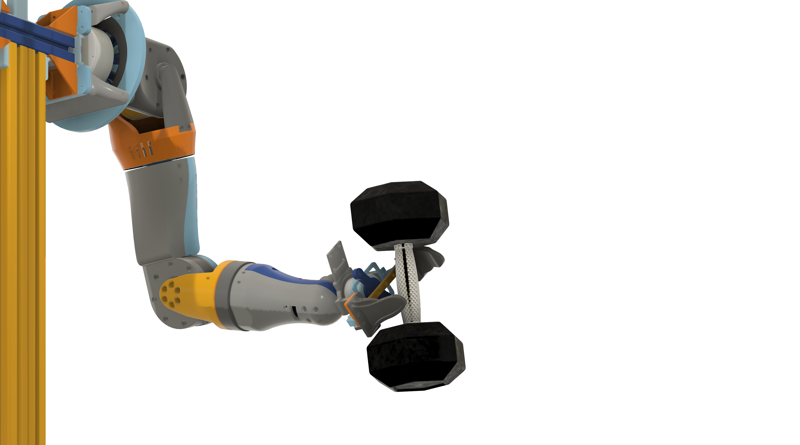
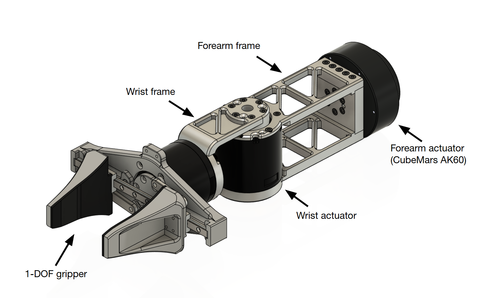

import { Callout } from 'nextra/components'

# Humanoid Hardware Admission Assignment

The Hardware Admission Assignment seeks to teach you the CAD, DFM, and robotics design related skills you'll need to build real robot hardware. You will design a piece of a humanoid robot arm, from a single machined part all the way up to a working lower-arm assembly and the math behind why it can lift something.

<Callout type="warning" emoji="️⚠️">
  This assignment can be a bit daunting, but we promise that with grit, you can complete this assignment regardless of your current capabilities. Feel free to ask any questions on Discord.
</Callout>

## Rules

1. If you finished the assignment, submit your work to the `assignment-completions` discord channel. The exact submission format is described in [How to Submit](#how-to-submit).
2. This assignment should be completed individually. If you do collaborate with others, be sure to credit them in the submission. **DO NOT** submit someone else's work.
3. You are allowed to use AI tools such as LLMs.
4. You are allowed to look at other people's designs, vendor CAD, and reference robots. If you borrow an idea, say so. We'll know if you copied a whole part though ;)
5. All CAD should be done in **SOLIDWORKS**. This is what the team uses. If you find yourself well-versed with other CAD software, you can import your designs into SolidWorks once you're done.
6. If your submission does not meet every constraint and every item on the [Final Checklist](#final-checklist), you will be asked to fix it before it is reviewed.

## Goal of the Assignment
In this assignment, you are tasked with designing the **lower arm** of a humanoid robot: a 1 degree-of-freedom (DOF) wrist and a 1 DOF gripper attached to a forearm that we provide. You will select a wrist actuator, design the frame that holds it, assemble everything with proper mates and limits, and then calculate how much torque the elbow above it needs to lift a 10 lb object and select an elbow actuator that can deliver it.



The skills you will practice are the same ones used at [Figure](https://www.figure.ai/), [Tesla (Optimus)](https://www.tesla.com/AI), [Boston Dynamics](https://bostondynamics.com/), [Agility Robotics](https://agilityrobotics.com/), [Apptronik](https://apptronik.com/), [1X](https://www.1x.tech/), and many robotics startups: picking actuators, designing machined frames around them, checking clearances, and sizing joints.

## Getting Started

### Prerequisites
We recommend you refresh your knowledge of the following before beginning the assignment:
- **Statics**: free body diagrams, moments, and torque.
- **Units**: you will be converting between lb, kg, N, N·m, and mm constantly. Be careful.
- **Basic machining awareness**: what a mill can and cannot cut. [This video](https://www.youtube.com/watch?v=6FOfXN9eWgg) is a good 10 minute primer on design for CNC machining.
- **SOLIDWORKS basics**: sketches, extrudes, cuts, fillets, and mates. If you have never used it, the built-in tutorials (Help → SOLIDWORKS Tutorials) for *Parts*, *Assemblies*, and *Drawings* take about 3 hours total and are worth it.

### Getting SOLIDWORKS
SOLIDWORKS is **Windows-only**. If you are on a Mac or Linux, skip to the lab-computer options below.

**Option 1: University of Waterloo student license (recommended for MME students).**
Waterloo Engineering holds an educational SOLIDWORKS license, and students in the Faculty of Engineering can install it on their own laptop for free.
- MME students: you likely already installed it for ME/MTE 100. Otherwise, [MME IT](https://uwaterloo.ca/mechanical-mechatronics-engineering-information-technology/) (E2 2354) distributes the serial number and installer.
- Other Engineering programs: start at [Engineering Computing – Resources for Students](https://uwaterloo.ca/engineering-computing/resources-students) or ask your department's IT office.
- **Activate the license during install.** If you skip activation you only get a 30-day trial.

**Option 2: Campus lab computers (Mac users, or if you don't want to install anything).**
- SOLIDWORKS is installed on the **Nexus** Windows lab machines used by MME, including the CAD labs in E5 and E7. Log in with your WatIAM credentials.
- You can also use [Engterm remote desktop](https://uwaterloo.ca/engineering-computing/remote-desktop-connection) to run Nexus software from your own laptop. It works, but it is slow for CAD. Use it for small edits, not for building the full assembly.
- If you go this route, **keep your files on cloud storage or the shared team folder**, not on the lab machine's local disk. It gets wiped.

<Callout type="warning" emoji="️⚠️">
  **Version matters.** SOLIDWORKS files are only forward-compatible: a part saved in 2025 cannot be opened in 2024. Use the same major version as the team.
</Callout>

{/* TODO (team lead): confirm the current team SOLIDWORKS version and the exact MME IT request link each term. */}

### Download the Provided Files
Download the assignment kit. It contains everything we "provide" in the stages below.

{/* TODO (team lead): upload the kit and replace this link. Contents listed in public/assets/admission_assignments/humanoid_hardware/PLACEHOLDERS.md */}
**[Download: Humanoid Hardware Assignment Kit (.zip)](DOWNLOAD_LINK_PLACEHOLDER)**

Inside you will find:
```
humanoid_hardware_assignment_kit/
├── 00_README.txt
├── 01_forearm/
│   ├── WATO-HUM-ARM-FOREARM-FRAME-v01.SLDPRT      # the forearm structure you attach to
│   └── WATO-HUM-ARM-FOREARM-FRAME-v01.STEP
├── 02_gripper/
│   ├── WATO-HUM-ARM-GRIPPER-ASSY-v01.SLDASM       # 1 DOF gripper, complete
│   ├── WATO-HUM-ARM-GRIPPER-ACTUATOR-v01.STEP     # the gripper actuator (Dynamixel XH540-V270-R)
│   └── ...
├── 03_reference/
│   └── joint_locations.pdf                       # coordinate frames and joint axes
└── 04_templates/
    ├── WATO-PART-TEMPLATE.prtdot
    ├── WATO-ASSY-TEMPLATE.asmdot
    └── WATO-DRAWING-TEMPLATE.drwdot
```

### Resources
We are not going to teach you SOLIDWORKS here. These cover everything the assignment needs:
- [SOLIDWORKS Tutorials](https://my.solidworks.com/training) (My.SolidWorks, free with a login). Do *Parts*, *Assemblies*, and *Drawings*.
- [Mates](https://help.solidworks.com/2024/english/SolidWorks/sldworks/c_Mates_Overview.htm), [Limit Mates](https://help.solidworks.com/2024/english/SolidWorks/sldworks/HIDD_DVE_MATE_LIMIT.htm), and [Interference Detection](https://help.solidworks.com/2024/english/SolidWorks/sldworks/c_Interference_Detection_Overview.htm).
- [Hole Wizard](https://help.solidworks.com/2024/english/SolidWorks/sldworks/c_Hole_Wizard_Overview.htm) and [Mass Properties](https://help.solidworks.com/2024/english/SolidWorks/sldworks/HIDD_MASS_PROPERTY.htm).
- [In-context design](https://help.solidworks.com/2024/english/SolidWorks/sldworks/c_Designing_in_Context.htm) for designing a part inside an assembly.
- [Pack and Go](https://help.solidworks.com/2024/english/SolidWorks/sldworks/c_Pack_and_Go.htm) for sharing files without breaking references.
- [Design for CNC machining](https://www.hubs.com/knowledge-base/how-design-parts-cnc-machining/) and [design for 3D printing](https://www.hubs.com/knowledge-base/how-design-parts-fdm-3d-printing/) (Hubs).
- [Robot arm torque tutorial](https://www.robotshop.com/community/tutorials/show/robot-arm-torque-tutorial) (RobotShop).

## CAD Guidelines
Follow these throughout. They are checked at review.

**Naming.** Every file follows `WATO-<ROBOT>-<SUBSYSTEM>-<DESCRIPTION>-v<##>.<ext>`, for example `WATO-HUM-ARM-WRIST-MOUNT-v01.SLDPRT` or `WATO-HUM-ARM-LOWER-ARM-ASSY-v02.SLDASM`. Descriptions are short, ALL-CAPS, hyphenated. Purchased parts keep the vendor name with a `VENDOR-` prefix, e.g. `VENDOR-ROBOTIS-XH540-V270-R.STEP`.

**Templates and units.** Start every part, assembly, and drawing from the templates in `04_templates/`. They set **MMGS** units and the custom properties the drawing title block reads. Fill in the *Description* and *Author* properties.

**Modelling.**
- All sketches fully defined. No blue lines.
- All fastener holes made with Hole Wizard. Extruded-cut holes are only acceptable for weight saving.
- Socket head screws are the default, unless you can justify otherwise. Use metric (M2.5, M3, M4) sizes.
- Fillets and chamfers are features, not sketch geometry. Group similar ones in the same feature.
- Vendor parts: override their mass to the datasheet value. STEP files can have no density.

**Assemblies.**
- Every component mated and fully defined except for the DOF that is supposed to move; make sure to set limits to DOFs.
- Every fastener modelled, with realistic length: at least 1.5 × diameter of thread engagement, make sure to not poke into anything that moves.
- Clearance holes are screw size + 0.2mm (i.e. 3.2mm for M3, 2.7mm for M2.5). Parts must be physically assemblable.

**Sharing.** Never rename or move a referenced file outside SOLIDWORKS. Hand files to anyone, including us, with *Pack and Go*. Export a `.STEP` alongside every part you design.

## The Assignment

You are given a forearm frame and a complete 1 DOF gripper with its actuator. Missing is everything in between, plus the joint above: the wrist actuator, the frame that connects the wrist actuator to the gripper (the **wrist mount**), the frame that connects the wrist actuator to the forearm (the **wrist bracket**), and the **elbow actuator** that has to lift all of it. Three stages, plus one optional.

{/* TODO: annotated exploded view: forearm frame (provided) → wrist bracket (yours) → wrist actuator (you select) → wrist mount (yours) → gripper actuator (provided) → gripper (provided) */}


<Callout type="warning" emoji="️⚠️">
  **To make the assignment easier, the wrist is fixed to a single DOF** (rotation about the forearm axis) and the forearm and gripper are given. A real humanoid wrist has two or three DOF.
</Callout>

### Stage 1: Part Design (Wrist Mount)

#### Background
Frames between actuators are the most common part on a humanoid. Every extra gram from a frame costs torque at every joint above it, and every frame has to be machinable.

#### Task
Select a wrist actuator that meets the constraints below, then design the single machined part that connects the wrist actuator's output flange to the rear of the gripper actuator.

{/* TODO: render of the wrist mount design envelope between the two actuators. Do not show a finished answer. */}


#### Wrist Actuator Constraints
{/* TODO (team lead): confirm these numbers against the current arm spec before each admission wave. */}

| Constraint | Requirement |
|---|---|
| Supply voltage | **24 V DC** |
| Rated (continuous) torque | **≥ 3.0 N·m** |
| Peak torque | **≥ 8.0 N·m** |
| No-load speed | **≥ 30 rpm** |
| Mass | **≤ 450 g** |
| Communication | CAN bus or RS-485, daisy-chainable |
| Integrated | Absolute output encoder and motor driver in the housing |
| Output | Bolt-on flange with a documented bolt pattern |
| Budget | ≤ \$600 USD |

Common candidates: [ROBOTIS Dynamixel](https://www.robotis.us/dynamixel/), [MyActuator RMD-X](https://www.myactuator.com/), [CubeMars AK](https://www.cubemars.com/), [Robstride](https://www.robstride.com/). You are not limited to these.

#### Wrist Mount Constraints

| Constraint | Requirement |
|---|---|
| Material | **6061-T6 aluminum** |
| Manufacturing | Machinable on a **3-axis CNC mill** |
| Mass | **≤ 120 g** |
| Actuator spacing | Gripper actuator rear mounting face **45.0 ± 0.2 mm** from the wrist actuator output flange face, along the wrist axis |
| Alignment | Gripper actuator axis coaxial with the wrist axis within 0.1 mm |
| Minimum wall thickness | 2.0 mm |
| Minimum internal corner radius | 1.5 mm |
| Wiring | A pass-through of at least **8 mm × 12 mm** for the gripper actuator's cable |
| Fasteners | M2.5 SHCS to the gripper actuator; whatever the wrist actuator flange requires. Tapped holes ≥ 2 × diameter deep |

**3-axis mill rules of thumb.** Every feature reachable from directly above in one of your setups. No sharp internal corners in pockets. Break external edges with a 0.5 mm chamfer or fillet.

#### Deliverables
- Actuator selection: a table comparing **3 or more** candidates against every constraint above, a link to the winner's datasheet, and a paragraph on why you chose it.
- `WATO-HUM-ARM-WRIST-MOUNT-v##.SLDPRT` and `.STEP`.
- `WATO-HUM-ARM-WRIST-MOUNT-v##.SLDDRW` on the team drawing template, exported to PDF. Dimension both bolt patterns, the 45 mm spacing with its tolerance, and the overall envelope. Include material and edge-break notes.

### Stage 2: Assembly Design (Lower Arm)

#### Background
Most first designs fail at integration, not at the part: the wrist rotates and a cable wraps around the frame, or a screw head hits the forearm.

#### Task
Design the wrist bracket that mounts your chosen wrist actuator to the provided forearm, then assemble the complete lower arm: forearm, wrist bracket, wrist actuator, wrist mount, gripper actuator, gripper, and every fastener. Below is the finished lower arm with the gripper, wrist mount, wrist actuator, and elbow actuator hidden. Your job is to fill the gap.

{/* TODO: screenshot(s) of the reference lower arm with gripper, wrist mount, wrist actuator, and elbow actuator hidden */}


#### Constraints
- The wrist actuator output axis lies on the wrist axis given in `03_reference/joint_locations.pdf`.
- Wrist bracket: 6061-T6, 3-axis machinable, **≤ 180 g**, same DFM rules as Stage 1.
- The wrist rotates **±150°** from neutral, enforced with a limit mate. The gripper's open and closed positions are enforced with a limit mate.
- **Zero interferences** at wrist = 0°, +150°, and −150°, with the gripper both open and closed. Screw threads in tapped holes may be excluded.
- A **6 mm diameter** cable path exists from the gripper actuator, through the wrist mount pass-through, past or through the wrist actuator, and along the bracket to the elbow, at every wrist angle. Model it as a swept body or a sketch and show it clears.
- All fasteners modelled with correct lengths and clearance holes per the [CAD Guidelines](#cad-guidelines). Use SOLIDWORKS Toolbox or vendor models from [McMaster-Carr](https://www.mcmaster.com/).
- Fix the forearm frame. Everything is positioned relative to it.

#### Deliverables
- `WATO-HUM-ARM-WRIST-BRACKET-v##.SLDPRT` and `.STEP`.
- `WATO-HUM-ARM-LOWER-ARM-ASSY-v##.SLDASM` with every component, every fastener, and limit mates set.
- Interference Detection screenshots at the three wrist angles.
- A screen recording (≤ 60 s) dragging the wrist through its range and opening and closing the gripper.

### Stage 3: Actuator Selection (Elbow Joint)

#### Background
Actuator sizing is the most common reason arms fail to meet spec. Someone adds 200 g at the hand and nobody re-runs the elbow calculation.

#### Task
Assign materials to every part, get the lower arm's mass properties, and calculate the torque the elbow needs to lift a **10 lb (4.54 kg)** object held at the gripper fingertips in the worst-case pose. Then select an elbow actuator that meets that requirement and the constraints below.

{/* TODO: free body diagram of the lower arm horizontal with the 10 lb load and lever arms labelled */}


#### Materials
{/* TODO (team lead): confirm against current BOM */}

| Part | SOLIDWORKS material |
|---|---|
| Forearm frame, wrist bracket, wrist mount, gripper frame | `6061-T6 (SS)` |
| Gripper fingers | `Nylon 101` |
| Fasteners | `Alloy Steel` |
| Wrist actuator | Override mass to datasheet value |
| Gripper actuator | Override mass to **165 g** |
| Elbow actuator | Not part of the moving load. Its mass does not enter this calculation. |

#### Method
Worst case is the forearm horizontal with the gripper in line with it. Set the Mass Properties output coordinate system at the **elbow axis** (from `joint_locations.pdf`) so the centre of mass reads directly as a lever arm. Then:

```math
\tau_{static} = m_{arm} \, g \, r_{arm} + m_{load} \, g \, r_{load}
```

```math
\tau_{required} = 1.5 \times 1.3 \times \tau_{static}
```

where 1.5 is a first-pass dynamic factor and 1.3 a safety factor. Use kg and m. The elbow must **hold** the 10 lb object, not just lift it, so $\tau_{required}$ is compared against the actuator's **rated** (continuous) torque, not its peak.

#### Elbow Actuator Constraints
{/* TODO (team lead): confirm these numbers against the current arm spec before each admission wave. */}

| Constraint | Requirement |
|---|---|
| Rated (continuous) torque | **≥ your $\tau_{required}$** |
| Supply voltage | **24 V DC** |
| Communication | CAN bus or RS-485, daisy-chainable |
| Integrated | Absolute output encoder and motor driver in the housing |
| Mass | **≤ 1.2 kg** |
| Budget | ≤ \$1500 USD |

Same candidate vendors as Stage 1. Larger frame sizes in the same product lines are the natural place to look.

#### Deliverables
- Screenshot of Mass Properties for the full lower arm assembly showing total mass and centre of mass relative to the elbow axis.
- The calculation (PDF, Markdown, or spreadsheet) with lever arms, both torques, and the resulting $\tau_{required}$.
- Elbow actuator selection: a table comparing **3 or more** candidates against every constraint above, a link to the winner's datasheet, and a paragraph on why you chose it.
- One sentence: how much does $\tau_{required}$ change if your wrist mount were 50 g heavier?

## Final Checklist
This is how you will be evaluated. If any item fails, you will be asked to fix it before review.

**Parts and assemblies**
- [ ] All sketches fully defined. No blue lines.
- [ ] All fastener holes made with Hole Wizard.
- [ ] Fillets and chamfers as features, grouped.
- [ ] Parts in MMGS.
- [ ] File names follow the naming convention.
- [ ] Every component in the assembly is mated, with the intended DOF and limits set.
- [ ] Every fastener modelled with a realistic length and clearance hole.
- [ ] Zero interferences at all three wrist angles, gripper open and closed.
- [ ] 6 mm cable path clears at all wrist angles.
- [ ] Wrist mount ≤ 120 g, wrist bracket ≤ 180 g, both 6061-T6 and 3-axis machinable.
- [ ] 45.0 ± 0.2 mm actuator spacing and coaxiality met.
- [ ] Vendor part masses overridden to datasheet values.

**Drawing**
- [ ] Uses the team drawing template.
- [ ] Millimetres, no more precision than 0.00.
- [ ] Hole callouts generated by the hole-callout tool, not typed.
- [ ] Centre marks and centre lines on all round features.
- [ ] Material and edge-break notes present.

**General**
- [ ] Every constraint in every stage met.
- [ ] Both actuator comparisons (wrist and elbow) have 3 or more real candidates with datasheet links.
- [ ] Torque calculation uses the mass properties from your actual assembly, and the chosen elbow actuator's rated torque meets it.
- [ ] You can explain how every part you designed would be manufactured.

## How to Submit
1. *Pack and Go* the lower arm assembly to a zip named `FIRSTNAME-LASTNAME-HumanoidHardware.zip`. Copying files into a zip by hand will break references and we will not be able to open it.
2. Upload the zip, plus your STEP exports, drawing PDF, both actuator comparisons, interference screenshots, screen recording, and torque calculation, to a Google Drive or OneDrive folder. Set it to **anyone with the link can view**.
3. Post **one message** in the `assignment-completions` discord channel with:
   - Your name and program.
   - An image of your assembly.
   - The folder link.
   - Which stages are complete, and anyone you collaborated with.
   - A ping to any humanoid hardware lead.
4. A hardware lead will open the assembly, rotate the wrist, run Interference Detection, and read the calc. We will reply in the channel or set up a short call to go through your design. Expect a response within a week.

Once your submission is approved, you are on the team. Welcome to WATonomous.
