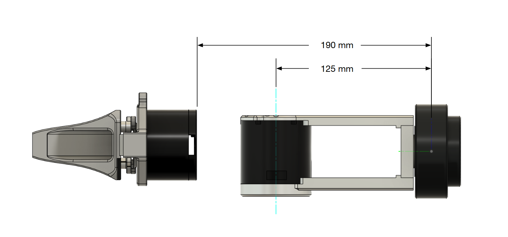
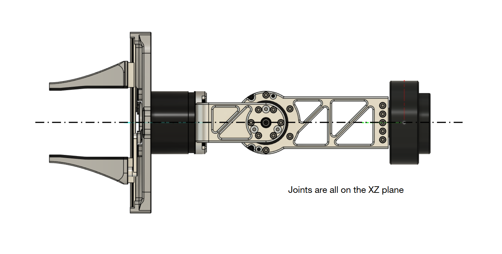
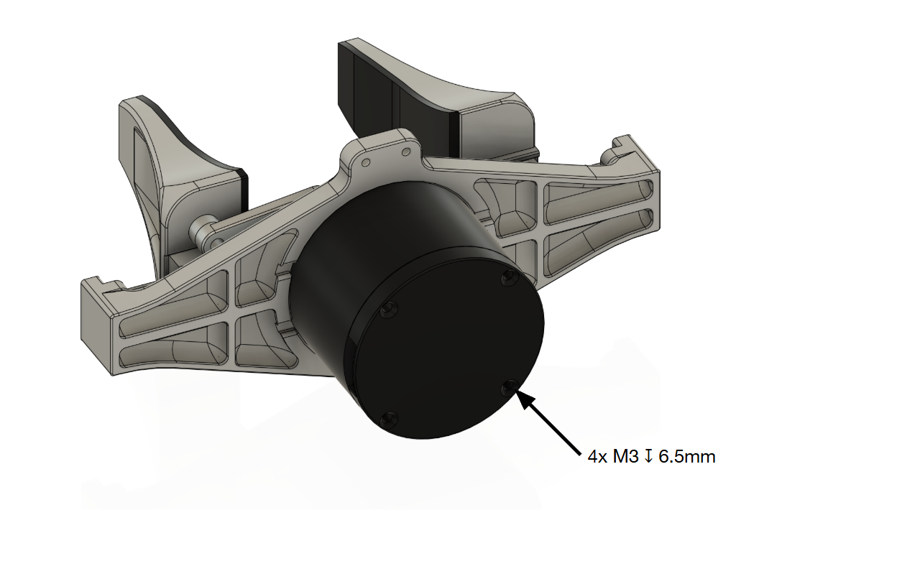
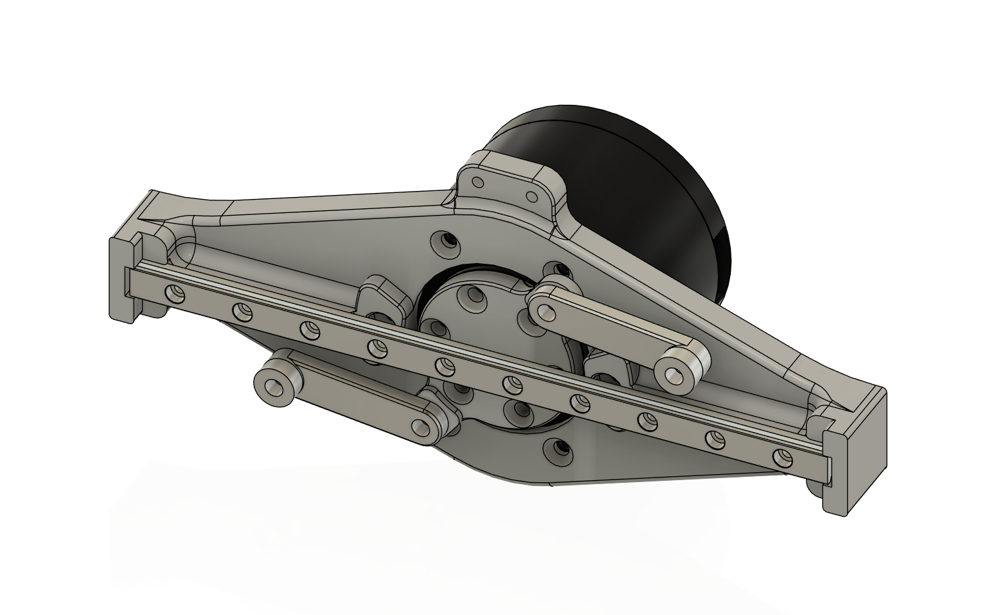
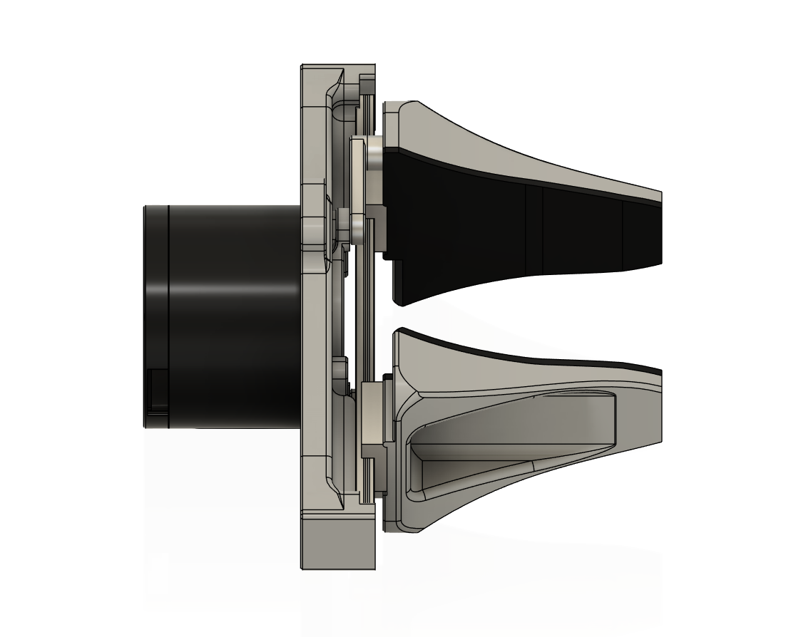

import { Callout } from 'nextra/components'
import Checklist from '../../components/checklist'

# Humanoid Hardware Admission Assignment

This Humanoid Admission Assignment seeks to teach you basic CAD, DFM, and robotics design related skills you'll need to build real robot hardware. You will design a piece of a humanoid robot arm, from the machined frames up to a working lower-arm assembly and the math behind why it can lift something.

<Callout type="warning" emoji="️⚠️">
  This assignment can be a bit daunting, especially if university is your first time learning CAD; but we promise that with grit, you can complete this assignment regardless of your current capabilities. Feel free to ask any questions on Discord.
</Callout>

## Rules

1. If you finish the assignment, submit your work to the `mechanical-onboarding` discord channel. The exact submission format is described in [How to Submit](#how-to-submit).
2. This assignment should be completed individually. If you do collaborate with others, be sure to credit them in the submission. **DO NOT** submit someone else's work.
3. You are allowed to use AI tools such as LLMs.
4. You are allowed to look at other people's designs, vendor CAD, and reference robots. If you borrow an idea, say so. We'll know if you copied a whole part though ;)
5. All CAD should be done in **SOLIDWORKS**. This is what the team uses. If you find yourself well-versed with other CAD software, you can import your designs into SolidWorks once you're done.
6. If your submission does not meet every constraint and every item on the [Final Checklist](#final-checklist), you will be asked to fix it before it is reviewed.

In this assignment, you are tasked with designing the **lower arm** of a humanoid robot: a 1 degree-of-freedom (DOF) wrist and a 1 DOF gripper attached to a forearm actuator that we provide. You will select a wrist actuator, design the frames that hold it, assemble everything with proper mates and limits, and then calculate how much torque the elbow joint needs to lift a 10 lb object and select an elbow actuator that can deliver it.


The skills you will practice are the same ones used at [Figure](https://www.figure.ai/), [Tesla (Optimus)](https://www.tesla.com/AI), [Boston Dynamics](https://bostondynamics.com/), [Agility Robotics](https://agilityrobotics.com/), [Apptronik](https://apptronik.com/), [1X](https://www.1x.tech/), and many robotics startups: picking actuators, designing machined frames around them, checking clearances, and sizing joints.

## Getting Started

### Prerequisites
We recommend you refresh your knowledge of the following before beginning the assignment:
- **Statics**: free body diagrams, moments, and torque.
- **Units**: you will be converting between lb, kg, N, N·m, and mm constantly. Be careful.
- **Basic machining awareness**: what a mill can and cannot cut. [This video](https://www.youtube.com/watch?v=6FOfXN9eWgg) is a good 10 minute primer on design for CNC machining.
- **SOLIDWORKS basics**: sketches, extrudes, cuts, fillets, and mates. If you have never used it, the built-in tutorials (Help → SOLIDWORKS Tutorials) for *Parts*, *Assemblies*, and *Drawings* take about 3 hours total and are worth it.

### Getting SOLIDWORKS
SOLIDWORKS is **Windows-only**. If you are on a Mac or Linux, skip to the lab-computer options below.

**Option 1: University of Waterloo student license (recommended for MME students).**
Waterloo Engineering holds an educational SOLIDWORKS license, and students in the Faculty of Engineering can install it on their own laptop for free.
- MME students: you likely already installed it for ME/MTE 100. Otherwise, [MME IT](https://uwaterloo.ca/mechanical-mechatronics-engineering-information-technology/) (E2 2354) distributes the serial number and installer.
- Other Engineering programs: start at [Engineering Computing – Resources for Students](https://uwaterloo.ca/engineering-computing/resources-students) or ask your department's IT office.
- **Activate the license during install.** If you skip activation you only get a 30-day trial.

**Option 2: Campus lab computers (Mac users, or if you don't want to install anything).**
- SOLIDWORKS is installed on the **Nexus** Windows lab machines used by MME, including the CAD labs in E5 and E7. Log in with your WatIAM credentials.
- You can also use [Engterm remote desktop](https://uwaterloo.ca/engineering-computing/remote-desktop-connection) to run Nexus software from your own laptop.
- If you go this route, **keep your files on cloud storage or the shared team folder**, not on the lab machine's local disk; it gets wiped.

<Callout type="warning" emoji="️⚠️">
  **Version matters.** SOLIDWORKS files are only forward-compatible: a part saved in 2025 cannot be opened in 2024. Use the same major version as the team.
</Callout>

{/* TODO (team lead): confirm the current team SOLIDWORKS version and the exact MME IT request link each term. */}

### Download the Provided Files
Download the assignment kit. It contains everything we "provide" in the stages below.

{/* TODO (team lead): upload the kit and replace this link. Contents listed in public/assets/admission_assignments/humanoid_hardware/PLACEHOLDERS.md */}
**[Download: Humanoid Hardware Assignment Kit (.zip)](DOWNLOAD_LINK_PLACEHOLDER)**

Inside you will find:
```
humanoid_hardware_assignment_kit/
├── 00_README.txt
├── 01_forearm/
│   └── HUM-ARM-FOREARM_ACTUATOR-v01.STEP             # forearm actuator, fixed at the origin
└── 02_gripper/                                   # 1 DOF gripper, as loose parts. You assemble it.
    ├── HUM-ARM-GRIPPER-ACTUATOR-v01.STEP         # gripper actuator
    ├── HUM-ARM-GRIPPER-BASE-v01.STEP             # mounts to the gripper actuator
    ├── HUM-ARM-GRIPPER-HORN-v01.STEP             # on the actuator output, drives the linkages
    ├── HUM-ARM-GRIPPER-LINKAGE-v01.STEP          # use two
    └── HUM-ARM-GRIPPER-FINGER-v01.STEP           # use two
```

### Resources
We are not going to teach you SOLIDWORKS here. These cover everything the assignment needs:
- [SOLIDWORKS Tutorials](https://my.solidworks.com/training) (My.SolidWorks, free with a login). Do *Parts*, *Assemblies*, and *Drawings*.
- [Mates](https://help.solidworks.com/2024/english/SolidWorks/sldworks/c_Mates_Overview.htm), [Limit Mates](https://help.solidworks.com/2024/english/SolidWorks/sldworks/HIDD_DVE_MATE_LIMIT.htm), and [Interference Detection](https://help.solidworks.com/2024/english/SolidWorks/sldworks/c_Interference_Detection_Overview.htm).
- [Hole Wizard](https://help.solidworks.com/2024/english/SolidWorks/sldworks/c_Hole_Wizard_Overview.htm) and [Mass Properties](https://help.solidworks.com/2024/english/SolidWorks/sldworks/HIDD_MASS_PROPERTY.htm).
- [In-context design](https://help.solidworks.com/2024/english/SolidWorks/sldworks/c_Designing_in_Context.htm) for designing a part inside an assembly.
- [Pack and Go](https://help.solidworks.com/2024/english/SolidWorks/sldworks/c_Pack_and_Go.htm) for sharing files without breaking references.
- [Design for CNC machining](https://www.hubs.com/knowledge-base/how-design-parts-cnc-machining/) and [design for 3D printing](https://www.hubs.com/knowledge-base/how-design-parts-fdm-3d-printing/) (Hubs).
- [Robot arm torque tutorial](https://www.robotshop.com/community/tutorials/show/robot-arm-torque-tutorial) (RobotShop).

## CAD Guidelines
Follow these throughout.

**Naming** 

Every file follows `HUM-<PROJECT>-<PART>-v<##>.<ext>`, where the project is the body section (`ARM`, `LEG`, `TORSO`, `HEAD`). Hyphens separate the levels; words within a level are joined with underscores. If a part belongs to a sub-assembly, that sub-assembly goes between the project and the part. For example `HUM-ARM-WRIST_FRAME-v01.SLDPRT`, `HUM-ARM-GRIPPER-FINGER-v01.SLDPRT`, or `HUM-ARM-LOWER_ARM-v02.SLDASM`. Names are short and ALL-CAPS. Purchased parts use the vendor part number as the part name, e.g. `HUM-ARM-ROBOTIS_XH540_V270_R-v01.STEP`.

**Units** 

Every part and assembly should be in **MMGS** (millimetre, gram, second). Set it in Document Properties before you draw anything.

**Modelling**

- All sketches should be fully defined.
- All fastener holes should be made with Hole Wizard.
- Socket head screws are the default, unless you can justify otherwise. Use metric (M2.5, M3, M4) sizes.
- Fillets and chamfers should be made as features, not sketch geometry. Group similar ones in the same feature.
- For external/vendor parts, override their masses with datasheet values - STEP files you find online can have no density.
- For external/vendor parts, use STEP files/solid models; avoid using models composed of only surfaces if possible.

**Assemblies**

- Every component should be mated and fully defined.
- Every fastener modelled, with realistic length: at least 1.5 × diameter of thread engagement, make sure to not poke into anything that moves. For this assignment, you do NOT have to include fasteners for the gripper; only for frame parts you design.
- Clearance holes are screw size + 0.2mm (i.e. 3.2mm for M3, 2.7mm for M2.5). Parts must be physically assemblable.

## The Assignment

Provided is a forearm actuator and the parts for a simple 1 DOF gripper, similar to the one used on our humanoid. Your job is to fill in the gap between them and select an actuator for the elbow. That means you need to select a wrist actuator, design a part that connects the wrist actuator to the gripper (the **wrist frame**), design a part that connects the forearm actuator to the wrist actuator (the **forearm frame**), and pick an **elbow actuator** strong enough to lift all of it.


<Callout type="warning" emoji="️⚠️">
  **To make the assignment easier, the wrist is fixed to a single DOF**. A real humanoid wrist has two or three DOF.
</Callout>

### Joint Locations
All actuator positions are relative to the origin. Fix the forearm actuator so that the origin in its STEP file sits on the assembly origin, with the **X axis along the forearm** pointing toward the gripper. All of the dimensions below are measured from the origin, and every joint axis should lie on the same plane.

| Feature | Location |
|---|---|
| Forearm actuator | Place part origin on the assembly origin, axis along +X |
| Wrist axis | Parallel to Z axis, at a distance of **125 mm** |
| Gripper actuator | Axis is parallel with forearm actuator, back face at a distance of **190 mm** from the origin |

The drawings below show which dimensions these refer to.




### Stage 1: Frame Design
#### Task
Select a wrist actuator that meets the constraints below, then design the two frames around it:
- The **wrist frame**, which connects the wrist actuator's output flange to the rear of the gripper actuator.
- The **forearm frame**, which mounts the wrist actuator to the provided forearm actuator.

Remember to follow [Joint Locations](#joint-locations). The wrist will rotate **±120°** from its default position, so design the forearm frame with this movement in mind. You will check it properly in Stage 2.

#### Wrist Actuator Constraints
{/* TODO: confirm these numbers against the current arm spec before each admission wave. */}

| Constraint | Requirement |
|---|---|
| Supply voltage | **24 V DC** |
| Rated (continuous) torque | **≥ 3.0 N·m** |
| Peak torque | **≥ 8.0 N·m** |
| Mass | **≤ 450 g** |

Common candidates: [ROBOTIS Dynamixel](https://www.robotis.us/dynamixel/), [MyActuator RMD-X](https://www.myactuator.com/), [CubeMars AK](https://www.cubemars.com/), [Robstride](https://www.robstride.com/). You are not limited to these.

#### Frame Constraints

| Constraint | Requirement |
|---|---|
| Material | **6061-T6 aluminum** |
| Manufacturing | Machinable on a **3-axis CNC mill** |
| Mass | Wrist frame **≤ 150 g**, forearm frame **≤ 300 g** |
| Wiring | Allocate appropriate space for wires/connectors. |
| Fasteners | Ensure appropriate fasteners are used, with appropriate thread engagement |

The rear of the gripper actuator has **4× M3 tapped holes, 6.5 mm deep**. This is what your wrist frame bolts to.



<Callout type="info" emoji="💡">
   Every actuator vendor publishes a dimensioned drawing of the entire actuator: diameters, number of holes, thread size, and thread depth. Search for `<model name> drawing` or `<model name> dimensions`, or look for a "Drawings" / "Downloads" tab on the product page. Use those numbers. Do not measure the STEP file and guess.
</Callout>

#### Deliverables
- Actuator selection: Provide a datasheet for the actuator you chose, as well as a brief justification for why you chose the actuator.
- `HUM-ARM-WRIST_FRAME-v##.SLDPRT` included in the final submission.
- `HUM-ARM-FOREARM_FRAME-v##.SLDPRT` included in the final submission.

### Stage 2: Assembly

#### Task
Assemble the complete lower arm: forearm actuator, forearm frame, wrist actuator, wrist frame, and 1-DOF gripper. The gripper comes as loose parts, so you will have to assemble it too. Use the images below as a reference for how the gripper goes together - all faces are coincident.




#### Constraints
- Follow [Joint Locations](#joint-locations).
- The wrist rotates **±120°** from neutral.
- The gripper is assembled from the provided parts as its own sub-assembly, with mates that let it open and close by dragging the horn, and a limit mate on the open and closed positions.
- **Zero interferences** with wrist at = 0°, +120°, and −120°.
- All fasteners modelled with correct lengths and clearance holes per the [CAD Guidelines](#cad-guidelines). Use SOLIDWORKS Toolbox or  models from [McMaster-Carr](https://www.mcmaster.com/). You do NOT have to include fasteners for the gripper; only for parts you designed.

#### Deliverables
- `HUM-ARM-GRIPPER-v##.SLDASM`, assembled from the provided gripper parts, included in the final submission.
- `HUM-ARM-LOWER_ARM-v##.SLDASM`, with every component, every fastener, and limit mates set, included in the final submission.
- Interference Detection screenshots at the three wrist angles.
- A screen recording (≤ 60 s) dragging the wrist through its range and opening and closing the gripper.

### Stage 3: Actuator Selection (Elbow Joint)

#### Background
Actuators are one of, if not the most important component of humanoids. If the elbow motor is under specced, the arm struggles to hold load, overheats or stalls, and no amount of clever frame design will fix that. If it is over specced, you are carrying extra mass which increases the torque required at every other joint. Getting the torque number right, and knowing where it came from, is a fundamental skill in designing robots.

#### Task
Assign materials to every part, get the lower arm's mass properties, and calculate the torque the elbow needs to lift a **10 lb (4.54 kg)** object held at the gripper fingertips. Then, select an elbow actuator that meets that requirement.

#### Materials

| Part | SOLIDWORKS material |
|---|---|
| Forearm frame, wrist frame | `6061-T6 Aluminum` |
| Fasteners | `Alloy Steel` |
| Gripper | `ABS` |
| Forearm actuator | Override mass to datasheet value |
| Wrist actuator | Override mass to datasheet value |
| Gripper actuator | Override mass to **165 g** |
| Elbow actuator | Not part of the moving load; its mass is not included in the calculation. |

#### Method
Assume the **elbow axis** passes through the origin, perpendicular to the forearm axis (for simplicity's sake, not realistic). The whole lower arm, forearm actuator included, is your moving load. The static torque at the elbow is given by:

```math
\tau_{static} = m_{arm} \, g \, r_{arm} + m_{load} \, g \, r_{load}
```

where $r_{arm}$ is the distance from the elbow axis to the lower arm's centre of mass and $r_{load}$ is the distance to where the 10 lb object sits in the gripper. SOLIDWORKS Mass Properties will give you the mass and centre of mass. It is up to you to work out the worst-case pose, choose a sensible margin for dynamics and safety, and decide whether to compare against the actuator's rated or peak torque. This will give you $\tau_{required}$ for the elbow joint.

#### Elbow Actuator Constraints

| Constraint | Requirement |
|---|---|
| Torque | **≥ your $\tau_{required}$**, against whichever spec you justified |
| Supply voltage | **24 V DC** |
| Mass | **≤ 1.2 kg** |
| Budget | ≤ \$1500 USD |

Hint: Start searching from larger frame sizes in the same product lines as before.

#### Deliverables
- Screenshot of Mass Properties for the full lower arm assembly showing total mass and centre of mass.
- Your calculation (PDF, screenshot, image, etc.): any assumptions, free body diagrams, $\tau_{static}$, the margin you applied and why, and the resulting $\tau_{required}$.
- A table comparing **3 or more** actuator candidates against every constraint, a link to the winner's datasheet, and a brief on why you chose it.
- One sentence: how much does $\tau_{required}$ change if your wrist frame were 50 g heavier?

## Final Checklist
You've made it to the end! Provided is a simple checklist to go through before submission.

**Parts and assemblies**
<Checklist id="humanoid-hardware-parts" items={[
  "All sketches fully defined. No blue lines.",
  "All fastener holes made with Hole Wizard.",
  "Fillets and chamfers as features, grouped.",
  "Parts in MMGS.",
  "File names follow the naming convention.",
  "Every component in the assembly is mated, with the intended DOF and limits set.",
  "Every fastener required for parts you designed is included, with a realistic length and clearance hole.",
  "Wrist frame ≤ 150 g, forearm frame ≤ 300 g, both 6061-T6 and machinable on a 3-axis CNC.",
  "Vendor part masses overridden to datasheet values.",
]} />

**General**
<Checklist id="humanoid-hardware-general" items={[
  "Every constraint in every stage met.",
  "Wrist actuator selection includes a datasheet and justification; elbow actuator comparison has 3 or more real candidates with datasheet links.",
  "Torque calculation uses the mass properties from your actual assembly, and the chosen elbow actuator's torque meets it.",
]} />

## How to Submit
1. *Pack and Go* the lower arm assembly to a zip named `FIRSTNAME-LASTNAME-HumanoidHardware.zip`. Copying files into a zip by hand will break references and we will not be able to open it.
2. Upload the zip, both actuator selections, interference screenshots, screen recording, and torque calculation, to a Google Drive or OneDrive folder. Set it to **anyone with the link can view**.
3. Post **one message** in the `mechanical-onboarding` discord channel with:
   - Your name and program.
   - An image of your assembly.
   - The folder link.
   - Which stages are complete, and anyone you collaborated with.
   - A ping to any humanoid hardware lead (@symmmmmm, @floppyarms15).

Once your submission is approved, you are on the team. Welcome to WATonomous.

Side note: this is the first time we're running this assignment; any suggestions/feedback you have would be greatly appreciated!
