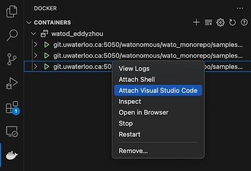

import { Callout } from 'nextra/components'
import { Steps } from 'nextra/components'

# Monorepo Infrastructure

As our team continues to encompass more fields of robotics around the school, the one thing holding us all together is our software infrastructure. The WATonomous Monorepo Infrastructure is a heavily optimized build and development system utilizing industry-standard software tools such as ROS2, Docker, Docker Compose, and Foxglove.

We aim to further optimize our Monorepo Infrastructure as time progresses. 

<Callout type="warning" emoji="️💡">
  Maintenance of the Monorepo Infrastructure is a joint responsibility by all Autonomy Directors of WATonomous
</Callout>

## History
### Early Autodrive
The WATonomous monorepo originated during the [AutoDrive Challenge](https://www.autodrivechallenge.com/), where the team faced the critical decision of selecting a software framework to support the complex demands of autonomous vehicle development. After evaluating options, the team chose the [Robotics Operating System (ROS)](https://www.ros.org/) as its primary message-passing infrastructure due to its robust ecosystem, modularity, and tools for communication and debugging. ROS’s publish-subscribe model allowed different teams to independently develop components like perception, localization, and control while maintaining seamless integration.

This decision established a scalable and flexible foundation for the team’s software architecture, enabling rapid iteration and collaboration. As the project evolved, the monorepo grew to include custom solutions tailored to the competition’s unique challenges, solidifying WATonomous's ability to tackle sophisticated autonomous driving tasks efficiently.

### Docker and the Introduction of WATcloud
As the project grew, team members faced challenges with dependency management and reproducibility. Frequent updates and compatibility issues disrupted workflows, and the introduction of a shared compute cluster ([WATcloud](https://cloud.watonomous.ca/)) made managing environments even more complex. To address these problems, [Docker](https://www.docker.com/company/) and [Docker Compose](https://docs.docker.com/compose/) were introduced into the repository.

Docker allowed the team to encapsulate the software environment, including dependencies and configurations, into portable containers. This ensured consistent execution across local machines and the shared cluster, eliminating environment mismatches and streamlining workflows. Docker's adoption improved collaboration, reproducibility, and scalability, becoming a key enabler for the monorepo’s continued development.

### Optimizing Development QoL

While the introduction of Docker was a game-changer for reproducibility and consistency, it also introduced new challenges. One major hurdle was the steep learning curve for new members, who not only had to grasp ROS but also learn containerization basics. This created a significant onboarding barrier and slowed development for newcomers.

To address this, the team shifted focus toward abstracting Docker from the everyday developer’s workflow. This includes automating common tasks under shell scripts (watod) to reduce the need for deep Docker expertise. Other key improvements to the monorepo infrastructure included:

- **Foxglove Integration:** [Foxglove](https://foxglove.dev/product?utm_term=ros%20visualization&utm_campaign=Alternatives+to+Foxglove&utm_source=adwords&utm_medium=ppc&hsa_acc=7660688999&hsa_cam=13033285199&hsa_grp=118842211861&hsa_ad=520284632119&hsa_src=g&hsa_tgt=kwd-583367314976&hsa_kw=ros%20visualization&hsa_mt=p&hsa_net=adwords&hsa_ver=3&gad_source=1&gclid=EAIaIQobChMIn7CxkNL2iQMV60n_AR1wUACBEAAYASAAEgLIzPD_BwE) replaced VNC for remote data visualization, providing a more efficient and user-friendly interface for analyzing real-time data streams.
- **Reverse Mounting:** This feature exposed coding libraries outside the Docker container, enabling developers to use local tools for code completion and navigation without being confined to the container environment.
- **Watod Bash Completion:** This feature enables terminal command completion for watod commands.

These enhancements streamlined the development process, improved accessibility for new members, and reinforced the monorepo's adaptability and efficiency.

## How It Works

### A Visual Understanding
Below is a possible way to visualize how the Monorepo Infrastructure works:


The entire system communicates amongst itself using ROS2 messages. All the cool algorithms for perception, planning, control, etc. are wrapped in their own ROS2 nodes to function concurrently. Various nodes share `docker containers` if they require the same libraries and tools to function (eg. two nodes may require the same version of PyTorch, so they share the same docker container).

### On Startup
The visualization of the tech stack above represents our code in a running state. On startup, watod (docker-compose under the hood) is used to orchestrate the startup of each and every docker container, ROS2 node, and core algorithms. It carefully and automatically builds out the entire software architecture piece by piece until you end up with the visualization above.

### Communication

<Callout type="warning" emoji="️💡">
  You don't really need to know this, but if you want to know more you can see examples of ROS2 and Docker working together [here](https://github.com/DominikN/ros2_docker_examples).
</Callout>

ROS 2 nodes communicate within and across containers using the DDS middleware. Within a container, nodes leverage shared memory for intra-process communication, avoiding the overhead of serialization. For inter-process communication within the same container, DDS operates over the loopback network. Across containers, nodes use a shared Docker bridge network, enabling them to communicate using container names as hostnames. DDS handles node discovery via multicast, while message transfer occurs over unicast UDP or TCP. All containers are configured with the same `ROS_DOMAIN_ID` to ensure they participate in the same communication domain.

For optimization, shared memory is utilized for large messages on the same host, and ROS 2 QoS profiles are configured to balance reliability and performance. Critical data, such as control commands, use reliable QoS, while less critical data, like video streams, use best-effort QoS. In scenarios requiring minimal latency, containers may use host networking to bypass Docker’s network stack. This architecture enables seamless, efficient communication across nodes, whether they are within the same container or spread across multiple containers.

## How to Use

<Steps>
### Edit your `watod-config.sh`
 
This config file includes various commented out fields that you can set. With time, you will understand what all the field do, but all that matters is you set:

``` bash
ACTIVE_MODULES="<the_modules_you_want_to_enable>"
```
A list of possible modules to enable is given in the config. You can copy the config file to a local config named `watod-config.local.sh` which will not be pushed onto git and overrides the default `watod-config.sh`.
 
### Build the Code

To build all the code in the modules you want to run, use:
```bash
./watod build
```

### Run the Code

To run the modules, simply do:
```bash
./watod up
```

</Steps>

This workflow should be exactly how any robot is started. Any bootstrapping code should be strictly prohibited.

## How to Actually Use
Congratulations! You made the code run. However, this is just the tip of the iceberg. The Monorepo Infrastructure has a plethora of tools to help you develop in an efficient manner. 

Please go through the following to get an in-depth overview of all the tools available to you.

### What are Services?
Services are containers a module runs. A docker compose module can consist of 1 or more services. The number of services in a module is totally arbitrary and up to the system designer of your project.

We generally use modules to differentiate core parts of the software stack.

<Callout type="info" emoji="️ℹ️">
  Example. We have a module for visualization tools, and a module for the robot code itself. This lets us run the robot code without necessarily running the visualization tools and vice versa.
</Callout>

To specifically build and up services of your choosing, you can run:
```bash
./watod build <service_you_want_to_build>
./watod up <service_you_want_to_up>
```

In fact, any docker compose command works with watod, so you can do some pretty cool things like:
```bash
./watod run <service_you_want_to_run_a_command_in> ros2 topic list
```

### Developing in the Monorepo Infrastructure
There are two ways to develop:

#### **Developing outside a container 🏕️** 
The Monorepo Infrastructure has the ability to automatically setup your VScode environment to enable code-completion and navigation. To do so, you just need to run the following:

```bash
./watod --setup-dev-environment <service_you_want_to_dev_on>
```

Follow the steps prompted in the terminal and you are good to go. Use this method most of the time.

To build your code and see changes, do:
```bash
./watod build
./watod up
```

If you want to make changes to only one service while keeping the other services running:
```bash
./watod up

# in a separate terminal
./watod build <service_you_want_to_build>
./watod down <service_you_want_to_build>
./watod up <service_you_want_to_build>
```

To run ROS2 commands outside the container, use:
```bash
./watod run <service> <ros2_command>
```

Some examples of ROS2 commands include:
```bash
# To build and run code using roslaunch (this is if you don't want to use the roslaunch file specified in the docker-compose module file)
./watod build <service>
./watod run <service> ros2 launch <package_name> <launch_file>

# To run a ros2bag
./watod run <service_containing_bag_player> ros2 bag play <bag_file_path.mcap>

# To debug topics
./watod run <service> ros2 topic list|info|hz
```

#### **Developing inside a container 🏡** 
The Monorepo Infrastructure has the ability to automatically setup a Docker Devcontainer for you to develop in. To do so, do the following:

Set your `watod-config.sh` to run in `develop` mode:
```bash
MODE_OF_OPERATION="develop"
```

Up the service you want to dev in:
```bash
./watod up <service>
```

Enter the container with VScode and go to `/home/bolty/ament_ws` to begin developing.

You can run ros2 commands natively when inside the container. Likewise, you can also run colcon build commands and roslaunch.

<Callout type="warning" emoji="️💡">
  Make sure to `source /opt/watonomous/setup.bash` before running any ros2 commands. This points your terminal to the ROS binaries so that you can use them.
</Callout>

Some examples of ROS2 commands include:
```bash
# To build all the code in the src
colcon build
# To build only specific packages 
colcon build --packages-select <ros_packages_you_want_to_build>

# ROS2 debug messages
```

### Docker Registries
To speed up the process of building images, the Monorepo Infrastructure utilizes docker registries to store prebuilt images for you to use.

