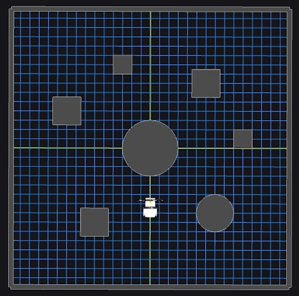
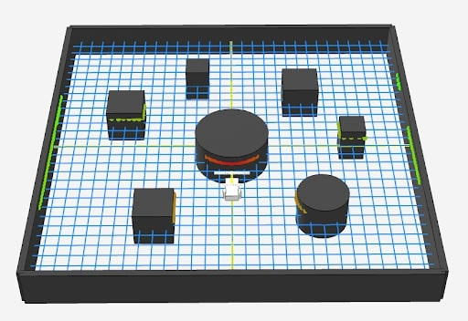
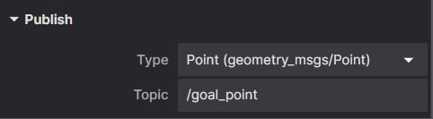
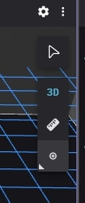
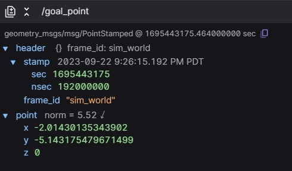
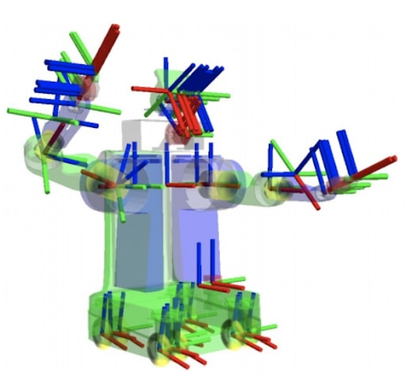

# General Autonomous Software Onboarding - ASD Assignment

import { Callout } from 'nextra/components'
import { Steps } from 'nextra/components'
 
<Callout type="error" emoji="️❗">
  You must complete [ASD - Developing with WATcloud](/onboarding/asd_watcloud_dev) before proceeding with this guide.
</Callout>

## Introduction
Congratulations! WATonomous has recognized your talent, and we would like to get you ready to contribute to the team. 

The Autonomous Software Division (ASD) assignment is designed to train a newcomer robotics programing at WATonomous from the ground up. 

**The onboarding assignment consists of the following:**
1. **Accessing the WATonomous Server Cluster (WATcloud)**
2. **Getting used to ROS2 - Docker robotics infrastructure**
3. **Writing your own control program to direct a robot in simulation**

Should you finish this assignment, you will have all the skills necessary to contribute towards building a real autonomous vehicle. Note, this assignment will not cover ML concepts. However, ML is used throughout robot autonomy, so we highly recommend you learn ML on your own time. [Here’s some ML resources for you](https://mega.nz/folder/gXdVhJID#XCXqwUR-9Y43slf_LJaUDw) (DO NOT SHARE).

<mark>After completing this assignment, you will become an official member of WATonomous with a dedicated watonomous email.</mark> Please contact the Director of ASD ([Eddy Zhou](e23zhou@watonomous.ca)) on discord, showing proof of completion and 2 subteams you are interested in joining. [Link to subteams here](https://www.watonomous.ca/roles).

**The ASD leads are here to help** so feel free to ask any questions about the onboarding assignment in the asd-questions channel on discord. This document is pretty long, but rest assured that a large majority of the assignment is a gigantic walk through.

Good Luck!

## Server Access
Server access steps have been moved to [here](https://wiki.watonomous.ca/). Please let the WATcloud leads know if you have any issues.

<mark>**Deliverable 1.0**</mark> Create a small SLURM job. Specify to the SLURM node that keep the job running for 2 hours or more. 

<mark>**Deliverable 2.0**</mark> Connect VS Code to a WATcloud SLURM job. Clone the [ASD Training Repository](https://github.com/WATonomous/wato_asd_training) into your WATcloud user’s home directory (~/). Open your cloned repository in VS Code. If you aren’t familiar with git, here’s a [cheatsheet](https://www.google.com/url?q=https://education.github.com/git-cheat-sheet-education.pdf&sa=D&source=docs&ust=1725499216448502&usg=AOvVaw1rF47Ac-OyVH_LDB6B4S3t).

<mark>**Deliverable 2.0.1**</mark> [**STAR THE WATO_MONOREPO**](https://github.com/WATonomous/wato_monorepo). It’s voluntary, but it will help us legitimize the repository overtime :).


<mark>**Deliverable 2.1**</mark> In the opened ASD Training Repo, create a new branch titled <span style={{ color: 'blue' }}>"your_name"_training.</span> If you aren’t familiar with git, here’s a [cheatsheet](https://www.google.com/url?q=https://education.github.com/git-cheat-sheet-education.pdf&sa=D&source=docs&ust=1725499876349288&usg=AOvVaw3DFdExLIHhMU0bH-bGz0nK).

 
 ### About the Training Repo
 The repository you just cloned contains a barebones setup of WATonomous’ current ASD infrastructure. It closely mirrors the infrastructure of the [wato_monorepo](https://github.com/WATonomous/wato_monorepo/tree/main), which is the central repository for all of the code that goes into the car. You can read up on the reasoning behind having a monorepo [here](https://github.com/WATonomous/wato_monorepo/blob/main/docs/monorepo.md).

 ### Quality of Life
 To make connecting to the server in your terminal easier and quicker, you can set up aliases. Aliases are short-form commands that represent a bigger command you don’t feel like remembering. 

### For Linux and Mac
Edit your <span style={{ color: 'blue' }}>~/.bashrc</span> to include an alias. Its general structure is…

<span style={{ color: 'blue' }}>alias "alias_name"=”the_long_command_you_dont_wanna_remember”</span>

You may need to fiddle around with your bashrc to get it to work. Ideally, you should have your alias ready whenever you open up the terminal.

**A sample alias to connect to the server could look like:**

```bash
SSH_PRIV_KEY_PATH=~/.ssh/id_rsa
SSH_USERNAME=eddyzhou
alias sshdelta="ssh -v -o ProxyCommand="ssh -W %h:%p -i '$SSH_PRIV_KEY_PATH' $SSH_USERNAME@bastion.watonomous.ca" -i '$SSH_PRIV_KEY_PATH' $SSH_USERNAME@delta-ubuntu2.cluster.watonomous.ca”
```

You should now be able to just type <span style={{ color: 'blue' }}>"sshdelta"</span> in a new tab of your terminal to connect to our WATcloud server. Aliases are a very powerful command line tool to make development quicker. If you don’t want to remember a command that you use all the time, make an alias! You can also create aliases on our server for remote development.

### Congratulations!
You now know how to connect to the WATcloud! Whenever you want to do WATonomous work, you can simply SSH into your WATcloud user and continue where you left off. You do not have to go through this entire process to connect to our server again (well, until the server runs into issues). VS Code will always have the same SSH targets to connect to, and you can always run one of your aliases to enter our server anywhere around the globe.

### A note on Docker
Docker is used heavily throughout our server cluster. It allows for multiple users to set up their own environments and code dependencies without interfering with others. Whether you are doing ASD work, or working on your own project, Docker is an important tool to learn not only for our server, but for any companies you work at that have a large server infrastructure.

## ASD Training Repository
In the previous section, you would have cloned the [ASD Training Repository](https://github.com/WATonomous/wato_asd_training) into your user’s home directory on the server. **Please keep this folder open as you read.** There is alot less hand-holding from this point onward.

The repository you just cloned contains a barebones setup of WATonomous’ current ASD infrastructure. It closely mirrors the infrastructure of the [wato_monorepo](https://github.com/WATonomous/wato_monorepo), which is the central repository for all of the code that goes into the car. You can read up on the reasoning behind having a monorepo [here](https://github.com/WATonomous/wato_monorepo/blob/main/docs/monorepo.md).

### Our Tech stack
Our autonomy stack contains a multitude of coding tools and libraries (PyTorch, TensorFlow, OpenCV, Numpy, Scikit, Foxglove, Gymnasium, etc.), but the three **MOST-PROMINENT, REOCCURING TOOLS** you must know are [ROS2](https://docs.ros.org/en/humble/index.html), [Docker](https://docs.docker.com/), and [Docker Compose](https://docs.docker.com/). 

These software tools enable cool AI tools and algorithms to communicate properly in a robotic system. Permutations of these open source tools are used throughout the cutting-edge robotics industry. It is especially prevalent in R&D, where new tools need to be integrated and tested at an alarming rate.

### ROS2
The [Robotics Operating System 2](https://docs.ros.org/en/humble/index.html) (ROS2) is the second iteration of open source tools and libraries used for quickly building robot applications. It helps us intuitively do interprocess communication without the need to dig extremely deep into low-level programming. ROS2 is the monorepo’s main communication interface.

<mark>**Deliverable 3.0**</mark> Identify locations in the code where ROS2 is being used.

### Docker
For our ASD stack, we use [Docker](https://docs.docker.com/) to containerize all of our code. Docker can be thought of as a lightweight virtual machine, allowing us to create separate environments (containers) for running code. This makes our codebase portable and modular.

Docker uses docker files (.Dockerfile extension) to configure and set up each container. Dockerfiles generally start with a machine base, and commands are specified to setup the machine, install dependencies, and setup the code workspace. Here is an [example dockerfile from the `wato_monorepo`](https://github.com/WATonomous/wato_monorepo/blob/main/docker/samples/cpp/aggregator.Dockerfile).

Generally the Dockerfiles for your modules will be set up already by your team leads. However, Docker is still a very useful tool to learn, and you can reference the [getting started](https://docs.docker.com/get-started/) 

documentation for more details if interested. Those who can understand our monorepo down to the docker-level are much valued :).

<mark>**Deliverable 3.1.0**</mark> Identify locations in the code where Docker is being used.

<mark>**Deliverable 3.1.1**</mark> What is the difference between a Dockerfile, a Docker Image, and a Docker Container? Refer to online references.

### Docker Compose and wato
[Docker Compose](https://docs.docker.com/compose/) is a utility for managing a codebase with multiple docker components. It provides an intuitive yaml interface to configure, build, and run docker containers. With a single Docker Compose command, you can startup multiple containers at once.

In our ASD training repo, and our monorepo, you will make great use of a software tool known as ‘watod’. Under the hood, watod is a wrapper around Docker Compose. You can use watod just like how you would use Docker Compose.

<mark>**Deliverable 3.2.0**</mark> Identify locations where Docker Compose is being used. What does WATO call these Docker Compose files? Hint: directory name

<mark>**Deliverable 3.2.1**</mark> Identify environment variables in a docker-compose file (Hint: they start with a $). How are these environment variables set during runtime? The next question can clear up this question.

<mark>**Deliverable 3.2.2**</mark> Identify any files prefixed with ‘watod’. Take a closer look at ‘watod-setup-env.sh’, what is it doing? What script do you run to run ‘watod-setup-env.sh’? How does this relate to the environment variables found in the docker-compose file?

<mark>**Deliverable 3.2.3**</mark> In your own words, explain what watod does. How does it interface with our docker-compose files?

### What's up with the long image names?
You may have noticed docker image names along the lines of “git.uwaterloo.ca:5050/watonomous/wato_monorepo/…”. This long image name refers to a docker image stored in a [Docker Registry](https://docs.docker.com/registry/). 

Building docker images from scratch can take an extremely long time. So our team takes advantage of Docker Registries to quickly pull pre-built images. This saves us a lot of time. 

In the ASD Training Assignment, docker registries are disabled. This is why you see the manifest error when building. No fret, we disabled registries on purpose. In the actual wato_monorepo, you’ll have to learn how to use registries.

### A Visual Understanding
Below is a possible way to visualize how our ASD infrastructure works:


The entire system communicates within itself using ROS2 messages. All the cool algorithms for perception, planning, control, etc. are wrapped in their own ROS2 nodes to function concurrently. Various nodes share <span style={{ color: 'blue' }}>docker containers</span> docker containers if they require the same libraries and tools to function (eg. two nodes may require the same version of PyTorch, so they share the same docker container).

<mark>**Deliverable 3.2.3**</mark> In your own words, describe an analogy to real life that closely resembles the ASD infrastructure.

### On startup
The visualization of the tech stack above represents our code in a running state. On startup, watod (docker-compose under the hood) is used to orchestrate the startup of each and every docker container, ROS2 node, and core algorithms. It carefully and automatically builds out the entire software architecture piece by piece until you end up with the visualization above.

## Training overview
Now that you have a decent understanding of our tech stack. We can now move on to the final part of the ASD training. This part will be the most time consuming, and it will also contain an extremely limited amount of hand holding. **Our team is here to help, so if you have any questions, feel free to ask on Discord!**

The provided training repository contains the following:
- A [Gazebo server](https://gazebosim.org/home), which is a robotics simulator allowing us to interact with and write code for a virtual robot
- A [Foxglove](https://app.foxglove.dev/signin) websocket, which streams ROS data over a websocket to be viewed using the Foxglove ROS visualization dashboard.
- ROS2, Docker, and WATO backend infrastructure.
- Sample ROS2 nodes in C++ and Python that demonstrate custom message passing.
- A barebones ROS2 node which you will write your code in.

The end result of the training will be some custom-written ROS2 nodes which will interact with various sensors on the robot, perform some computation/processing, and output commands to control the robot. All of this will be done using ROS2 as a framework. 

### Set up
In previous sections, we made you analyze the ASD Training code. Now is the time to learn how to use it.

### Configuration and startup

### Watod Orchestration
As you may or may not know, <span style={{ color: 'blue' }}>watod</span> is used to orchestrate our entire tech stack together. It sets any necessary environment variables that our <span style={{ color: 'blue' }}>docker compose</span> profiles would need on startup, and then calls the docker compose command to begin building all the docker containers.

Oftentimes, you don’t need to run the entire software pipeline to begin development, so you may only need to run a minimum slice of the software pipeline to begin. The powerful thing about <span style={{ color: 'blue' }}>watod</span> is that you can configure what profiles (docker-compose files) to start up. This equates to only starting only a portion of the entire stack as opposed to starting up the whole thing.

### watod-config.sh
To configure what profiles to startup, we use <span style={{ color: 'blue' }}>watod-config.sh</span> Specifically the <span style={{ color: 'blue' }}>ACTIVE_PROFILES</span> field.
```bash
## ----------------------- Watod2 Configuration File Override ----------------------------
## ACTIVE PROFILES CONFIGURATION
## List of active profiles to run, defined in docker-compose.yaml.
##
## Possible values:
## - vis_tools : starts tools for data visualization (foxglove)
## - gazebo : starts robot simulator (gazebo)
## - samples : starts up sample nodes for reference (optional)
## - robot : starts up robot nodes


ACTIVE_PROFILES="vis_tools gazebo samples"

## Name to append to docker containers. DEFAULT = <your_watcloud_username>

# COMPOSE_PROJECT_NAME=""


## Tag to use. Images are formatted as <IMAGE_NAME>:<TAG> with forward slashes replaced with dashes.
## DEFAULT = <your_current_github_branch>

# TAG=""

```

Your watod-config.sh would have ACTIVE_PROFILES commented out, so please populate this variable just like above. <span style={{ color: 'blue' }}>vis_tools</span>, <span style={{ color: 'blue' }}>gazebo</span>, and <span style={{ color: 'blue' }}>samples</span> are all profiles. 
 
<Callout type="error" emoji="️❗">
  NOTE: Once you are a full ASD member, please leave the watod-config.sh unchanged when you make a Pull Request.
</Callout>

### ./watod up
After you’ve changed your <span style={{ color: 'blue' }}>watod-config.sh</span>, simply startup the training stack by entering 

<span style={{ color: 'blue' }}>./watod up</span>

in your command line while inside the <span style={{ color: 'blue' }}>./wato_asd_training/</span> directory. You should then see docker compose building all the Docker images present in each of the profiles you specified. You could startup each of the three profiles alone if you wanted to. Use <span style={{ color: 'blue' }}> Ctrl + C </span> to stop watod.


<mark>**Deliverable 4.0**</mark> Startup all three profiles in the training repo (vis_tools, gazebo, and samples). After you’ve done that, stop <span style={{ color: 'blue' }}>watod</span>watod and startup each profile alone. Do this again with two of the three profiles.

### Dev containers
Dev containers are a very important aspect of WATonomous’ development cycle. When you run ./watod up, you spin up multiple containers that you can develop in. Inside these containers, you can change code, debug, and develop to your heart’s content, and all changes made inside the dev container will propagate out to your host machine.

**The typical WATonomous development cycle looks like this:**
<Steps>
### Step 1
 
Up a container using ./watod up

 
### Step 2
 
Enter the container using VScode Docker extension


### Step 3

Make changes inside the container and debug with ros2 tools


### Step 4

Changes in the container automatically propagate out (and vice versa)


### Step 5

Outside the container, Git add, commit, and push
</Steps>

The main benefit to dev containers is that you can use linters and tools installed inside the container. For example, you cannot install numpy in the WATcloud host, but you can install numpy in a container and play around with it inside that container.

<mark>**Deliverable 4.0.1**</mark> Enter the transformer container and change its [BUFFER_CAPACITY](https://github.com/WATonomous/wato_asd_training/blob/074cb7400fcfdc12130b520c606044ec16083e48/src/samples/cpp/transformer/include/transformer_core.hpp#L20). 

<mark>**Deliverable 4.0.2**</mark> Rebuild the transformer inside the container using colcon build **under the ~/ament_ws directory**. Source your changes with source install/setup.bash. 

<mark>**Deliverable 4.0.3**</mark> Launch the transformer node with ros2 launch transformer transformer.launch.py. You should notice your transformer buffer fill up faster or slower based on the new BUFFER_CAPACITY you specified.

<mark>**Deliverable 4.0.4**</mark> Outside the container, check that your changes to the transformer have propagated out using git status. You should see something like the following…


You can also to ./watod up outside your container, and the changes you made inside the container should reflect in the robot logs.

<mark>**Deliverable 4.0.5**</mark> **BONUS**  when doing ./watod up, the transformer node spins up automatically. Can you think of a way to not make the node spin up? Hint: you need to stop the node from launching, but you have to keep the container running for an indefinite period.

## Foxglove


[Foxglove](https://foxglove.dev/) is an open source data visualization tool for robotics. Founded by a couple of folks at [Cruise](https://webviz.io/), Foxglove’s main advantage is its ability to visualize server-side data. 

You may have heard of RViz, which is ROS’s native visualization software. As powerful as this tool can be, RViz is not great for server-side development. In order to use RViz on our server, you’d have to spin up a VNC docker container. This is what our team has done in the past, but it was terrible. RViz would run at no faster than 3fps.

### Port Forwarding
In a nutshell, [Port Forwarding](https://www.coeosolutions.com/news/what-is-port-forwarding) establishes a connection between a communication endpoint on one device in a private network to another device on another network. We use Port Forwarding to view Graphic User Interfaces (GUIs) and stream data to your local machine. The world of networking is scary, so we will try to make it as straightforward as possible. 

A recurring pattern for Port Forwarding is: <span style={{ color: 'blue' }}>“software A is streaming data out of some port ####, I want to read this data myself, so I will forward port #### to my machine to read it”</span>. If software A is in a Docker container on a server host machine, then you have to forward the port from the Docker container to the host machine, and then from the host machine to your local machine.

You don’t have to do much port forwarding yourself, but it’s good to know the gist of it as we move forward.

### Using Foxglove
1. Make sure you have the **gazebo** and **vis_tools** profiles running
2. Have some sort of web browser on your local machine
3. Have the asd_training_config downloaded on your local machine (this is in the training repo)

Once you have the two profiles running, you should notice an auto-forwarded port in your VS Code. 


This port is where foxglove is streaming its data from. You don’t have to do any forwarding yourself, as we’ve done it for you ;P. 

To view this data, go to the Foxglove website, create an account <span style={{ color: 'blue' }}>(with your personal email, we need to hash out sponsorship from Foxglove before you can use your watonomous email)</span>, and either visualize the data through your web browser or a local download of Foxglove.

### Viewing ROS data through foxglove
**To view the data coming from the forwarded port**, in the Foxglove dashboard click Visualize Data -> Open Connection -> Foxglove Websocket and set it as the port that was forwarded. In the example above, that would be <span style={{ color: 'blue' }}>ws://localhost:33401</span>. It will be different for everyone.


You can now proceed to open your Foxglove Studio to begin viewing the robot simulation.

<mark>**Deliverable 4.1**</mark> Up the ASD Training Repo and view your robot simulation in Foxglove on your local machine.


Your Foxglove Studio should look something like this. Don’t worry if it looks slightly different. We will fix that now. In the ASD Training Repo, we’ve provided a configuration file that sets up your Foxglove Studio to look exactly like how we want it to look. If you haven’t yet, download the configuration file from the repo. 

You then need to load this file into your local Foxglove Studio. 


Reload your Foxglove, and you should see something like the following.


<mark>**Deliverable 4.2**</mark> Upload the ASD Foxglove config to your local foxglove.

<mark>**Deliverable 4.3**</mark> Interact with Foxglove Studio. You can move around the robot with the Teleop Panel. Here are a couple of subtasks to get you acquainted.

<mark>**Deliverable 4.3.1**</mark>

<mark>**Deliverable 4.3.2**</mark> **BONUS:** View the list of Topics. What is a Topic? This can be a great opportunity to get an initial idea of ROS Topics.

<mark>**Deliverable 4.3.2**</mark> **BONUS:** The visualized data is, in-reality, a bunch of numbers. Foxglove (and RViz) do some post processing to make it look intuitive. View the <span style={{ color: 'blue' }}>/lidar</span> topic’s raw data through a new Raw Message Panel.

## Hands-on Training
Now that your development environment is set up, we can begin hands-on training. You can always refer back to the previous steps for reference. **Kind reminder that our team is here to help, so if you ever have any questions, please feel free to ask in the ASD-Questions channel :).**

Originally, the intent of this training was to code up a semi-complete navigation system to make the robot rather-intelligently navigate to a destination of your choice. However, for the sake of not blowing up your mind, we have trimmed the assignment down to at least touch all the fundamental concepts we would like you to learn. If you would like to do the whole assignment, feel free to reach out, and we can give you more info on how the robot should navigate the map.

### The Basis of Robot navigation
Robot navigation is a very large field of study, so let’s be more specific. The navigation problem we are most concerned with here at WATonomous is: **given an end position, and no prior knowledge of the environment, navigate to that end position.**

In Foxglove Studio, you should see an environment that closely relates to the problem above.


Here, the end position can be specified by the user to be anywhere on the map.

In an ideal environment, where obstacles don’t move, robot navigation can be quite simple. A naive approach to this problem could be: Occupancy, Immediate Trajectory, and Execution. We provide a brief description of them below:

**Occupancy:** A map of squares indicating where the robot can and cannot go.

**Immediate Trajectory:** The planned trajectory to take to get to the end position. 

**Execution:** Following the planned trajectory as best as we can.

In this system, the occupancy around the robot is found continuously. Given this geometric representation, we can produce a trajectory using the Immediate Trajectory planner. This trajectory is then Executed for a period of time. The whole process repeats continuously until an endpoint is reached.

This is not much different to the real autonomy stack of the car. A higher fidelity Occupancy is found using Perception. Immediate trajectories need to factor in the complexity of the road with Navigation. And we mist execute on this trajectory with Control.

To formalize, Perception would receive sensor messages and do processing. Navigation would receive the processed sensor data and figure out a set of actions to take. Control would receive the actions and perform them, finally sending commands to the motor. In fact, WATonomous’s software stack follows a very similar architecture, but with more node subdivision within each group to perform more complex computations.

### Goal
The Foxglove simulation consists of a robot within an environment. The robot has three wheels, two motors, a camera, and a 1-dimensional laser scanner.



You can freely control the robot’s movement within the environment using the Foxglove Teleop panel.

As you may have noticed, the Teleop control of the robot is pretty terrible. It oversteers, stops late, and has a ton of inertia. **What if we could simply instruct the robot to move to a specific point on the map instead?**

The goal of your hands-on training is to do just that! By specifying a goal on the foxglove map, your robot should naively navigate to that point on the map. 

<Callout type="error" emoji="️❗">
  Note: It is important to know that the node you are about to create does not allow the robot to avoid obstacles. It will simply follow the straight-line trajectory to the point you specified. 
As naive as this sounds, this is actually the basis of robot control. You will see later how this simple control algorithm you’ll make is used with the rest of the navigation stack to achieve obstacle avoidance!
</Callout>

### ROS
Robot Operating System (ROS) is a popular framework for robotics codebases. At its core, it is a message broker – a system which manages and passes data between programs. This allows for modularity, management of complex data types, and interoperability. What makes ROS so powerful is the ability to easily interface libraries and tools that were built on top of ROS to bring advanced capabilities and interactive visualizations to your software stack. Some examples that we will be using are:
- Foxglove, a web-based ROS dashboard for visualizing data and interacting with the robot
- Geometry messages, a ROS package which includes a lot of standard geometry data types like Pose, Point, Twist, Quaternion, etc.
- Transforms 2 (Tf2), a ROS package which allows easy transformations between coordinate frames

The basic building block of the ROS framework are nodes. Nodes are responsible for performing a specific set of tasks, and interact with other nodes by receiving (subscribing) or sending out (publishing) messages. You can think of ROS like a network, with many nodes interacting with each other through ROS to achieve the overall function of the software stack. 

On the technical side, ROS nodes are just c++ or python programs with the ROS library. The ROS framework then manages the building, running, and message passing of each node behind the scenes. The ROS library provides the syntax for creating a node, subscribing to messages, sending out messages, and native objects for ROS messages.

<Callout type="error" emoji="️❗">
  Note: This document will give a quick overview of ROS2 code, however we highly recommend going through the ROS2 Getting Started documentation which is much more detailed and explains ROS2 from start to finish. There may be a steep learning curve, so if you are confused throughout these training modules, feel free to ask the team leads for an explanation on discord!
</Callout>
  

Here is an example ROS node in C++:
```c++
#include "transformer_node.hpp"


ExampleNode::ExampleNode() : Node("example_node"){
  // Subscribe to a topic
  subscription_ = this->create_subscription<geometry_msgs::msg::Pose>(
    "/example_topic0", 20, 
std::bind(&ExampleNode::subscription_callback, this, 
std::placeholders::_1));
  // Publish to a topic
  publisher_ =
 this->create_publisher<geometry_msgs::msg::Pose>("/example_topic1", 20);
}


// Subscription callback: gets called when a message from the subscription comes in
void ExampleNode::subscription_callback(const geometry_msgs::msg::Pose::SharedPtr msg)
{
	// Print to the console
RCLCPP_INFO(this->get_logger(), "Received message…");
	…
	// Publish a message
   	publisher_->publish(msg);
}


// Boilerplate code for starting up the node (gets called by ROS   framework)
int main(int argc, char ** argv)
{
  rclcpp::init(argc, argv);
  rclcpp::spin(std::make_shared<ExampleNode>());
  rclcpp::shutdown();
  return 0;
}

```

**Let’s break it down.**

First, we have the constructor of our node, which inherits the Node class from the ROS library (rclcpp). There we pass the name of our node, “example_node”.

``` c++
ExampleNode::ExampleNode() : Node("example_node"){
 …
}

```

### Publisher:

Inside the constructor, we initialize our publishers and subscribers. Here is the syntax to create a publisher with the rclcpp library:
``` c++
// In header file:
rclcpp::Publisher<MESSAGE_TYPE>::SharedPtr publisher_;

// In node constructor:
publisher_ = this->create_publisher<MESSAGE_TYPE>("/TOPIC", 20);

```

Where MESSAGE_TYPE is the message you are publishing (i.e. geometry_msgs::msg::Pose for a Pose message) and “/TOPIC” is the topic you are publishing to. The 20 at the end is the buffer size, 20 is a good number for that. 
You can then publish a message to the publisher using:
``` c++
publisher_->publish(msg);

```

Where msg is an object of the type you specified (i.e. geometry_msgs::msg::Pose()). 

### Subscriber
Next, here is the syntax to create a subscriber:

``` c++
// In header file:
rclcpp::Subscription<MESSAGE_TYPE>::SharedPtr subscriber_;


// In node constructor:
subscriber_= this->create_subscription<MESSAGE_TYPE>(
    "/TOPIC", 20, 
std::bind(&CALLBACK, this, 
std::placeholders::_1));

```

Where MESSAGE_TYPE is the message in the topic you want to subscribe to (i.e. geometry_msgs::msg::Pose), “/TOPIC” is the topic to subscribe to, and CALLBACK is a reference to a member function that will get called when a new message comes in (i.e. ExampleNode::subscription_callback). Again, the 20 is the buffer size, and std::placeholders::_1 is boilerplate code for calling the callback with an argument. 

When a message is received by the subscriber, it calls the callback function with a pointer to the message. Here is an example callback function you would define in your node class:

``` c++
// In header file:
void ExampleNode::subscription_callback(const geometry_msgs::msg::Pose::SharedPtr msg);


//Implementation:
void ExampleNode::subscription_callback(const geometry_msgs::msg::Pose::SharedPtr msg)
{
 …
}

```

The ::SharedPtr is a special type of smart pointer, but it is functionally the same as a normal pointer and can be dereferenced and accessed using ->. Values of the message can be accessed just like a normal C++ object, such as “msg->position.x, msg->position.y, msg->position.z” to access the coordinates of the Pose message. 

You can reference the property names of any message by searching up the message followed by “ros2” on google. For example, here are the docs for the Pose message: [docs for message](http://docs.ros.org/en/noetic/api/geometry_msgs/html/msg/Pose.html), and you can see all the variables you can access in it.

### Timers:
Timers are tasks that execute in a repeated loop. Example use cases for timers are control loops which consistently update motor commands based on observations. The syntax to create a timer is the following:

``` c++
//In header file:
rclcpp::TimerBase::SharedPtr timer_;
void timer_callback();


//In node constructor:
timer_ = this->create_wall_timer(std::chrono::milliseconds(delay_ms), std::bind(&YourNode::timer_callback, this));


//Callback implementation:
void YourNode::timer_callback(){

}

```

Where delay_ms is the time between timer calls in milliseconds, and YourNode::timer_callback is the callback function that is called when the timer executes. 

### Printing
To print to the console, use RCLCPP_INFO followed by a string. You can pass additional parameters to the RCLCPP_INFO and they get added to the string using c++ sprintf [format](https://www.tutorialspoint.com/c_standard_library/c_function_sprintf.htm). For example, adding %f to the string will add in a floating point number to the print, which is passed in as a parameter to RCLCPP_INFO. The following code segment shows printing position.x to the console.

``` c++
RCLCPP_INFO(this->get_logger(), "Received message… x=%f", msg->position.x);
// Will output “Received message… x=10.5” or whatever position.x is

```

These are all of the core functionalities to writing a node in ROS! As an exercise, try implementing a publisher and subscriber in C++ using one of the empty nodes available in the training repo, such as <span style={{ color: 'blue' }}>src/robot/control/src/control_node.cpp</span>

<mark>**Deliverable 5.1**</mark> Write a timer that executes every second that will call a callback function and print out a message of your choice to the console. Verify that it works by running ./watod up and viewing the console printouts.

<mark>**Deliverable 5.2**</mark> Create a publisher that publishes a std_msgs::msg::String message to the “/example_string” topic. Modify the timer callback function you wrote in Deliverable 5.1 to include publishing of a string message to your publisher with a message of your choice. Verify the messages are being sent by adding a “raw message” widget to foxglove and set it to your new topic name. Congratulations, you published your first message!


<mark>**Deliverable 5.3**</mark> Write a subscriber that receives nav_msgs::msg::Odometry messages from the “/model/robot/odometry” topic (should be automatically available via Gazebo when you run the training repo) and prints its x,y,z coordinates to the console. Reference the ros2 documentation for the Odometry message properties. Congratulations, you subscribed to your first message! 

You have now successfully written a node to publish and subscribe to messages, which is the core functionality of ROS! You can now write nodes to interact with robots via subscribing and publishing ROS messages. 

### Control
Now it’s time to implement your first node to interact with the robot! This node will be responsible for receiving a goal position to drive towards and send motor commands to the robot to drive towards it. 

To set a position for the robot to drive to, we will be using Foxglove’s 3D panel publish feature, which allows you to click on the 3D map and publish a message. In Foxglove under panel settings for the 3D panel, you should see the following listed under the Publish tab:



This is where you select the message type and topic to publish to when you click on the 3D map. If you use our configuration file, these will be automatically selected to geometry_msgs::msg::Point and “/goal_point” topic. 

In order to publish that message, click on the circle icon at the top right of the 3D panel (shown below) and click on a point on the map. 



You can verify that your point is published by adding a Raw Message widget and point it to the “/goal_pose” topic and watch as a message appears when you click on the circle icon and click on the map.



The purpose of the control node is to subscribe to this topic and drive the robot towards the point you clicked on the map.
You will be writing code in the control node, so go ahead open up <span style={{ color: 'blue' }}>src/robot/control/src/control_node.cpp</span> in the wato_asd_training repo. Now, to receive these messages, create a new subscriber in the Control node (a blank node called Control has been setup already in the repo, you may edit that node) and make it subscribe to geometry_msgs::msg::PointStamped messages in the “/goal_point” message. Then, create a callback and print out the x,y,z values of that [PointStamped](https://docs.ros.org/en/noetic/api/geometry_msgs/html/msg/PointStamped.html) message (reference link) using RCLCPP_INFO. 

<mark>**Deliverable 6.1**</mark> Create a subscriber that receives geometry_msgs::msg::PointStamped messages from the “/goal_point” topic. Verify you receive the messages by printing out the x,y,z coordinates to the console. 

Now that you can receive the goal pose, the next step is to control the robot. Firstly, we need a timer callback that will run the control loop on repeat. To do this, create a timer that runs every 100ms and calls a blank function for now.

<mark>**Deliverable 6.2**</mark> Create a timer that calls a blank callback function every 100ms for control. You can verify it works by printing a random message using RCLCPP_INFO.

Inside this timer, we will be using a simple proportional controller. A proportional controller is the first term in PID control, which simply multiplies a constant scalar to the error, where error is the distance between your current point and desired point.

Command = Kp * error

In this case, we have two error terms: x and y. The x error will define forward movement, and the y error will define angular movement. 

However, there is one problem. Currently, the point message is defined in the world coordinate frame, while we want the error in the robot’s relative coordinate frame to do relative movements. In order to do this, we will take advantage of ROS2’s transform system: TF2

### Transforms
Transforms define coordinate frames for geometry objects. One example could be a coordinate relative to the world versus relative to the robot, or a coordinate relative to an arm of the robot versus the base of the robot. Here is an illustration of a complex robot with multiple transforms (shown by red,blue,green axis markers): 


Luckily, the ROS2 library has an easy way for dealing with transforms. The gazebo environment we provided automatically publishes the transform of the robot, which allows us to easily convert 

a point in world space to robot space. Once the point is in robot space, we can get the relative x and y offset from the robot’s position to the point.

To access ROS2’s transform system, you must create a tf_buffer and tf_listener using the following syntax:

``` c++
// In header file   
std::unique_ptr<tf2_ros::Buffer> tf_buffer_;
std::shared_ptr<tf2_ros::TransformListener> tf_listener_;
  
// In node constructor
tf_buffer_ = std::make_unique<tf2_ros::Buffer>(this->get_clock());
tf_listener_ = std::make_shared<tf2_ros::TransformListener>(*tf_buffer_);

```

Then, to access the transform between two frames, use the following syntax:

``` c++
geometry_msgs::msg::TransformStamped transform;


try {
    transform = tf_buffer_->lookupTransform("TO_FRAME", "FROM_FRAME", tf2::TimePointZero);
} catch (const tf2::TransformException & ex) {
    RCLCPP_INFO(this->get_logger(), "Could not transform %s", ex.what());
}

```

Where “TO_FRAME” is the frame you want to transform the point into, and “FROM_FRAME” is the frame the point originated in.

Then to transform a point using that frame:

``` c++
auto transformed_point = geometry_msgs::msg::PointStamped();

 tf2::doTransform(original_point, transformed_point, transform);

```

Where original_point is the point in the FROM_FRAME and transformed_point is that same point in the TO_FRAME.

We will be leveraging this code to transform our global point published to /goal_point into the robot’s frame. The goal_point will be in the frame “sim_world” (which is our global frame in this case) and the robot’s frame is “robot”.

<mark>**Deliverable 6.2**</mark> Create a tf_buffer and tf_listener in your control node. Then, in the control callback, get the transform from “sim_world” to “robot” and transform the goal_point to the robot frame. You may need to store goal_point in an instance variable in the Node class to access it in the timer callback after it has been received from the subscriber.

Now that the point is transformed, the x coordinate relates to the robot’s forward motion while the y coordinate relates to the robot’s side to side motion (angular). Therefore, an easy proportional control loop may be derived where the linear command is proportional to the X component and the angular command is proportional to the Y component.

<mark>**Deliverable 6.3**</mark> Create two variables called Kp_linear and Kp_angular which will be the scalars for the proportional loop, initialize them to 0.5 as a good starting guess (these can be tuned later). Multiply Kp_linear by the X component of the goal_point transformed in the robot frame and Kp_angular by the Y component of the goal_point transformed in the robot frame. These will be your control signals to send to the robot.

Now that you have the control signals, you must publish them to the robot.  By default, the robot takes in control signals in the form of a [geometry_msgs::msg::Twist](https://docs.ros.org/en/melodic/api/geometry_msgs/html/msg/Twist.html) message, which has a linear and angular velocity associated with it. The simulated robot is setup to receive Twist messages in the “/cmd_vel” topic, so you can directly send commands to the robot by creating a publisher in the control node that publishes geometry_msgs::msg::Twist messages to the “/cmd_vel” topic. Once the subscriber is made, you can then package up your linear and angular velocity commands inside of a Twist message (linear velocity will use the x component of the linear Vector3 of Twist and angular velocity will use the z component of the angular Vector3 of Twist. The rest will remain 0) and publish to the robot to control it!

<mark>**Deliverable 6.4**</mark> Create a publisher that publishes geometry_msgs::msg::Twist messages to the “/cmd_vel” topic. In your control timer, create a new Twist message, set the linear x component to the result of the linear proportional loop and the angular z component to the result of the angular proportional loop. Then, your robot should drive towards the goal_point message when you publish in Foxglove!

## Conclusion
Congratulations, you have now successfully controlled a robot using ROS2! The fundamentals of publishers, subscribers, and a few tricks you learned like Foxglove and transforms will be extremely valuable in your development in the WATO ASD software stack. 

Please contact the Director of ASD (Eddy Zhou) on discord, showing proof of completion and 2 subteams you are interested in joining. [Link to subteams here](https://www.watonomous.ca/roles). **Welcome to WATonomous :)**
