# General Autonomous Software Onboarding - ASD Assignment

import { Callout } from 'nextra/components'
import { Steps } from 'nextra/components'
 
<Callout type="error" emoji="️❗">
  You must complete [ASD - Developing with WATcloud](/onboarding/asd_watcloud_dev) before proceeding with this guide.
</Callout>

## Introduction
Congratulations! WATonomous has recognized your talent, and we would like to get you ready to contribute to the team. 

The Autonomous Software Division (ASD) assignment is designed to train a newcomer robotics programing at WATonomous from the ground up. 

**The onboarding assignment consists of the following:**
1. **Accessing the WATonomous Server Cluster (WATcloud)**
2. **Getting used to ROS2 - Docker robotics infrastructure**
3. **Writing your own control program to direct a robot in simulation**

Should you finish this assignment, you will have all the skills necessary to contribute towards building a real autonomous vehicle. Note, this assignment will not cover ML concepts. However, ML is used throughout robot autonomy, so we highly recommend you learn ML on your own time. [Here’s some ML resources for you](https://mega.nz/folder/gXdVhJID#XCXqwUR-9Y43slf_LJaUDw) (DO NOT SHARE).

<mark>After completing this assignment, you will become an official member of WATonomous with a dedicated watonomous email.</mark> Please contact the Director of ASD ([Eddy Zhou](e23zhou@watonomous.ca)) on discord, showing proof of completion and 2 subteams you are interested in joining. [Link to subteams here](https://www.watonomous.ca/roles).

**The ASD leads are here to help** so feel free to ask any questions about the onboarding assignment in the asd-questions channel on discord. This document is pretty long, but rest assured that a large majority of the assignment is a gigantic walk through.

Good Luck!

## Server Access
Server access steps have been moved to [here](https://wiki.watonomous.ca/). Please let the WATcloud leads know if you have any issues.

<mark>**Deliverable 1.0**</mark> Create a small SLURM job. Specify to the SLURM node that keep the job running for 2 hours or more. 

<mark>**Deliverable 2.0**</mark> Connect VS Code to a WATcloud SLURM job. Clone the [ASD Training Repository](https://github.com/WATonomous/wato_asd_training) into your WATcloud user’s home directory (~/). Open your cloned repository in VS Code. If you aren’t familiar with git, here’s a [cheatsheet](https://www.google.com/url?q=https://education.github.com/git-cheat-sheet-education.pdf&sa=D&source=docs&ust=1725499216448502&usg=AOvVaw1rF47Ac-OyVH_LDB6B4S3t).

<mark>**Deliverable 2.0.1**</mark> [**STAR THE WATO_MONOREPO**](https://github.com/WATonomous/wato_monorepo). It’s voluntary, but it will help us legitimize the repository overtime :).

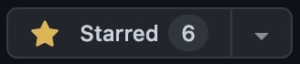

<mark>**Deliverable 2.1**</mark> In the opened ASD Training Repo, create a new branch titled <span style={{ color: 'blue' }}>"your_name"_training.</span> If you aren’t familiar with git, here’s a [cheatsheet](https://www.google.com/url?q=https://education.github.com/git-cheat-sheet-education.pdf&sa=D&source=docs&ust=1725499876349288&usg=AOvVaw3DFdExLIHhMU0bH-bGz0nK).

 
 ### About the Training Repo
 The repository you just cloned contains a barebones setup of WATonomous’ current ASD infrastructure. It closely mirrors the infrastructure of the [wato_monorepo](https://github.com/WATonomous/wato_monorepo/tree/main), which is the central repository for all of the code that goes into the car. You can read up on the reasoning behind having a monorepo [here](https://github.com/WATonomous/wato_monorepo/blob/main/docs/monorepo.md).

 ### Quality of Life
 To make connecting to the server in your terminal easier and quicker, you can set up aliases. Aliases are short-form commands that represent a bigger command you don’t feel like remembering. 

### For Linux and Mac
Edit your <span style={{ color: 'blue' }}>~/.bashrc</span> to include an alias. Its general structure is…

<span style={{ color: 'blue' }}>alias "alias_name"=”the_long_command_you_dont_wanna_remember”</span>

You may need to fiddle around with your bashrc to get it to work. Ideally, you should have your alias ready whenever you open up the terminal.

**A sample alias to connect to the server could look like:**

```bash
SSH_PRIV_KEY_PATH=~/.ssh/id_rsa
SSH_USERNAME=eddyzhou
alias sshdelta="ssh -v -o ProxyCommand="ssh -W %h:%p -i '$SSH_PRIV_KEY_PATH' $SSH_USERNAME@bastion.watonomous.ca" -i '$SSH_PRIV_KEY_PATH' $SSH_USERNAME@delta-ubuntu2.cluster.watonomous.ca”
```

You should now be able to just type <span style={{ color: 'blue' }}>"sshdelta"</span> in a new tab of your terminal to connect to our WATcloud server. Aliases are a very powerful command line tool to make development quicker. If you don’t want to remember a command that you use all the time, make an alias! You can also create aliases on our server for remote development.

### Congratulations!
You now know how to connect to the WATcloud! Whenever you want to do WATonomous work, you can simply SSH into your WATcloud user and continue where you left off. You do not have to go through this entire process to connect to our server again (well, until the server runs into issues). VS Code will always have the same SSH targets to connect to, and you can always run one of your aliases to enter our server anywhere around the globe.

### A note on Docker
Docker is used heavily throughout our server cluster. It allows for multiple users to set up their own environments and code dependencies without interfering with others. Whether you are doing ASD work, or working on your own project, Docker is an important tool to learn not only for our server, but for any companies you work at that have a large server infrastructure.

## ASD Training Repository
In the previous section, you would have cloned the [ASD Training Repository](https://github.com/WATonomous/wato_asd_training) into your user’s home directory on the server. **Please keep this folder open as you read.** There is alot less hand-holding from this point onward.

The repository you just cloned contains a barebones setup of WATonomous’ current ASD infrastructure. It closely mirrors the infrastructure of the [wato_monorepo](https://github.com/WATonomous/wato_monorepo), which is the central repository for all of the code that goes into the car. You can read up on the reasoning behind having a monorepo [here](https://github.com/WATonomous/wato_monorepo/blob/main/docs/monorepo.md).

### Our Tech stack
Our autonomy stack contains a multitude of coding tools and libraries (PyTorch, TensorFlow, OpenCV, Numpy, Scikit, Foxglove, Gymnasium, etc.), but the three **MOST-PROMINENT, REOCCURING TOOLS** you must know are [ROS2](https://docs.ros.org/en/humble/index.html), [Docker](https://docs.docker.com/), and [Docker Compose](https://docs.docker.com/). 

These software tools enable cool AI tools and algorithms to communicate properly in a robotic system. Permutations of these open source tools are used throughout the cutting-edge robotics industry. It is especially prevalent in R&D, where new tools need to be integrated and tested at an alarming rate.

### ROS2
The [Robotics Operating System 2](https://docs.ros.org/en/humble/index.html) (ROS2) is the second iteration of open source tools and libraries used for quickly building robot applications. It helps us intuitively do interprocess communication without the need to dig extremely deep into low-level programming. ROS2 is the monorepo’s main communication interface.

<mark>**Deliverable 3.0**</mark> Identify locations in the code where ROS2 is being used.

### Docker
For our ASD stack, we use [Docker](https://docs.docker.com/) to containerize all of our code. Docker can be thought of as a lightweight virtual machine, allowing us to create separate environments (containers) for running code. This makes our codebase portable and modular.

Docker uses docker files (.Dockerfile extension) to configure and set up each container. Dockerfiles generally start with a machine base, and commands are specified to setup the machine, install dependencies, and setup the code workspace. Here is an [example dockerfile from the `wato_monorepo`](https://github.com/WATonomous/wato_monorepo/blob/main/docker/samples/cpp/aggregator.Dockerfile).

Generally the Dockerfiles for your modules will be set up already by your team leads. However, Docker is still a very useful tool to learn, and you can reference the [getting started](https://docs.docker.com/get-started/) 

documentation for more details if interested. Those who can understand our monorepo down to the docker-level are much valued :).

<mark>**Deliverable 3.1.0**</mark> Identify locations in the code where Docker is being used.

<mark>**Deliverable 3.1.1**</mark> What is the difference between a Dockerfile, a Docker Image, and a Docker Container? Refer to online references.

### Docker Compose and wato
[Docker Compose](https://docs.docker.com/compose/) is a utility for managing a codebase with multiple docker components. It provides an intuitive yaml interface to configure, build, and run docker containers. With a single Docker Compose command, you can startup multiple containers at once.

In our ASD training repo, and our monorepo, you will make great use of a software tool known as ‘watod’. Under the hood, watod is a wrapper around Docker Compose. You can use watod just like how you would use Docker Compose.

<mark>**Deliverable 3.2.0**</mark> Identify locations where Docker Compose is being used. What does WATO call these Docker Compose files? Hint: directory name

<mark>**Deliverable 3.2.1**</mark> Identify environment variables in a docker-compose file (Hint: they start with a $). How are these environment variables set during runtime? The next question can clear up this question.

<mark>**Deliverable 3.2.2**</mark> Identify any files prefixed with ‘watod’. Take a closer look at ‘watod-setup-env.sh’, what is it doing? What script do you run to run ‘watod-setup-env.sh’? How does this relate to the environment variables found in the docker-compose file?

<mark>**Deliverable 3.2.3**</mark> In your own words, explain what watod does. How does it interface with our docker-compose files?

### What's up with the long image names?
You may have noticed docker image names along the lines of “git.uwaterloo.ca:5050/watonomous/wato_monorepo/…”. This long image name refers to a docker image stored in a [Docker Registry](https://docs.docker.com/registry/). 

Building docker images from scratch can take an extremely long time. So our team takes advantage of Docker Registries to quickly pull pre-built images. This saves us a lot of time. 

In the ASD Training Assignment, docker registries are disabled. This is why you see the manifest error when building. No fret, we disabled registries on purpose. In the actual wato_monorepo, you’ll have to learn how to use registries.

### A Visual Understanding
Below is a possible way to visualize how our ASD infrastructure works:
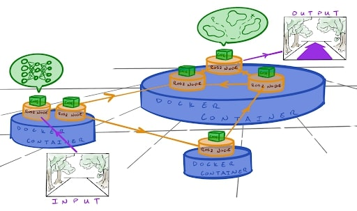

The entire system communicates within itself using ROS2 messages. All the cool algorithms for perception, planning, control, etc. are wrapped in their own ROS2 nodes to function concurrently. Various nodes share <span style={{ color: 'blue' }}>docker containers</span> docker containers if they require the same libraries and tools to function (eg. two nodes may require the same version of PyTorch, so they share the same docker container).

<mark>**Deliverable 3.2.3**</mark> In your own words, describe an analogy to real life that closely resembles the ASD infrastructure.

### On startup
The visualization of the tech stack above represents our code in a running state. On startup, watod (docker-compose under the hood) is used to orchestrate the startup of each and every docker container, ROS2 node, and core algorithms. It carefully and automatically builds out the entire software architecture piece by piece until you end up with the visualization above.

## Training overview
Now that you have a decent understanding of our tech stack. We can now move on to the final part of the ASD training. This part will be the most time consuming, and it will also contain an extremely limited amount of hand holding. **Our team is here to help, so if you have any questions, feel free to ask on Discord!**

The provided training repository contains the following:
- A [Gazebo server](https://gazebosim.org/home), which is a robotics simulator allowing us to interact with and write code for a virtual robot
- A [Foxglove](https://app.foxglove.dev/signin) websocket, which streams ROS data over a websocket to be viewed using the Foxglove ROS visualization dashboard.
- ROS2, Docker, and WATO backend infrastructure.
- Sample ROS2 nodes in C++ and Python that demonstrate custom message passing.
- A barebones ROS2 node which you will write your code in.

The end result of the training will be some custom-written ROS2 nodes which will interact with various sensors on the robot, perform some computation/processing, and output commands to control the robot. All of this will be done using ROS2 as a framework. 

### Set up
In previous sections, we made you analyze the ASD Training code. Now is the time to learn how to use it.

### Configuration and startup

### Watod Orchestration
As you may or may not know, <span style={{ color: 'blue' }}>watod</span> is used to orchestrate our entire tech stack together. It sets any necessary environment variables that our <span style={{ color: 'blue' }}>docker compose</span> profiles would need on startup, and then calls the docker compose command to begin building all the docker containers.

Oftentimes, you don’t need to run the entire software pipeline to begin development, so you may only need to run a minimum slice of the software pipeline to begin. The powerful thing about <span style={{ color: 'blue' }}>watod</span> is that you can configure what profiles (docker-compose files) to start up. This equates to only starting only a portion of the entire stack as opposed to starting up the whole thing.

### watod-config.sh
To configure what profiles to startup, we use <span style={{ color: 'blue' }}>watod-config.sh</span> Specifically the <span style={{ color: 'blue' }}>ACTIVE_PROFILES</span> field.
```bash
## ----------------------- Watod2 Configuration File Override ----------------------------
## ACTIVE PROFILES CONFIGURATION
## List of active profiles to run, defined in docker-compose.yaml.
##
## Possible values:
## - vis_tools : starts tools for data visualization (foxglove)
## - gazebo : starts robot simulator (gazebo)
## - samples : starts up sample nodes for reference (optional)
## - robot : starts up robot nodes


ACTIVE_PROFILES="vis_tools gazebo samples"

## Name to append to docker containers. DEFAULT = <your_watcloud_username>

# COMPOSE_PROJECT_NAME=""


## Tag to use. Images are formatted as <IMAGE_NAME>:<TAG> with forward slashes replaced with dashes.
## DEFAULT = <your_current_github_branch>

# TAG=""

```

Your watod-config.sh would have ACTIVE_PROFILES commented out, so please populate this variable just like above. <span style={{ color: 'blue' }}>vis_tools</span>, <span style={{ color: 'blue' }}>gazebo</span>, and <span style={{ color: 'blue' }}>samples</span> are all profiles. 
 
<Callout type="error" emoji="️❗">
  NOTE: Once you are a full ASD member, please leave the watod-config.sh unchanged when you make a Pull Request.
</Callout>

### ./watod up
After you’ve changed your <span style={{ color: 'blue' }}>watod-config.sh</span>, simply startup the training stack by entering 

<span style={{ color: 'blue' }}>./watod up</span>

in your command line while inside the <span style={{ color: 'blue' }}>./wato_asd_training/</span> directory. You should then see docker compose building all the Docker images present in each of the profiles you specified. You could startup each of the three profiles alone if you wanted to. Use <span style={{ color: 'blue' }}> Ctrl + C </span> to stop watod.


<mark>**Deliverable 4.0**</mark> Startup all three profiles in the training repo (vis_tools, gazebo, and samples). After you’ve done that, stop <span style={{ color: 'blue' }}>watod</span>watod and startup each profile alone. Do this again with two of the three profiles.

### Dev containers
Dev containers are a very important aspect of WATonomous’ development cycle. When you run ./watod up, you spin up multiple containers that you can develop in. Inside these containers, you can change code, debug, and develop to your heart’s content, and all changes made inside the dev container will propagate out to your host machine.

**The typical WATonomous development cycle looks like this:**
<Steps>
### Step 1
 
Up a container using ./watod up
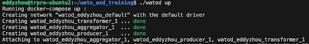
 
### Step 2
 
Enter the container using VScode Docker extension
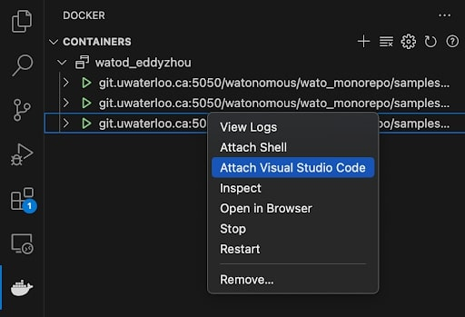

### Step 3

Make changes inside the container and debug with ros2 tools
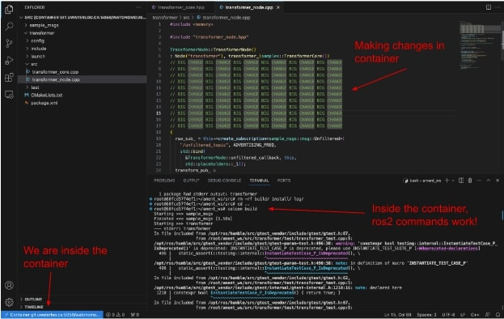

### Step 4

Changes in the container automatically propagate out (and vice versa)
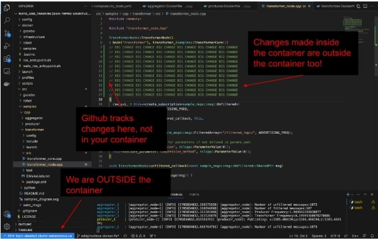

### Step 5

Outside the container, Git add, commit, and push
</Steps>

The main benefit to dev containers is that you can use linters and tools installed inside the container. For example, you cannot install numpy in the WATcloud host, but you can install numpy in a container and play around with it inside that container.

<mark>**Deliverable 4.0.1**</mark> Enter the transformer container and change its [BUFFER_CAPACITY](https://github.com/WATonomous/wato_asd_training/blob/074cb7400fcfdc12130b520c606044ec16083e48/src/samples/cpp/transformer/include/transformer_core.hpp#L20). 

<mark>**Deliverable 4.0.2**</mark> Rebuild the transformer inside the container using colcon build **under the ~/ament_ws directory**. Source your changes with source install/setup.bash. 

<mark>**Deliverable 4.0.3**</mark> Launch the transformer node with ros2 launch transformer transformer.launch.py. You should notice your transformer buffer fill up faster or slower based on the new BUFFER_CAPACITY you specified.

<mark>**Deliverable 4.0.4**</mark> Outside the container, check that your changes to the transformer have propagated out using git status. You should see something like the following…
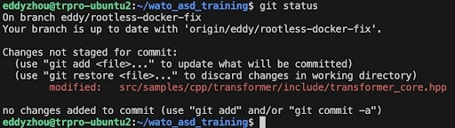

You can also to ./watod up outside your container, and the changes you made inside the container should reflect in the robot logs.

<mark>**Deliverable 4.0.5**</mark> **BONUS**  when doing ./watod up, the transformer node spins up automatically. Can you think of a way to not make the node spin up? Hint: you need to stop the node from launching, but you have to keep the container running for an indefinite period.

## Foxglove
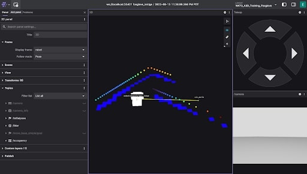

[Foxglove](https://foxglove.dev/) is an open source data visualization tool for robotics. Founded by a couple of folks at [Cruise](https://webviz.io/), Foxglove’s main advantage is its ability to visualize server-side data. 

You may have heard of RViz, which is ROS’s native visualization software. As powerful as this tool can be, RViz is not great for server-side development. In order to use RViz on our server, you’d have to spin up a VNC docker container. This is what our team has done in the past, but it was terrible. RViz would run at no faster than 3fps.

### Port Forwarding
In a nutshell, [Port Forwarding](https://www.coeosolutions.com/news/what-is-port-forwarding) establishes a connection between a communication endpoint on one device in a private network to another device on another network. We use Port Forwarding to view Graphic User Interfaces (GUIs) and stream data to your local machine. The world of networking is scary, so we will try to make it as straightforward as possible. 

A recurring pattern for Port Forwarding is: <span style={{ color: 'blue' }}>“software A is streaming data out of some port ####, I want to read this data myself, so I will forward port #### to my machine to read it”</span>. If software A is in a Docker container on a server host machine, then you have to forward the port from the Docker container to the host machine, and then from the host machine to your local machine.

You don’t have to do much port forwarding yourself, but it’s good to know the gist of it as we move forward.

### Using Foxglove
1. Make sure you have the **gazebo** and **vis_tools** profiles running
2. Have some sort of web browser on your local machine
3. Have the asd_training_config downloaded on your local machine (this is in the training repo)

Once you have the two profiles running, you should notice an auto-forwarded port in your VS Code. 
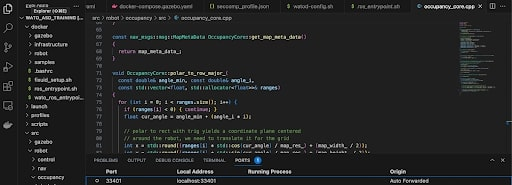

This port is where foxglove is streaming its data from. You don’t have to do any forwarding yourself, as we’ve done it for you ;P. 

To view this data, go to the Foxglove website, create an account <span style={{ color: 'blue' }}>(with your personal email, we need to hash out sponsorship from Foxglove before you can use your watonomous email)</span>, and either visualize the data through your web browser or a local download of Foxglove.

### Viewing ROS data through foxglove
**To view the data coming from the forwarded port**, in the Foxglove dashboard click Visualize Data -> Open Connection -> Foxglove Websocket and set it as the port that was forwarded. In the example above, that would be <span style={{ color: 'blue' }}>ws://localhost:33401</span>. It will be different for everyone.

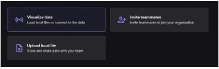
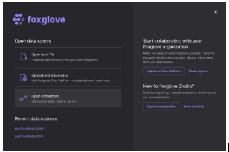
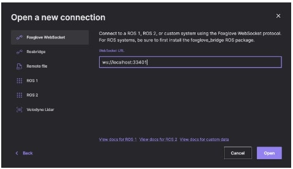

You can now proceed to open your Foxglove Studio to begin viewing the robot simulation.

<mark>**Deliverable 4.1**</mark> Up the ASD Training Repo and view your robot simulation in Foxglove on your local machine.

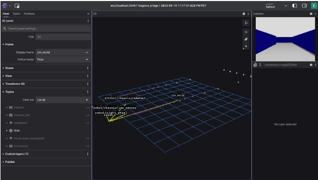

Your Foxglove Studio should look something like this. Don’t worry if it looks slightly different. We will fix that now. In the ASD Training Repo, we’ve provided a configuration file that sets up your Foxglove Studio to look exactly like how we want it to look. If you haven’t yet, download the configuration file from the repo. 

You then need to load this file into your local Foxglove Studio. 

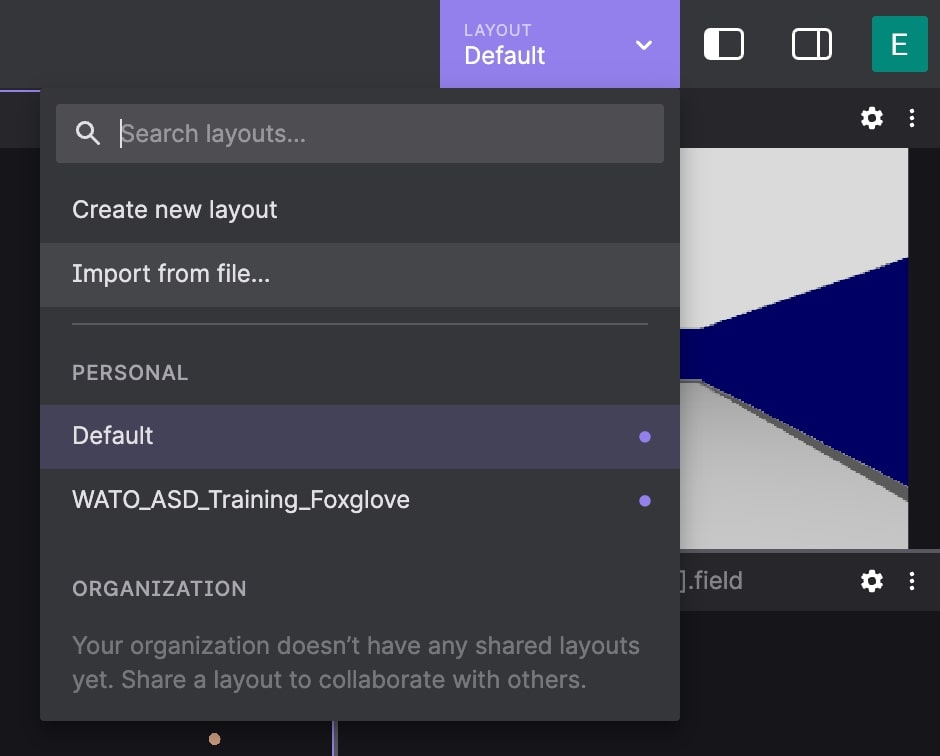

Reload your Foxglove, and you should see something like the following.

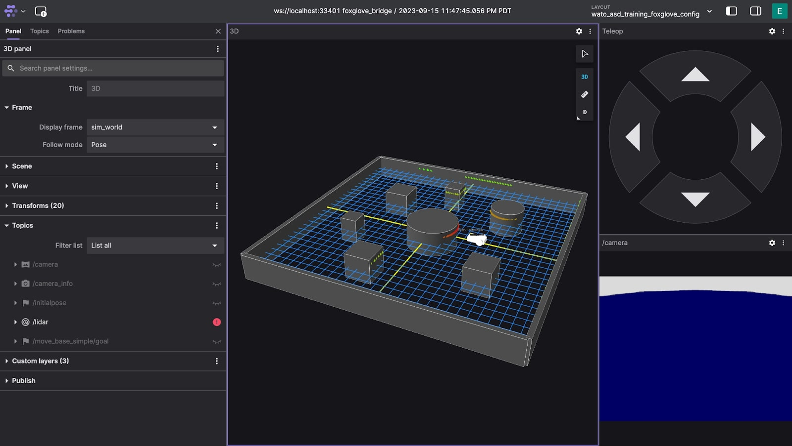

<mark>**Deliverable 4.2**</mark> Upload the ASD Foxglove config to your local foxglove.

<mark>**Deliverable 4.3**</mark> Interact with Foxglove Studio. You can move around the robot with the Teleop Panel. Here are a couple of subtasks to get you acquainted.

<mark>**Deliverable 4.3.1**</mark>

<mark>**Deliverable 4.3.2**</mark> **BONUS:** View the list of Topics. What is a Topic? This can be a great opportunity to get an initial idea of ROS Topics.

<mark>**Deliverable 4.3.2**</mark> **BONUS:** The visualized data is, in-reality, a bunch of numbers. Foxglove (and RViz) do some post processing to make it look intuitive. View the <span style={{ color: 'blue' }}>/lidar</span> topic’s raw data through a new Raw Message Panel.