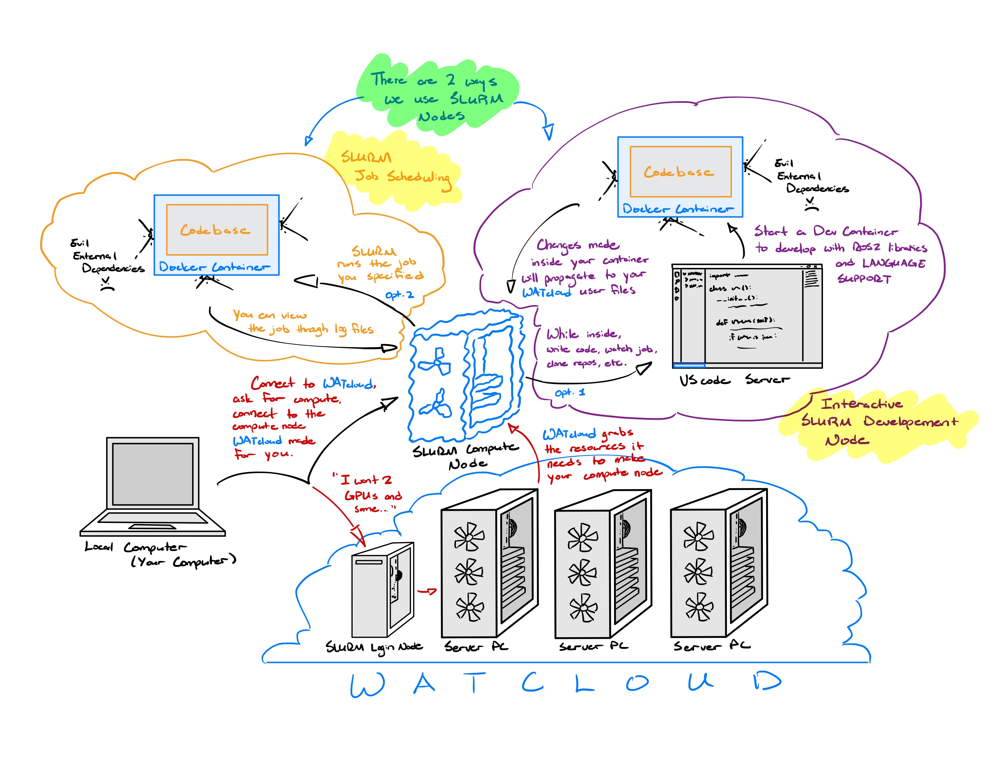
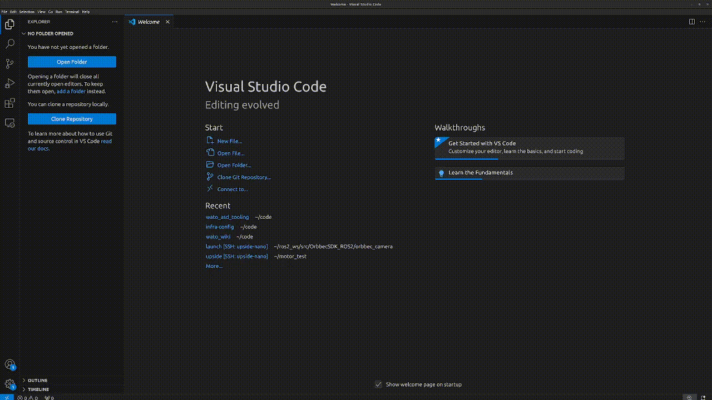

# Developing with WATcloud

import { Callout } from 'nextra/components'
 
<Callout type="error" emoji="️❗">
  You must complete your [Cluster Access Form](https://cloud.watonomous.ca/docs/compute-cluster/getting-access) before proceeding with this guide.
</Callout>

Here, we discuss setting up WATcloud to be used for software development in the Autonomous Software Division.

## Why WATcloud
Due to the high computational requirements of many aspects of the ASD stack, WATO has a large server infrastructure for remote development [WATcloud](https://cloud.watonomous.ca/). In this section, you will learn to connect to WATcloud on VS code. Connecting to a server to do remote development is not only a crucial aspect of software development at WATonomous, but is also a very common practice in the industry.
 
<Callout type="info" emoji="ℹ️">
  **Fun Fact:** WATcloud closely mimics server infrastructures used by OpenAI, NASA, Nvidia, and more!
</Callout>

## A Look from Afar
### How does WATcloud share compute resources fairly?
WATcloud relies heavily on a resource management tool known as [SLURM](https://slurm.schedmd.com/overview.html). SLURM ensures that all resources in WATcloud are shared in a fair and well-managed manner.

For the everyday developer, you can imagine SLURM as a "build your own computer" tool. You specify to SLURM what compute resources you want (CPU, RAM, GPU, memory, time limit, etc.) and SLURM will build a compute node with the resources it has on hand.

### So how does remote development actually work?

Remote development for a WATonomous member typically consists of a local machine, host machine, SLURM node, and a docker container. They are defined below:

- `Local Machine` Your personal computer. 
- `Host Machine` The computer you connect to. In the case of WATcloud, this is the SLURM login node.
- `SLURM Node` An "imaginary computer" that is created by WATcloud. You specify to WATcloud what compute you need by running commands in the SLURM login node.
- `Docker Container` An isolated coding environment.

To do remote development in the Autonomous Software Division, the process can be summed up by the image below:



<Callout type="warning" emoji="⚠️">
  As shown in the image, **there are two ways to use a SLURM node**.
</Callout>

### Job Scheduling vs Interactive Development
Use job scheduling when you want to run a command for a very long time (>1 day long). Use interactive development when you are actively making changes to your code and testing it.

For most WATonomous members, you would use job scheduling for tasks like training neural networks, large data processing, numerical optimization, etc. On the other hand, you would use interactive development when you are coding/testing ROS2 nodes, interacting with / visualizing live data, making code changes in general, etc.

## Setting up WATcloud for ASD

<Callout type="warning" emoji="⚠️">
  This section is experimental. Please let us know of any issues on our Discord
</Callout>

Dealing with SSH can be quite foreign to alot of new developers. Thankfully, we provide a series of helper scripts that will make setup for WATcloud easier on you.

## General Setup

import { Steps } from 'nextra/components'
 
<Steps>
### [Local Machine] Clone the wato_asd_tooling repository
 
```bash
git clone git@github.com:WATonomous/wato_asd_tooling.git
```
 
### [Local Machine] Generate an SSH config

If you have never created an `~/.ssh/config` file before, do that now. Note, we assume that all your SSH files are stored under `~/.ssh`

```bash
touch ~/.ssh/config
```

Generate a WATcloud SSH config. Follow the prompts whenever you get them.

```bash
cd wato_asd_tooling
bash ssh_helpers/generate_ssh_config.sh
```

You should now be able to connect our cluster using these commands:
```bash
ssh tr-ubuntu3
ssh derek3-ubuntu2
ssh delta-ubuntu2
```

### [Local Machine] Setup VScode for SSH
To do this, download the `Remote - SSH` VScode Extension. After that, you should be able to attach VScode to any of the machines.



### [Local Machine] Setup Agent Forwarding

Agent forwarding lets us carry our identity onto other machines that we connect to. What this means is, you can use git commands on other machines without having to create an SSH key on each machine you connect to.

Setup agent forwarding with our helper script. Follow the prompts whenever you get them.

```bash
cd wato_asd_tooling
bash ssh_helpers/configure_agent_forwarding.sh
```

### [Host Machine] Confirm Agent Forwarding Works

You should now be able to use git on all the WATcloud machines you connect to. Confirm by running the following **inside a WATcloud machine you connected to**.
```bash
ssh -T git@github.com
```
</Steps>

<Callout type="default" emoji="✏️">
  **Deliverable** Get SSH and SSH Agent Forwarding working.
</Callout>

## Setup for Job Scheduling
There is no setup. Creating an SLURM job is really easy. It was what SLURM was designed for. You can view docs on SLURM in the [WATcloud documentation](https://cloud.watonomous.ca/docs/compute-cluster/slurm).

<Callout type="default" emoji="✏️">
  **Deliverable** Run a SLURM batch job with 2 CPUs that counts to 60.
</Callout>

If you want to create a slurm job that runs inside a docker container, you can use the following helper script.

```bash
cd wato_asd_tooling
bash slurm_templates/custom_job_node.sh
```
<Callout type="warning" emoji="⚠️">
  You need to have access to our docker registry to make this work. You can come back to this when you've learned about docker in the [General Onboarding](/onboarding/asd_general_onboarding)
</Callout>

## Setup for Interactive Development
Unlike job scheduling, SLURM was not built to handle interactive development. Luckily we have a team of very talented individuals, and we managed to make interactive development work nonetheless :).

Creating an interactive development environment entails starting an SSH server inside the SLURM node, some wacky SSH key sharing, a netcast proxycommand, as well as pointing docker to a persistent filesystem. You don't have to do that though. You just need to do the following.
 
<Steps>
### SSH into a SLURM Login Node
 
Both `tr-ubuntu3` and `derek3-ubuntu2` are SLURM login nodes. You can connect to them by running either
```bash
ssh tr-ubuntu3
ssh derek3-ubuntu2
```
 
### Start a SLURM Dev Node
 
Run the helper script to startup a SLURM Dev Node. Follow all the prompts carefully.
```bash
cd wato_asd_tooling
bash slurm_templates/small_dev_node.sh
```

We also have other dev node configurations (including a custom configurator) inside the tooling repo.
```bash
bash slurm_templates/medium_dev_node.sh
bash slurm_templates/large_dev_node.sh
bash slurm_templates/custom_dev_node.sh
```

<Callout type="error" emoji="🚫">
  **DO NOT START MORE THAN ONE DEV NODE.** You have a chance of corrupting your docker filesystem. Starting more than one dev node is like building multiple computers. It is NOT the same as creating multiple terminals.
</Callout>

### [Local Machine] Setup SSH for SLURM
Run this last helper script **LOCALLY**. Follow the prompts carefully.

```bash
cd wato_asd_tooling
bash ssh_helpers/setup_slurm_ssh.sh
```
</Steps>

<Callout type="default">
  And you're good to go! Whenever you want to startup a SLURM Dev Node, start one up by running any of the SLURM Dev templates, and then SSH into the SLURM node through VScode.
</Callout>


